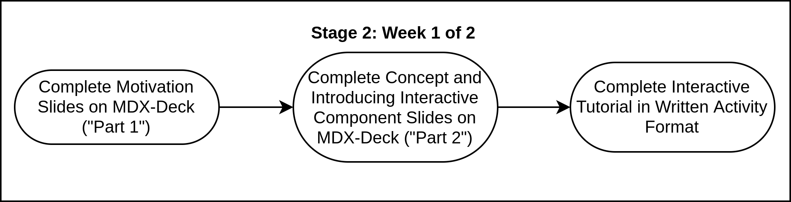
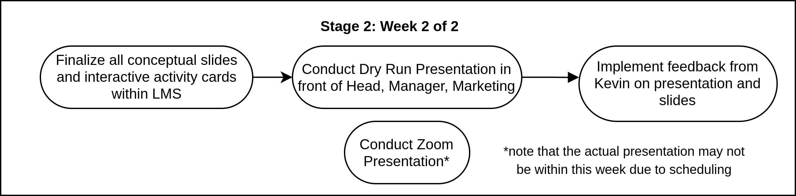

# Workshop Presentation: Stage 2

**Note that this section is incomplete, because we are working to incorporate Reveal.js, another code-based presentation system, into our learning management system to be presented. Therefore this page will be fully complete at a later time.**

## Week 1 of 2: Putting Presentation Together

**Setting up MDX-Deck:**

Please set up your MDX-Deck workspace on Code Sandbox. Follow the guide [here](https://about.bitproject.org/teams/developer-relations/setting-up-code-sandbox).

**Week 1 Checklist**

* [ ] Complete "Part 1" [Slides](workshop-blog-stage-1.md#part-one-idea-motivation)
* [ ] Complete "Part 2" [Slides](workshop-blog-stage-1.md#slide-deliverables-outdated)
* [ ] Complete Interactive Tutorial in Written Activity Format \("Part 3"\)
* [ ] Finalize Dry Run date and time with manager and head
* [ ] Finalize date and time of presentation with manager, Head and Marketing
* [ ] [General Slide Checklist ](./#general-slide-checklist)Fulfilled

## Week 2 of 2

#### Week 2 Checklist

* [ ] Finalize slides and activity cards
* [ ] Conduct Dry Run
* [ ] Integrate all Feedback on presentation
* [ ] Conduct Zoom Presentation

