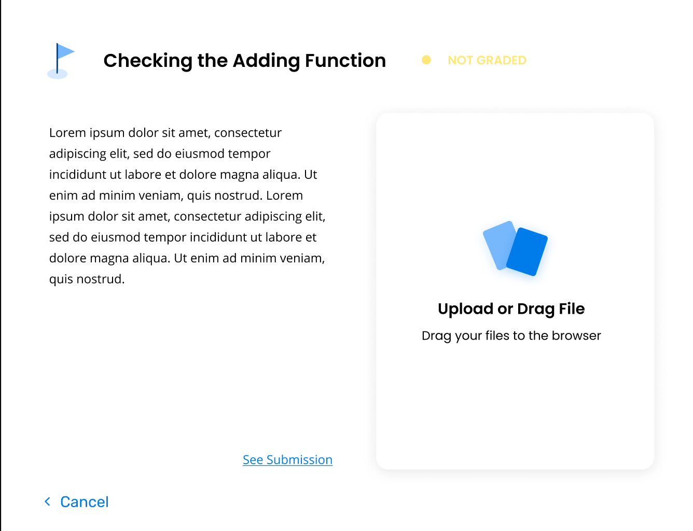

# Backend vs CDN

### Introduction

Along with the Backend API, we also have a CDN to host all of our static content on AWS Cloudfront to improve the LMS's runtime. This guide is used to show which models hold static data and which models have dynamic data. This is also used to show when to call to the Backend API and when to call to the CDN.

### Why We Use a CDN

When you have a lot of static data that is being fetched from the backend, it always takes a while to fetch that data back. Even if optimization techniques like caching are implemented, the backend will still return data slower than a CDN. Since a CDN is used to host static files and retrieves them very quickly in various amount of places in the world, it makes sense to get the data from a CDN rather than the backend. 

### Static Data

Static data is data that rarely changes within our Learning Management System. Some static data within the platform are Activities, Checkpoints, Cards, Hints, Modules, and Topics. 

**Activities** - These are the step-by-step tutorials that students follow to learn a specific Software Engineering skill like web development. An example of an Activity would be the Intro to Twitter API Activity on our platform.

**Checkpoints** - These are small tasks for the student to do to show whether or not they understand different parts of an Activity.

**Cards** - Cards are the instructions within an Activity. 

**Hints** - Hints are small instructions on how to solve a specific Card within an Activity.

**Modules** - Modules teach students how to use a specific skill through a list of Activities.  An example of a module is Streaming Tweets.

**Topics** - Topics teach students a general skill through a list of modules. An example of a Topic is Computational Social Science with the Twitter API.

### Dynamic Data

Dynamic data is data that constantly changes in our Learning Management System. Some dynamic data is ActivityProgress, ModuleProgress, TopicProgress.

**ActivityProgress** - ActivityProgress keeps track on how far the student has gotten in an Activity. It keeps track of the card unlocked, card locked, hints locked, hints unlocked and checkpoint completion.

**ModuleProgress** - ModuleProgress keeps track on how far the student has gotten in a Module. It keeps track of which activities have been completed, not completed, and in progress for a student.

**TopicProgress** - TopicProgress keeps track on how far the student has gotten in a Topic. It keeps track of which modules have been completed, not completed, and in progress for a student.

### Calling the Backend

You would typically call the Backend when you need to get dynamic data like ActivityProgress. This type of data always changes, so it makes sense for the ActivityProgress object to be called from the Backend. 

**Backend ur**l: [https://bit-backend-staging.herokuapp.com](https://bit-backend-staging.herokuapp.com/)

### Calling the CDN

You would use the CDN whenever you need static data like Activity. The Activity will always have the same title, summary, and difficulty level. It makes sense to put this in a CDN since this type of data will always stay the same.

**CDN url**: d36nt3c422j20i.cloudfront.net

#### Notes for the CDN routes:

**CDN is only for GET requests.** The CDN routes are very similar to the GET routes in the Backend. The only difference is that you add `/data.json` right after the route name.

Example to get data for a single Activity:  
`/activities/<int:activity_id>` -  backend url

`/activities/<int:activity_id>/data.json` - CDN url

