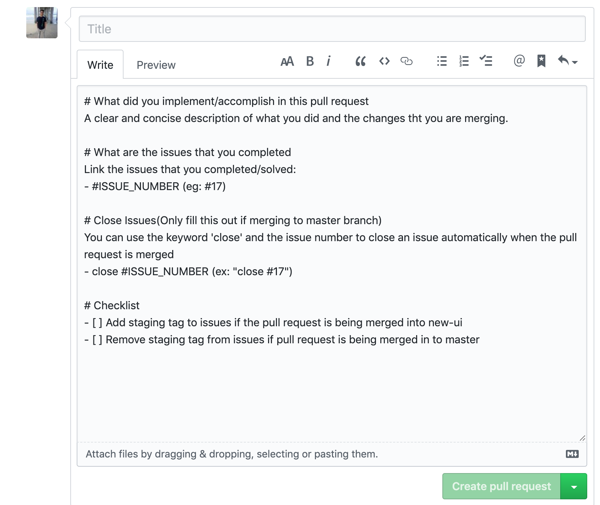
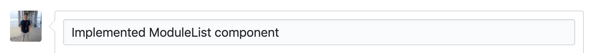
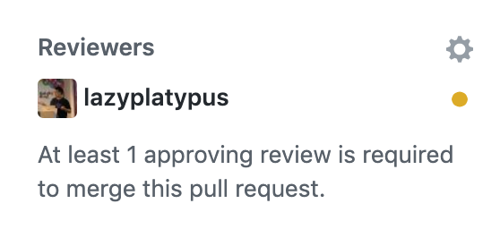

# How to make a Pull Request

## Pull request template

Each time you open a pull request, you will be introduced with the following template. 



### 

### Title

Each pull request should have a title that describes what you implemented/fixed.



### Reviewers

In every pull request, there needs to be a manager or the director of engineering to review the pull request before it gets merged. This allows the reviewer to make sure that the code follows our code style and that it works with other parts of the codebase.

 



### What did you implement/accomplish in this pull request?

For this field, you would want to write a very short description on what feature that you fixed/implemented.

```text
What did you implement/accomplish in this pull request?
Added in Action Card and ActivityList for the Module component.
```

### What are the issues that you completed?

For this field, list out the issue\(s\) that you completed. This is to let the reviewer to quickly reference the issue you were working on. 

example:

```text
What are the issues that you completed?
# 17
# 18
```

### Close Issues\(Only fill this out if merging to master branch\)

This field is used to close issues when the pull request is merged. You should only be closing issues if the pull request is merging to the master branch. If the pull request is not for master, you can leave this field blank.

Github has keywords that can close the issue automatically when the pull request is merged. You use the keyword 'close' and then \#ISSUE\_NUMBER to accomplish this. So for example if I wanted to close issue 17 I would write the following:

```text
Close Issues(Only fill this out if merging to master branch)
close #17
```

### Checklist

This field is a list of reminders to do before submitting the pull request. This is just as a 'sanity check' so that developers don't forgot anything before merging a feature. You must check off the checkboxes before submitting the pull request. 


