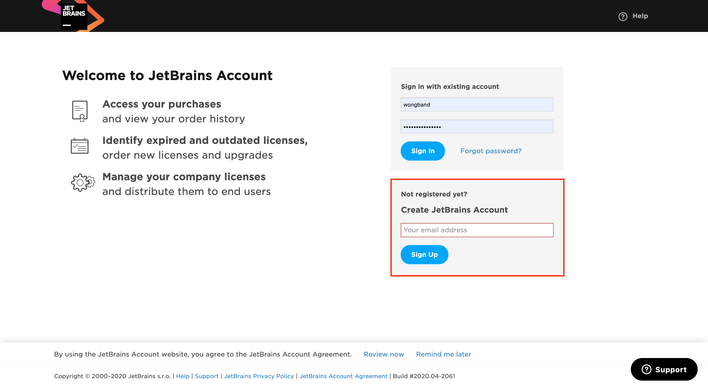
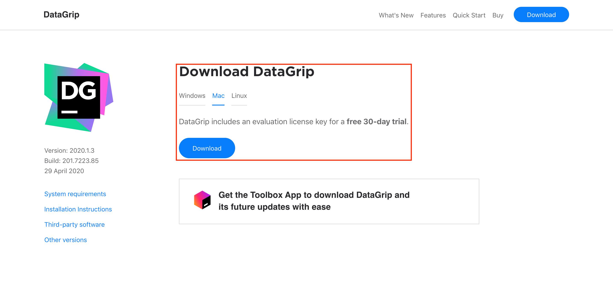
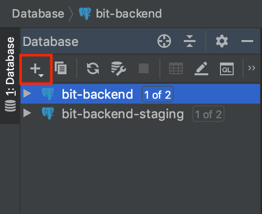
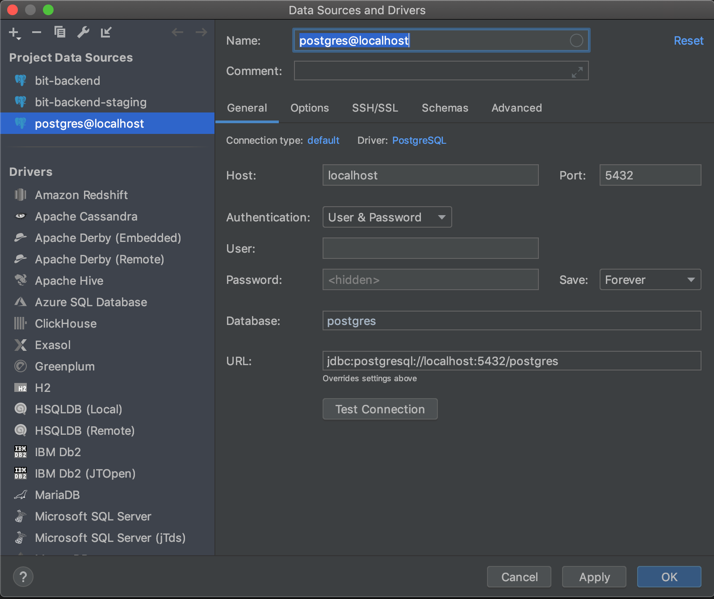
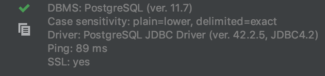
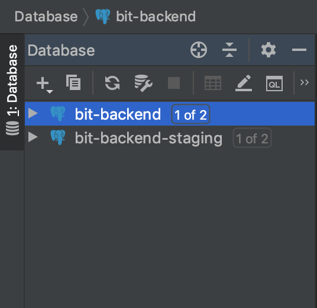
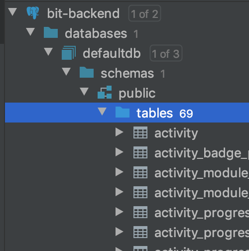
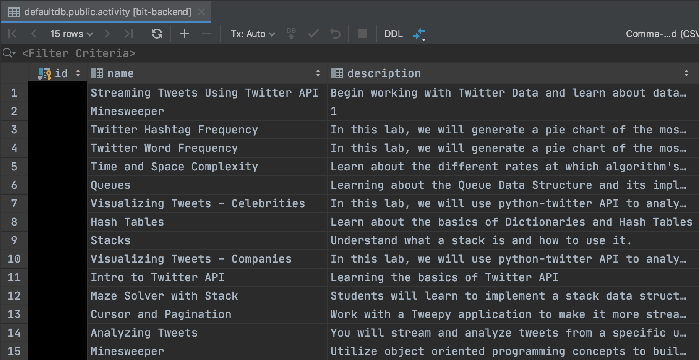

# DataGrip

### **What is DataGrip?**

DataGrip is a database management environment where users can view the data in the database. It also allows users to query and create data as well. This tool is very useful for both Backend and Frontend Engineers because you can visualize what data exists in our database. This is important because if you want to do any testing with a specific object in the database, you can find the respective id in the database and use that for any of the Backend API routes. This guide is used to help you install DataGrip and how to use it.

### **Making a JetBrains Account**

Before you are able to download DataGrip, you must make an account on JetBrains. Since we are students, JetBrains gives 1 year free subscriptions to all of their products. The subscription can be renewed as long as you are a student.

Go to this page to make a JetBrains Account [https://account.jetbrains.com/login](https://account.jetbrains.com/login)

When you reach the login page, go to the **Create JetBrain Account** and sign up with your school email. As long as you sign up with your school email, DataGrip and other JetBrain tools will be free to use. After that confirm your email and you should be good to download DataGrip.

### Installing DataGrip

After activating your account, go to this link to download, [https://www.jetbrains.com/datagrip/download/\#section=mac](https://www.jetbrains.com/datagrip/download/#section=mac). Select the right download link for your machine and click download.

### Setting up DataGrip

Afterwards, open the DataGrip app and you should be welcomed to this page.

On the left sidebar at the top left you should see a '+' button. 

Click it and you will see an option called **Data Source**. Hover over it and find the PostgreSQL option and click it.

Now the database connection modal should show up.

### Database Connection Fields

**Name:** This is the name that you want to give the database. 

**Host:** This is where the database is being hosted.

**Port:** This is the port in which the database is hosted on.

**User:** This is the user you want to login as that has permission to the database.

**Password:** This is the password of the user that you want to login as.

**Database:** This is the database that you want to connect too.

**URL:** This field represents database URL. This field is completed for you since when the other fields are filled out.

When all the fields are filled out, click the test connection button. The connection should show something like this under the button. If something like this does not connect, then one of the fields inputted was incorrect.

**Important:** If you want the parameters for each of the fields to setup the database, ask the Head of Engineering or one of the managers because we cannot expose database credentials since this guide is public. 

### **How to use DataGrip**

When you get your database set up, you should see your database on the right side bar. 

Open the following folders until you see the 'table' folder. Open the 'table' folder and you should see all of the tables on the database.

To view a specific table and its data, double click the table that you want to view. For example if I click the **activity** table I should get the following view.

You can view the other columns by scrolling to the right. 

