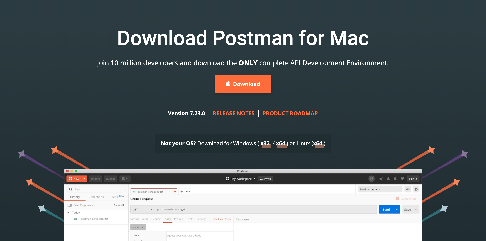
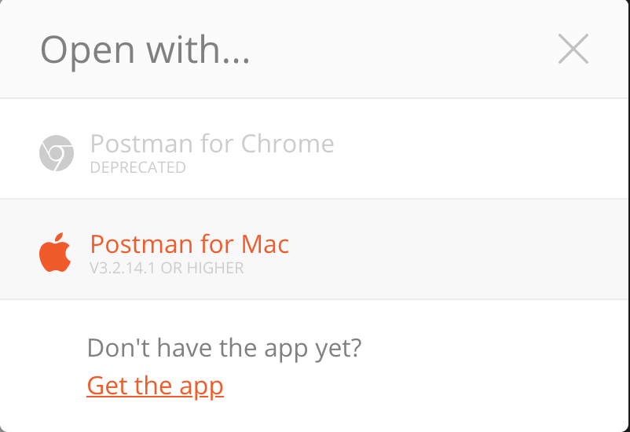
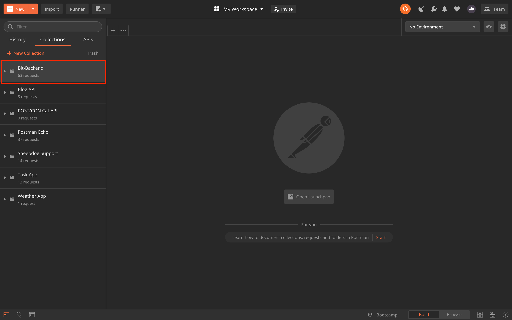
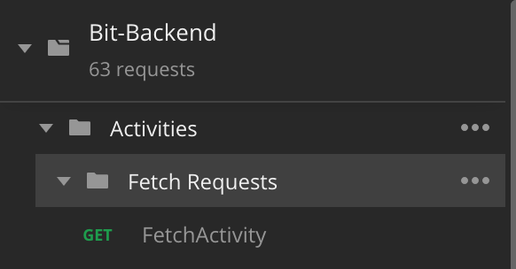

# Postman

### What is Postman?

Postman is a collaboration platform for API development. This tool is very useful to test out routes that the Backend Engineers make. So if a component needs to pull data from the backend, the Frontend Engineers can test the route that they need before coding out the API call.

This guide will show you how to get Postman set up and how to import the Backend Engineer's routes.

### Installing Postman Client

First go to this link [https://www.postman.com/downloads/](https://www.postman.com/downloads/)

You should be greeted with a page like this:

Click the download button in the center of the page to download the Postman Desktop App.

### Importing Bit-Backend Postman Collection

Perfect, you now have the Postman app downloaded on your machine. Next go to the following link [https://documenter.getpostman.com/view/4691925/SzS8uRkd?version=latest](https://documenter.getpostman.com/view/4691925/SzS8uRkd?version=latest). This link leads to all of the routes created by the Backend Engineering team. At the top right of the page click the \`Run in Postman\` button. A popup should appear below that looks like this:

Click the Postman for Mac/Windows/Linux option. Which will open another popup to open in Postman. Click the open in Postman option. When you do the Bit-Backend folder should be on a left side bar on the Postman app.

### How to find specific routes

You can now click on the Bit-Backend folder and you will see other folders as well. Each folder contains routes that correlate to the name of the folder name. For example, the Activities folder contains routes that relate to Activities.

### Helpful Resources

If you never used Postman before here are some links for Postman guides:

* [https://www.youtube.com/watch?v=FjgYtQK\_zLE&t=343s](https://www.youtube.com/watch?v=FjgYtQK_zLE&t=343s) - How to use Postman and why it is useful
* [https://www.youtube.com/watch?v=HiIJbmjeTPU](https://www.youtube.com/watch?v=HiIJbmjeTPU) - Environments and Environment variables

