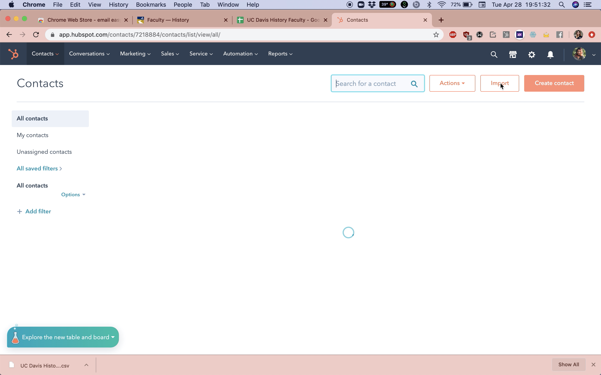
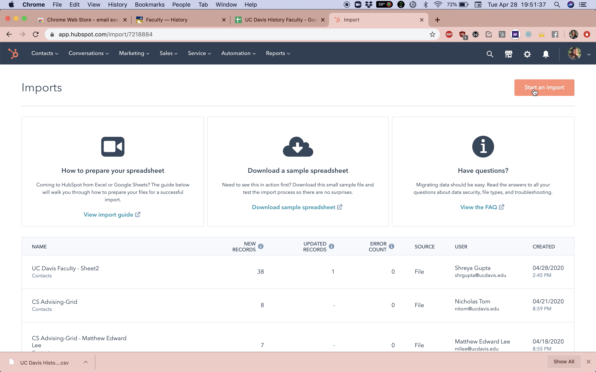

# Email Scraping & Hubspot

## Email Scraping:

### Download the Google Chrome Extension

We'll be using "Email Easy Scraper"

### Find the extension icon in your chrome menu

### Find the webpage of contacts

Make sure that all emails needed are listed on this page and you don't need to click on a separate link to access the email. The scraper only finds text in the email format.

### Click "Clear"

To make sure the scraper is empty after any previous email scraping to avoid duplication of records

### Click "Scrape"

### Click "Copy"

All emails from the webpage should appear below 

### Paste Emails in a new spreadsheet

You can use Google Sheets, Excel, Airtable, etc. 

### Save spreadsheet as .CSV file

## Import contacts

### Go to your organization's Hubspot and locate the "Contacts" page

### Click "Import" &gt; Click "Start an Import"

### Follow the next steps to upload the file

