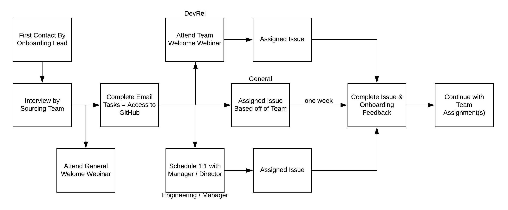

# Onboarding

## Flowchart Breakdown

If you are interested in joining Bit Project, please apply here: [https://www.bitproject.org/join\#positions](https://www.bitproject.org/join#positions)

### First Contact By Onboarding Lead

Once you have applied, an Onboarding Lead will email you in about 2-3 business days about your current application status. 

### Interview by Sourcing Team

Schedule an interview with a member of our Sourcing Team. They will provide you with a link to schedule a meeting on Zoom.

### Attend General Welcome Webinar

Daniel, the president of Bit Project, will give an introduction to Bit Project in general. No matter what team you are applying to, attendance to this webinar is required as it is a beginning stepping stone into what exactly Bit Project does.

This webinar takes place every Monday at 11 a.m. PST over Zoom. You are not required to make an account, but you must download zoom which is looked below.

**Note**: This task can be done before your interview with the Sourcing Team.

**Zoom Website:** [**https://zoom.us/**](https://zoom.us/)\*\*\*\*

**Zoom Download:** [**https://zoom.us/download**](https://zoom.us/download)\*\*\*\*

**Zoom Link**: **** [https://zoom.us/j/4639175564](https://zoom.us/j/4639175564) ****

### **Complete Email Tasks**

In the email sent by the Onboarding Lead, there will be some tasks for you to complete. One of the tasks is to Submit the Directory form on Airtable. Once you have completed the form, you will then be able to join our GitHub.

### Attend Team Welcome Webinar\(Content Developers only\)

You will meet with Kevin, the Director of Developer Relations and he will give you more information about what your typical tasks will be as a Content Developer. 

More Information about this here: [https://about.bitproject.org/teams/onboarding/developer-relations/content-developer](https://about.bitproject.org/teams/onboarding/developer-relations/content-developer)

### Schedule 1:1 with Director/Manager\(Managers and Engineering only\)

You will schedule an interview with either Kevin\(Managers\) or Bryan\(Engineering\) and they will assign you some tasks related the position you applied for. More information about the interview here:

Managers: [https://about.bitproject.org/teams/onboarding/developer-relations/manager](https://about.bitproject.org/teams/onboarding/developer-relations/manager)

Engineering: [https://about.bitproject.org/teams/onboarding/engineering](https://about.bitproject.org/teams/onboarding/engineering)

### Assign Issue

By now, you should all be assigned an task for you to complete. Most issues will be assigned via GitHub unless your director/lead/manager assigns you a different task. If you have any questions about your tasks, you can message your director or manager on Slack. 

### Complete Issue and Onboarding Feedback

After you complete your issue, please complete this form to let us know about your onboarding experience. We appreciate your feedback!

Feedback Form: [https://airtable.com/shrZQWKGzLhUk1UvK](https://airtable.com/shrZQWKGzLhUk1UvK)

If you have any more questions about onboarding, the links below have more specific information about your particular position.

### Difference between Onboarding 1:1 and Weekly 1:1 Meeting

The Objective of the **Onboarding 1:1 Meeting** is to have the new member learning about the team and have them staying aligned with other team members as soon as possible.   
During the meeting managers will:

1. Introduce the team to the new member, including the project they are working on currently, and any specific rule the new member needs to know.
2. Run through the expectations, goals and workflow with the new member.
3. Introduce the responsibilities for new members after onboarding.
4. Answer any questions new members might have & receive any feedback.

The Objective of the **Weekly 1:1 Meeting** is to build a trusting relationship and stay informed and aligned with each other.   
Especially since we are a remote club that has different students across the nation, it is extremely important that:

* We are able to share our ideas and concerns.
* Ensure that we remain on the same page.
* Stay engaged and meet our goals.
* Have the opportunity to work together to find ways to be more successful. 

During the weekly 1:1 Meeting:

1. Discuss any accomplishment after last met.
2. Talk about feelings about the work, satisfying and frustrations.
3. Providing mutual feedback to help each other grow.
4. Discuss any issues and obstacles noticed & solutions

## Developer Relations





## People



## Marketing



## Engineering



