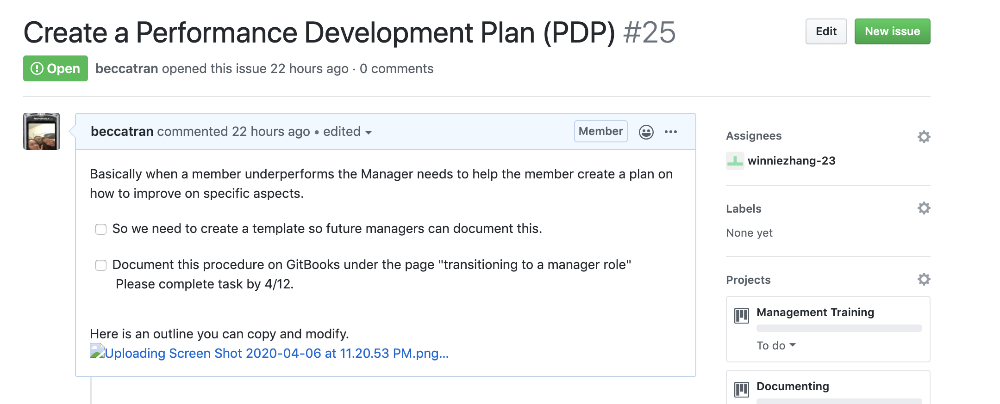
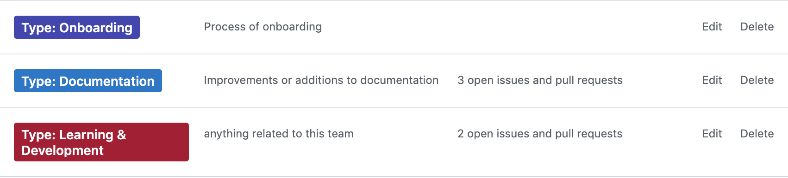
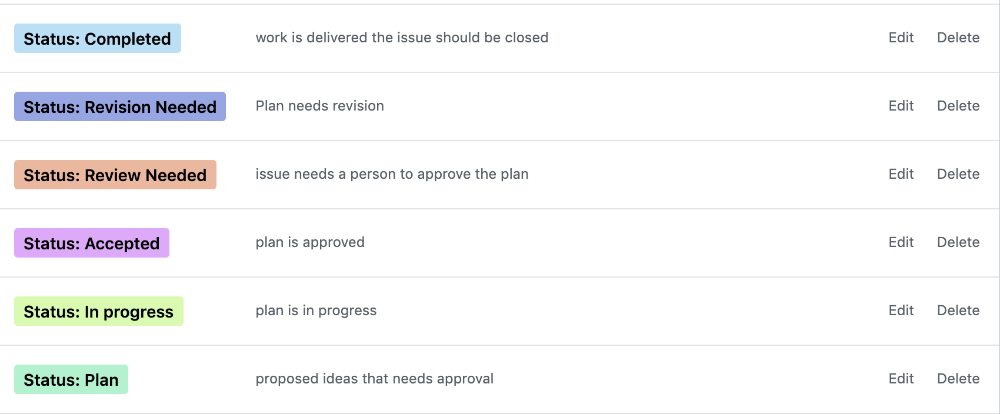
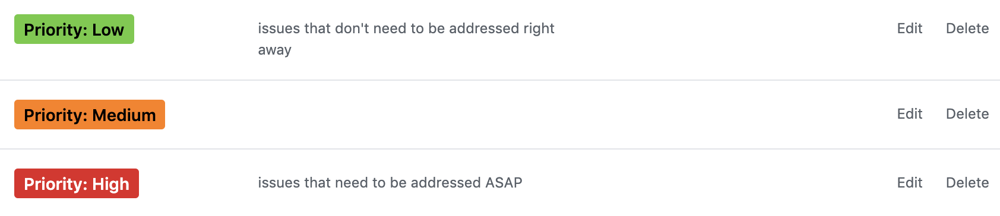

# People

## What is the People Team?

Bit Project has grown quickly, and plans to continue grow while maintaining our culture and remote working, embracing development, and building scalable people-oriented policies. Our team oversees recruiting and learning & development functions. We are responsible for investing in the engagement and development of members, as people, which first benefits the members, and as a result, the organization as a whole. The People team is about designing work so that you want to be there – present, engaged, and proud of what you do in Bit. In this team, we focus providing members proactive learning materials to make operations easier, especially in the times of change management. Moreover, we focus on onboarding new members from around the United States. Please do not hesitate to reach out to any People members with questions! In the case of a conflict between the organization and a team member, the People Team is always here to assist you.

## The Core Objectives of the People Team, Are to:

Shift from task-based management to objective-based management \(MBO\) – **Higher productivity, measurable performance results**

Encourage feedback – **Feeder for new insights**

Carry out data-infused decision making – **Better, more predictable decision outcomes**

Build communities and closer relationships – **Enhance retention**

Provide autonomy and trust members – **Innovation**

Improve, remove, and automate – **Eliminate the need for previously redundant and unrewarding work**

Cross pollination and collaboration – **Build capable managers with fresh ideas from alternate sources**

## Our Actions and Goals

As a team, we are always trying to find new ways to improve Bit Project. We want to create a well-rounded training guide for all members. On that notes, we decided to implement webinars for new members in our onboarding process to allow a smoother transition. We created a training guide on how to be a successful and effective Manager at Bit Project. Additionally, we are constantly creating learning & development guides such as communication, internal feedback, diversity and inclusion, and how to use applications like Github are all provided on this Handbook. Lastly, we support documentation of content throughout the organization to increase transparency, ensure that everyone stays up to date with the organization's decisions and roadmaps, and provide them with all the resources they need to be successful as Bit Project.

## Responsibilities

* Provide an enriching experience for all members by creating materials for learning & development.
* Maintain appropriate level of process, program, and policy knowledge in order to assist team members.
* Intake of feedback, questions and concerns.
* Administration of the Diversity and Inclusion Conduct
* Proactively identify process inefficiencies and inconsistencies and collaborate towards an improved and more productive process that improves the employee and/or manager’s experience.
* Work on onboarding people experience, values alignment during onboarding and improving onboarding through continuous iteration.
* Onboard, mentor, and grow the careers of all team members
* Announcing changes and improvements 
* Engagement survey administration & implementation.

## Leadership 

| Positons | Point of Contact |
| :--- | :--- |
| Director of People | @Becca Tran  |
| Learning & Development Manager  | @Jasmine Cheng |
| Learning & Development Associate   | VACANT |
| People Experience Manager  | VACANT  |
| People Experience Associate  | @Winnie  |
| Diversity and Inclusion Associate  | @Lily Hem |
| Onboarding Manager  | @Minh-Tu Nguyen |
| Onboarding Experience Associate  | VACANT  |

## **Contact People Team**

<table>
  <thead>
    <tr>
      <th style="text-align:left"><b>Medium</b>
      </th>
      <th style="text-align:left">How to Reach</th>
    </tr>
  </thead>
  <tbody>
    <tr>
      <td style="text-align:left">Email</td>
      <td style="text-align:left">people@bitproject.org</td>
    </tr>
    <tr>
      <td style="text-align:left">Department Slack Channel</td>
      <td style="text-align:left">
        
<code>#people</code>
        

        
<code>#onboarding</code>
        

        
<code>#socials</code>
        

      </td>
    </tr>
  </tbody>
</table>## **Department Organization**

### **Learning and Development** 

As a Learning and Development Manager/Associate you **develop evaluation processes and training programs**. Retaining a skilled in Bit Project should be a key focus within the department since members are the organization's most valuable resource. Members who are appropriately compensated and feel that they can develop professionally are among the most satisfied. We are increasing the number of training and professional development programs in Bit Project will create a more skilled and productive teams.



Being a People Experience Manager/Associate is very valuable to Bit Project. You will **collect constant feedback and keep track of all the feedbacks that members** give to each other by keeping up to date in our GitHub Repo Rather than a performance review ,which can convey an ominous tone, a "designing my success" review helps members to honestly evaluate weaknesses and strive for improvements while setting goals for future advancement. These  assessments will also help the People department to be connected with the developing skills of their members – knowledge that may be helpful when it comes time to fill open management positions.



A  Diversity and Inclusion Associate has to strategize and execute programs that will create an environment of cultural diversity in the workplace. They liaises between the management and other units of the organization to ensure uniform diversity processes and procedures with a positive impact across all functions of the house that includes organizational effectiveness, professional development, and community relations, and supplier diversity efforts. Along with upper management, it is the Diversity and Inclusion Associate's job to **develop and foster a culture where members feel included, engaged and eager to perform well in order to achieve Bit Project's goals.** 



### Onboarding

The Onboarding team **manages the entire onboarding experience for new members to ensure that we help them successfully transition into Bit Project**. People onboarding works to make sure all members are welcomed to our organization and well-versed in the organization’s standards and practices before embarking on their new roles. If you possess strong interpersonal and communication skills and enjoy working with others this team is for you!



## People Project Management Guidelines

People Team uses GitHub for agile project management using **issues**. Read through the documentation on each of these GitHub features if you are unfamiliar.

The [**People Repository**](https://github.com/bitprj/people) houses all People projects.

* Each **Issue** represents a discrete unit of work with a deliverable. For example  ****

* Every **Pull Request** should have an issue so that it can be tracked on issue boards. 
* **Milestones** represent units of work to be completed within a specific time frame, sometimes referred to as sprints. They are comprised of multiple issues that share a common due date, and help break large projects into more manageable parts.
* **Projects** boards are made up of issues, pull requests, and notes that are categorized as cards in columns of your choosing. It is a nice overview of a large goal that we are working on such as creating webinars. 

### Labels

Every issue should be categorized these labels. These labels should be used on all issues within the People group and each issue. We’re going to introduce three different types of labels to this particular repo. Those three types are **status labels**, **type labels** and **priority labels**.  Each issue should have each three different types of labels. 

#### Type 

It would also be helpful to see what type of issue it is that we are dealing with, which is where these handy **type labels** come in:

* `Onboarding` - work that is related with the Onboarding Team 
  * Onboarding process 
  * You can also add the `Documentation` if the issue needs any type of documentations 
* `Documentation` - work that needs to be documented on the Handbook or GitHub
*  `Learning & Development` - work related with the Learning & Development Team 

#### Status 

These new **status labels** cover a broad range of states that an issue may be in during different stages of development. The idea is that only one status label will be applied to any particular issue. 

* `plan` - work that is proposed, in an exploratory state.
  * To exit the plan stage the work must be assigned to a Director/Manager.
  * The person who created the issue accepts responsibility for the task by changing the label from `plan` to `in progress` and creating a pull request \(PR\), if appropriate. The plan status is optional, as issues that don't require formal planning can be opened and labeled `in progress`.
* `in process` - work in progress that has been accepted or work that is complete but should be scheduled for a future date.

  * Work in this stage should not be merged.

* `review needed` - work has been completed enough that it is ready for formal review and approval.
  * Work that is approved can be either merged or scheduled.
  * Work that doesn't require review can simply be merged/closed.
* `revision needed`- after the review phase the Director/Manager can ask for revisions if needed 
  * **\*\*Optional**
* `closed` - when work is delivered the issue should be closed.

#### Priority

**Priority** labels lets us know what are most critical to handle for the time

* `Low` - issues that can be addressed in 2 weeks 
* `Medium` - issues that need to be addressed within a week 
* `High` - issues that need to be addressed within a couple of days 

