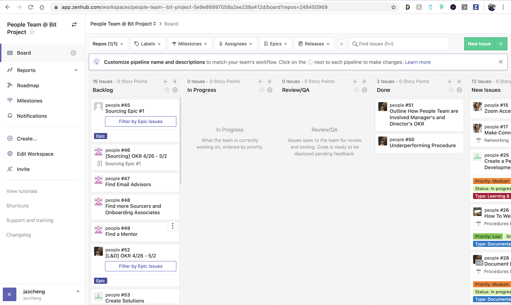

# Objectives and Key Results

## What are OKRs?

OKRs is a framework for defining objectives and their outcomes. Objectives comprise of a clearly defined goal and one or more key results which are measures to track the achievement of that goal. 

**Examples:**

* **Objective**: Expand the sourcing team
  * **Key Results**:  Reach out to 100 individuals a week, conduct at least 5 sourcing interviews a week
* **Objective**: Achieve a consistent member retention rate of &gt; 90%
  * **Key Results**: Collect feedback on how we can improve member satisfaction, create a system to track our retention rate, implement activities/processes that increase member retention

## Why are we doing OKRs?

We create and track OKRs in order to meet objectives through concrete and specific measurable tasks. The purpose of structuring our goals and tasks this way is to keep everyone  on track and achieve more as an organization,.

## Where are OKRs assigned?

We use ZenHub to assign OKRs. ZenHub is essentially a project management tool that integrates within GitHub's user interface. You are also free to assign tasks on GitHub and the issue will show up in ZenHub.

## When are OKRs assigned and due?

Everyone will need to finish their weekly OKRs by Saturday 11:59pm PST and OKRs will be assigned by your Manager/Director by Sunday night of each week.

