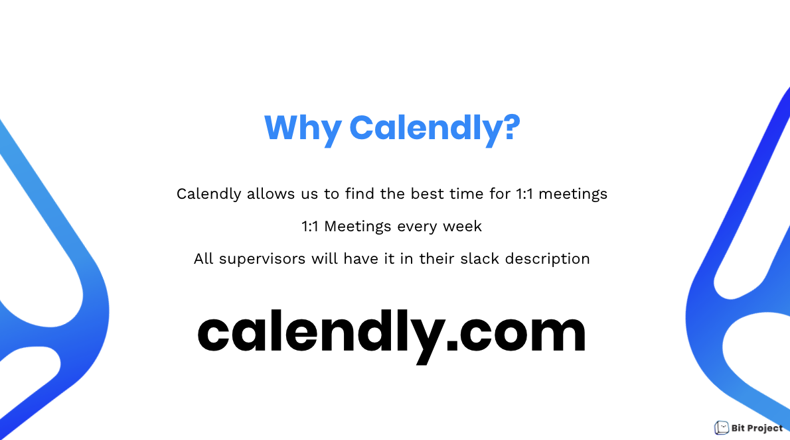

# Communication



**Effective Communication Webinar**, Becca Tran

## What is Communication? 

Communication is the exchange and sharing of ideas and information between two or more persons. Our organization is built upon **transparency** and learning different ways to **improve our communication skills. I**t is crucial for us to practice clear communication in ways that will help stay connected and work efficiently!

## Effective and Responsible Communication Guidelines

1. **Kindness matters**
   * Since we are going remote, there will be some misunderstanding so it is best to stay kind to everyone. You are looking at a screen, but you are really talking to a person. If you wouldn't say it to a person's face, don't send it to them in a text message.
2. **Express your thoughts** 
   * We live in different locations and often have very different perspectives. We want to know your thoughts, opinions, and feelings on things. All ideas and thoughts are valid. 
3. **Feedback is essential** 
   * It is difficult to know what is appropriate in every one of our team members. We encourage team members to give feedback and receive feedback in a considerate way.
4. **1:1 are important!**
   * Asynchronous communication \(e.g., via text\) is helpful and necessary. In some cases \(e.g., to clarify misunderstandings\) it can be much more effective to jump on a Zoom video call.
5. **Everyone is a moderator** 
   * If you see something that concerns you in Slack, Issues, Merge Requests, Video, Emails or any other forum, we encourage you to respectfully say something directly to the individual in a 1:1 format. If you are not comfortable reaching out to the individual directly, please reach out to your direct manager or People Business Partner to discuss

## Why We Document Everything

In small organizations, it's particularly tempting to avoid a documentation strategy. With only a few team members, it's feasible to keep everyone informed via meetings, Slack, or email threads. Long-term, this oversight becomes increasingly harmful.

As a team scales, the need for documentation increases in parallel with the cost of not doing it. Said another way, implementing a documentation strategy becomes more difficult — yet more vital — as a company ages and matures.

Documentation is rarely placed on the same pedestal with metrics such as sales and client retention during a company's formative years, but it deserves to be. The difference between a well-documented company and one that eschews a handbook is stark.

A handbook-first organization is home to team members who benefit from having a single source of truth to lean on. This type of organization is able to operate with almost supernatural efficiency. An organization that does not put concerted effort into structured documentation has no choice but to watch its team members ask and re-ask for same bits of data in perpetuity, creating a torturous loop of interruptions, meetings, and suboptimal knowledge transfers.

  

## GitHub

GitHub gives you a direct path to create websites for your projects, which makes it a natural choice for publishing and maintaining documentation. Quality documentation is a hallmark of any healthy software project. Most importantly, using GitHub Pages means your documentation lives alongside your code on GitHub, where you can use things like Issues and Pull Requests to ensure it receives the high level of care it deserves. A well-curated documentation increases your project’s approachability, provides asynchronous guidance, and fosters the type of uncoordinated collaboration that propels open-source software development.

### **How to Document Meeting Notes:**

Template:

* To increase productivity + efficiency, every meeting will follow the template available on GitHub
* Team leaders will add the agenda 3 days before
* Everyone will update the agenda 1 day before the meeting
* A notetaker will be responsible to write in important points discussed into the notes
* Other attendees are encouraged to help the notetaker to participate by taking notes when they speak

### The Meeting Notes Template

## Slack

Slack is our main form of communication. Files, code, information, and much more can be shared easily to members of the team through instant messaging. Multiple channels are created to communicate while having easy access to private messaging to anyone on the team.

Before making an account, you must download slack onto both your computer and mobile device. Make a slack account and join our workspace through the link below:

**Link** 👉 **\*\*\[**[https://app.slack.com/client/TJ2FB5CE9/CJ4BRKELX\*\*\]\(https://app.slack.com/client/TJ2FB5CE9/CJ4BRKELX](https://app.slack.com/client/TJ2FB5CE9/CJ4BRKELX**]%28https://app.slack.com/client/TJ2FB5CE9/CJ4BRKELX)\)

### Be respectful of your own time 

1. You should try avoid information overload in order to be productive and efficient with your time. While it can be tempting to read every message in every Slack channel you subscribe to, it’s very challenging, not expected, and not necessary.
2. One method for avoiding Slack overload is to focus your Slack reading on Starred channels and Threads. Starred channels are like "favorites" and allow you to follow messages from those channels easily. Threads consist of any conversation in which you are mentioned and allow you to easily track conversations in which you have direct involvement.
3. Use your notification settings liberally. Depending on how you use Slack this could range from limiting notifications to critical messages outside of your working hours to turning off Slack notifications entirely. Find the right balance for you and stick to it.

### Be respectful of others' time 

1. If you're only referring to someone, but don't actually need their attention, and want to spare them from getting notified, spell out their name normally without `@` mentioning them.
2. Slack messages should be considered asynchronous communication, and you should not expect an instantaneous response; you have no idea what the other person is doing.
3. Because we work globally, you may receive Slack mentions at any time of day. Please consider enabling Slack's Do not disturb functionality so you don't get interrupted, for example, in your offtime.
4. Slack does not currently support automatically activating Do Not Disturb over weekends. Please bear this in mind if you choose to work over weekends, as your Slack message to someone may interrupt their time off. Consider using another form of communication instead.
5. Do not feel obligated to respond to Slack messages when you are not working.
6. Feel free to send a colleague a link to these guidelines if the communication in Slack should be done **asynchronously**.
7. **Please avoid using @here or @channel unless this is about something urgent and important.** In chat, try to keep the use of keywords that mention the whole channel to a minimum. They should only be used for pings that are both urgent and important, not just important. By overusing channel mentions, you make it harder to respond to personal mentions promptly since people get pinged too frequently. Additionally, if you are planning to `@mention` a specific team \([Slack User Group](https://get.slack.help/hc/en-us/articles/212906697-Create-a-user-group#browse-user-groups-and-view-members)\), consider the size of the group you are mentioning  and the impact of pinging all of these people for the particular situation. If something is urgent and important:
   1. Use `@here` to notify all currently _active_ members in the room. Please only use `@here` if the message is important _and_ urgent.
   2. Use `@channel` to notify _ALL_ members in the room, irrespective of away status. Please only use `@channel` if the message is important _and_ urgent.
8. If you are aware that your teammate is on vacation, avoid mentioning them in a high volume channel. It will be difficult to find the information or question when they return. If you need to ensure they refer back to the thread, ensure to send them a link to the relevant Slack message through a direct message.

### General Guidelines 

1. If the subject is of value to the wider community, consider commenting on an existing issue or opening a new issue instead on the pertinent Github Repository.
2. Use the `:white_check_mark:` emoji or similar to indicate an inquiry has been answered. Anyone can add the emoji. If you're not sure, then feel free to leave it up to the person who asked. An emoji indicator is particularly helpful in channels where lots of questions are posted, such as `#questions`, and `#git-help`.
3. In general, you can think of emoji reactions as equivalent to body-language responses we use in real-life conversations, such as nodding your head as encouragement when a verbal \(or in Slack, written\) response might be too much.
   * Emoji Glossary \(just listing a few\)
     * ✅: "completed or approved"
     * 👍: "I agree or I understand" 
     * 👀: "I'll look into it"
4. In public channels, [threads](https://get.slack.help/hc/en-us/articles/115000769927-Message-threads) are valuable for keeping conversations together. If you want to respond to a question or comment in a channel, please start a thread instead of responding below them in the channel. This helps to keep the discussion in one place where it is easy to follow, and reduces noise as each message in a thread does not result in an unread message for everyone in the channel.
5. When and doubt please use the public channels! Rule of Thumb: **if someone can benefit from the question, post away on the public channel!**  We want to emphasize on this because it if we do not post on public channels it discourages collaboration, there would be less feedback, and it is not efficient.
6. Unless you're in an active chat, don't break up a topic into multiple messages as each one will result in a notification which can be disruptive. Use [threads](https://get.slack.help/hc/en-us/articles/115000769927-Message-threads) if you want to provide extra info to the question/comment you posted.
7. If you are having a hard time keeping up with messages, you can update your preferences to have Slack email you all notifications. To change the setting, go to `Preferences > Notifications > When I'm not active on desktop...` and "send me email notifications."
8. If you agree in a message to start a video call \(typically by asking "Call?"\) the person that didn't leave the last comment starts the call. So either respond to the "Call?" request with a video link or say "Yes" and let the other person start it. Don't say "Yes" and start a call 5 seconds later since it is likely you'll both be creating a video call link at the same time.
9. As an admin of the Slack workspace, if given the option to _"Disable future attachments from this website"_ when removing an attachment from a message **this will blacklist the link/domain from** [**unfurling**](https://about.gitlab.com/handbook/tools-and-tips/#unfurling-links-in-messages) **in the entire Slack workspace**. Be careful and deliberate when choosing this option as it will impact every user in the workspace.
10. When selecting your Slack display name, please do not have your name in all capital letters as this is often [associated as shouting](https://en.wikipedia.org/wiki/All_caps#Association_with_shouting) in written communications.

### Hey Taco!

Hey Taco is an application that is integrated with Slack. It is a way to give shoutouts and appreciation to people in your organization! What’s the point of all this taco giving? To put it simply: unity, recognition and gratitude. You name it and someone has probably given out a taco for it. Team member appreciation, a birthday, gratitude for leadership, or welcoming a new team member are all just a few of the reasons we give out tacos. You get 5 tacos a day!

## Zoom

[Zoom](https://zoom.us/) is a cloud-based video conferencing platform that can be used for video conferencing meetings, audio conferencing, webinars, meeting recordings, and live chat. This video conferencing will allow us to meet and work together productively "face-to-face" when meeting in-person isn't possible. This makes meeting remotely much more human, which essential in order to help users feel and stay connected.

### General Guidelines 

1. When the meeting first starts, you must introduce yourself to everyone, regardless if you already know them! Just like a real meeting or any social event, you don’t wanna initiate a convo between people you haven’t met. It would be pretty awk….
2. Please be focused, come prepared, and stay on task. This is an extremely important guideline to keep in mind. You should understand what will be discussed in the meeting and what you will contribute to it. We want zoom calls to last from roughly 30 minutes to 90 minutes. Everyone is fairly busy so I think they can benefit everyone. However, there are exceptions, like Townhall Meetings.
3. Hybrid calls aren't it, in calls that have remote participants everyone should use their own equipment \(camera, headset, and screen\). If we have hybrid calls, we won't be able to hear you well and you can miss on important information
4. It's okay to interrupt and put in your input. Keep to a moderate amount! We understand that when you are in a call and you want to have some input, the lag can make it seem like you are interrupting but put feel free to talk in between. We want the meetings to be more of discussion and it can improve the quality of our work. 
5. We expect you to be in an appropriate setting and wearing appropriate clothing. If you are in a loud environment, please go ahead and mute yourself. 
6. It is your own responsibly to remember what was discussed in the meeting. So takes notes if needed. 

### How Your First Meeting Will Generally Go 

1. Make a round of introductions 
2. If we plan to record the meeting, the host of the meeting will get your consent to record
3. Assign someone to take notes on GitHub
4. The host will tell you what the meeting is about and the goals 
5. Mute yourself if needed 
6. At the end, people should understand what was discussed and what your next steps are
7. Schedule another meeting if necessary 

## Calendly

[**Calendly**](https://calendly.com/) **is a simple calendar setting app.** One person makes a list of dates and times they are available, and other people go there and self-select their time. [**Calendly**](https://calendly.com/) **allows us to find the best time for 1:1 meetings. Only supervisors need Calendly and their links will be in their Slack profile.**

## Google Calendar 

Google Calendar is a time-management and scheduling calendar service. Google Calendar allows users to create and edit events. Reminders can be enabled for events, with options available for type and time. Event locations can also be added, and other users can be invited to events. Google Calendar helps us all stay on the same schedule even with differences in time zones. **Going remote means having A LOT of virtual meetings:**

* To increase transparency, all meetings \(unless specified otherwise\) will be recorded on the Google Calendar
* All Calendly events will be linked to the Calendar
* All virtual socials will be updated on the Calendar

**If you are invited to any Google Calendar event, please RSVP as soon as possible.** 

**If you do not have access to our Google Calendar please tell your supervisor!**

### How to Use it

1:1 Meetings:

* Signing up to meet your supervisor for weekly 1:1s will automatically appear on the Google Calendar

Team/Department Meetings:

* All teams and departments are required to set up meetings through Google Calendar
  * Add event to Calendar
  * Invite all members to event
  * Include Zoom meeting link in description

\*\*\*\*

