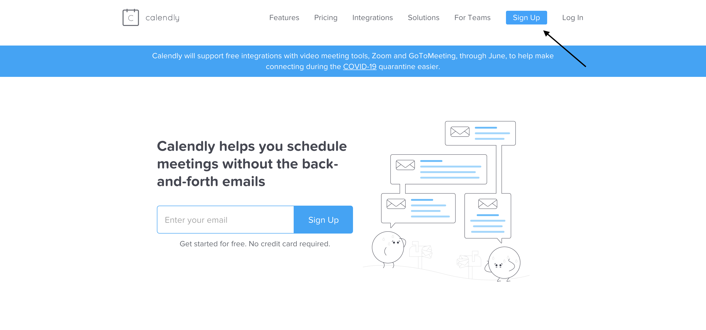
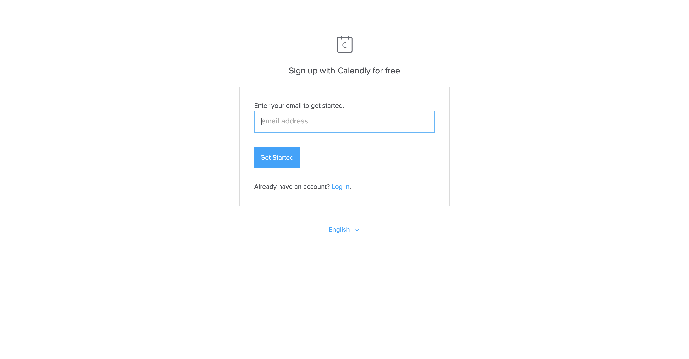
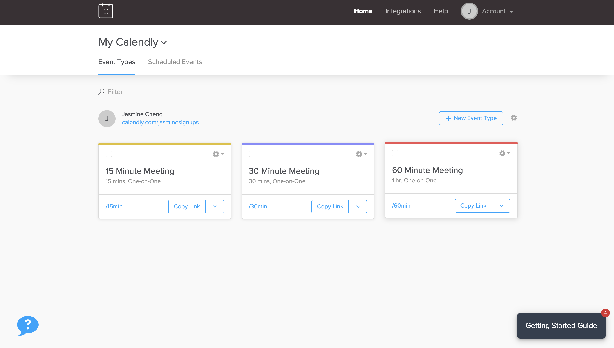
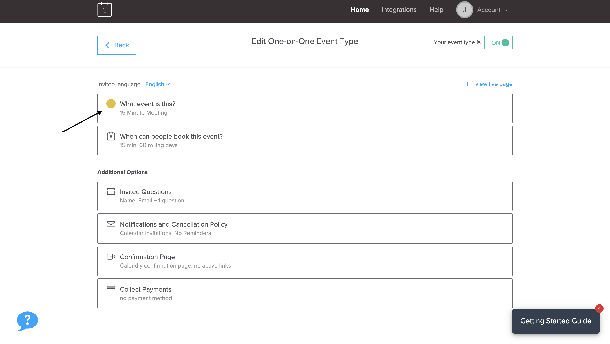
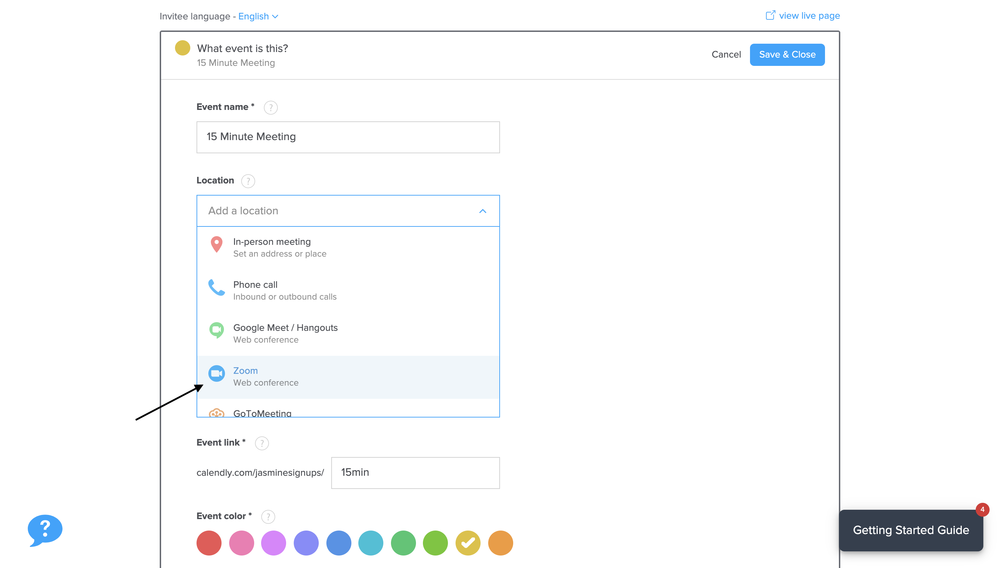
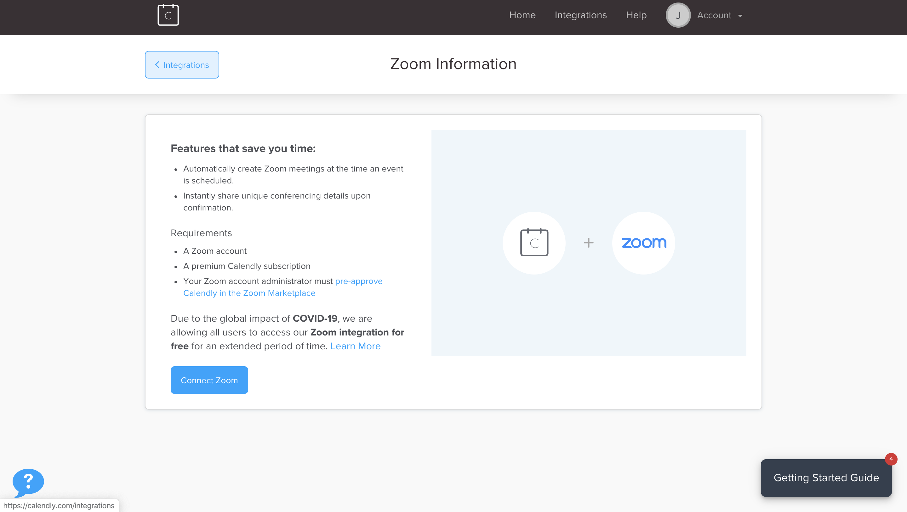
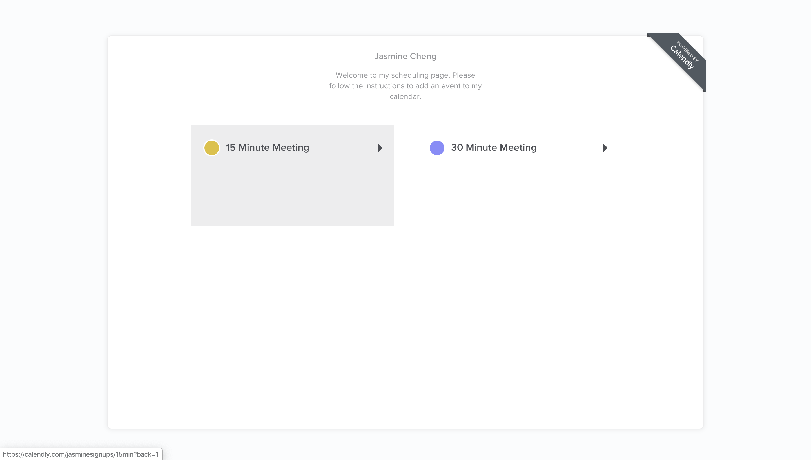
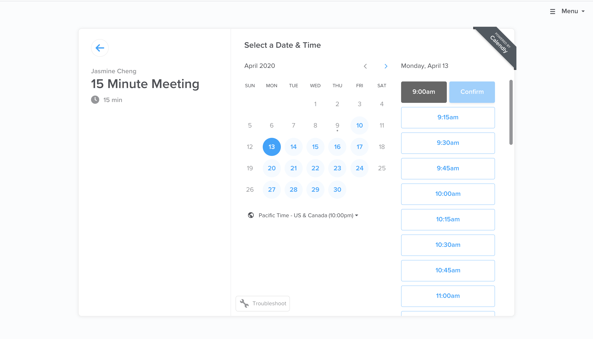
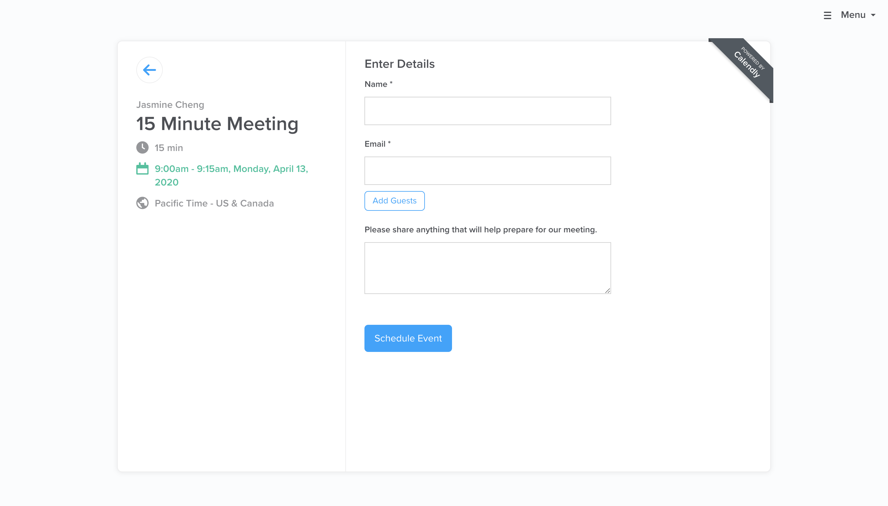

# How to Set Up and Use Calendly

Calendly is a platform that allows you to invite others to schedule meeting times based on your availability. Once the time is confirmed, Calendly sends a meeting invite directly to your calendar. At Bit Project, we'll be using Calendly to mainly schedule one-on-one meetings.

## Getting Started

#### 1. Go to calendly.com and click sign up.

#### 2. Enter your email address.

#### 3. After clicking through preferences, you will get to this page.

These 1:1 meetings should be relatively short so I suggest having only 15 or 30 minute meetings.

## Integrating Zoom into your Meetings

#### 1. Click on 15 minute meeting and click on "What event is this?"

#### 2. Click on location, then Zoom.

#### 3. Click "Zoom integration page" under location and then click "connect Zoom". 

You will be prompted to sign into Zoom.

Zoom is now integrated into your Calendly!

## How to Schedule a Meeting on Calendly

#### 1. When you click on someone's Calendly link, you'll get to this page.

#### 2. Click on a date and a time on the calendar. Then click confirm.

#### 3. Fill out your contact information.

You've now successfully scheduled a meeting!

