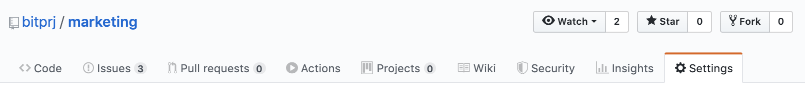
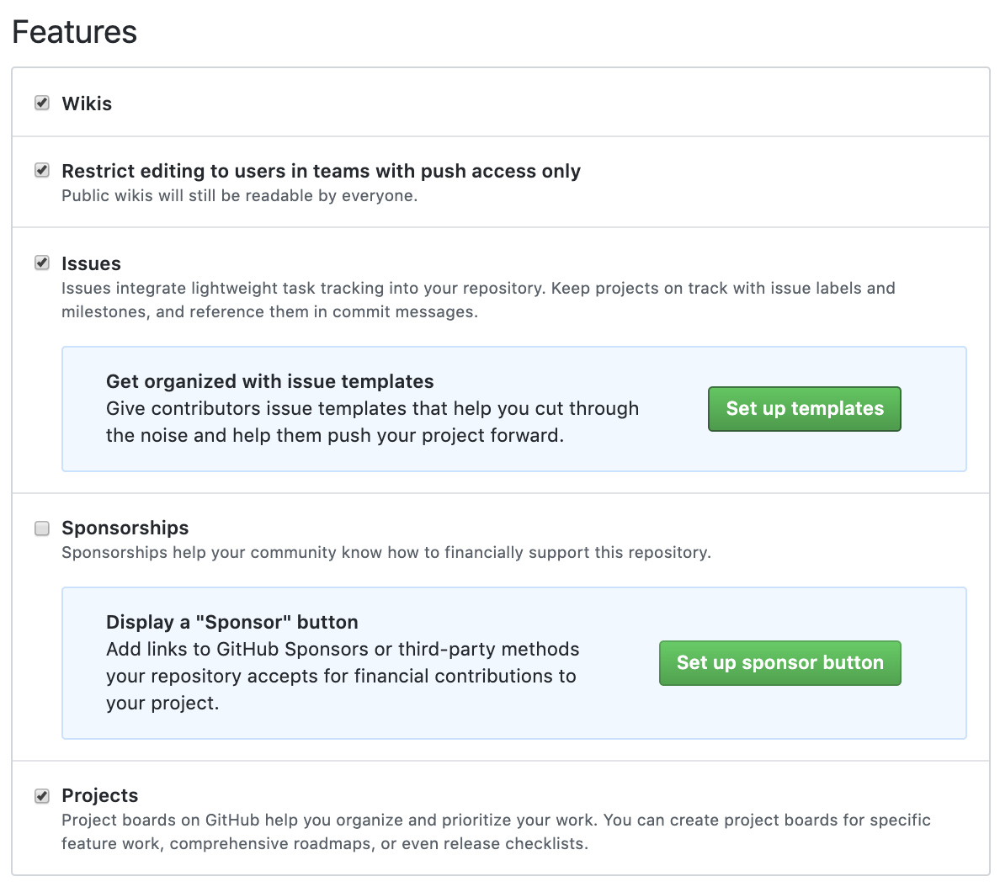
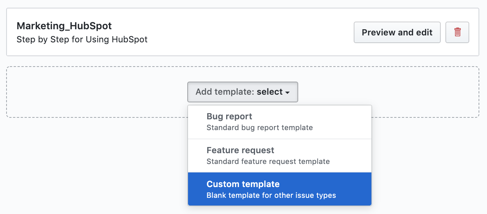
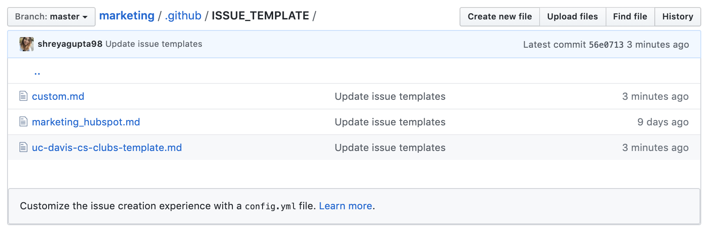

# How To: Make Issue Templates

On GitHub Enterprise, navigate to the main page of the repository.

 Under your repository name, click **Settings:**

Scroll down to **Features** and **Set up templates**: 

Use the Add template drop-down menu, and click on the **type of template** you'd like to create.

To preview or edit the template before committing it to the repository, click **Preview and edit**.

To edit the template, click the pen, and type in the fields to edit their contents.

When you're finished editing and previewing your template, click **Propose changes** in the upper right corner of the page. Enter a commit message describing your changes.

Below the commit message fields, decide whether to commit your template directly to the default branch, or to create a new branch and open a pull request.

Click **Commit changes**. Once these changes are merged into the default branch, the template will be available for contributors to use when they open new issues in the repository.

Locate the template in the repo within the .github/ISSUE\_TEMPLATE/ folder

_Modified original from:_  [_**Creating issue templates for your repository**_](https://help.github.com/en/enterprise/2.15/user/articles/creating-issue-templates-for-your-repository)_\*\*\*\*_

