# How To: Make Issues

## How to Make Issues

A step by step tutorial on how to create an issue.

### Step 1: Select your Repository

Within the Bit Project GitHub, select the repository that you would like to create an issue in.

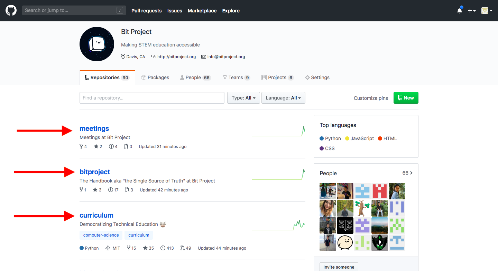

### Step 2: Click on the Issues Tab

Once in the repository, click on the issues tab. This will display all the issues that are currently open in the repository.

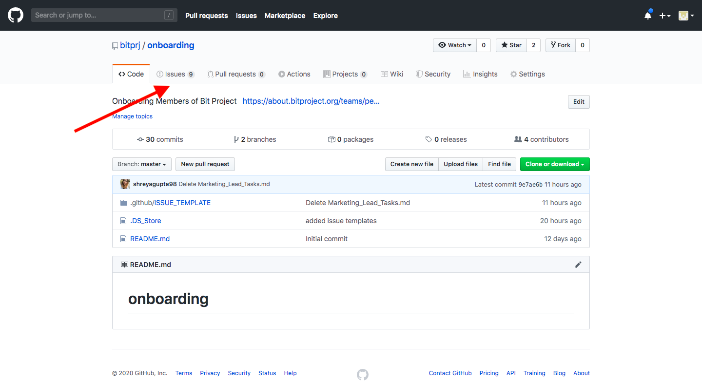

### Step 3: Select New Issue

To the right of the page, select on the green button that says New Issue.

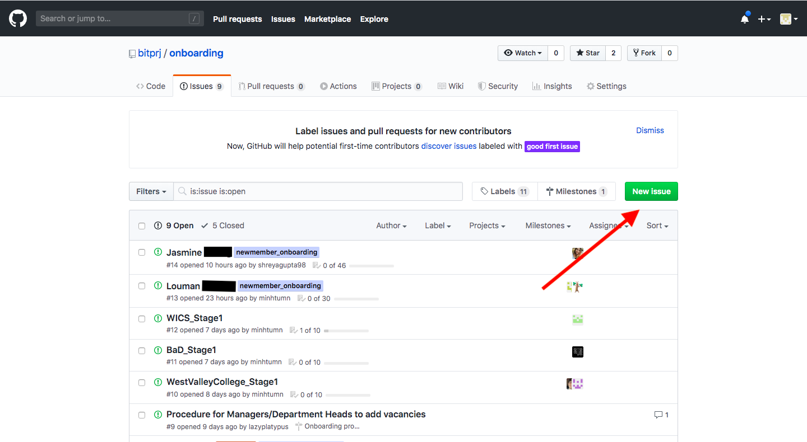

### Step 4: Select a Template or Open a Blank Issue

#### Template

If the repository has templates created, select the one that you would like to use by clicking the green button "Get Started" for your choice of template.

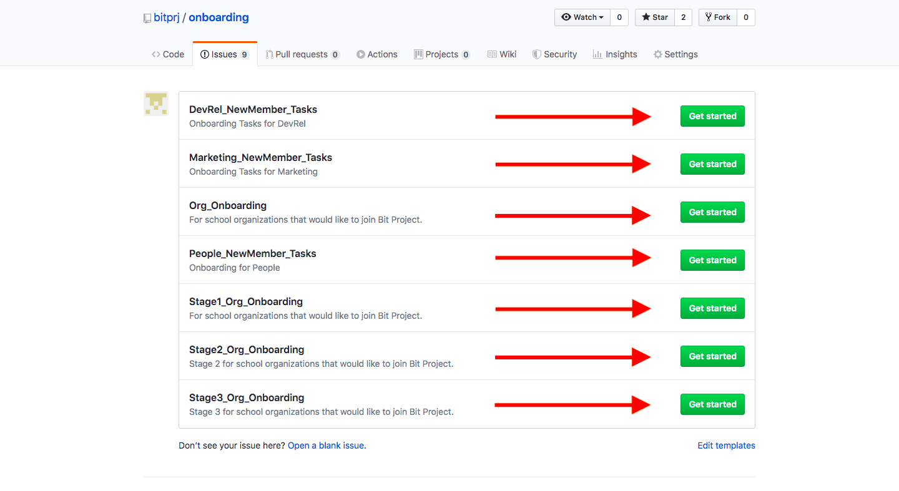

#### Blank Issue

If you would like to have a brand new issue, select "Open a blank issue" at the bottom of the page.

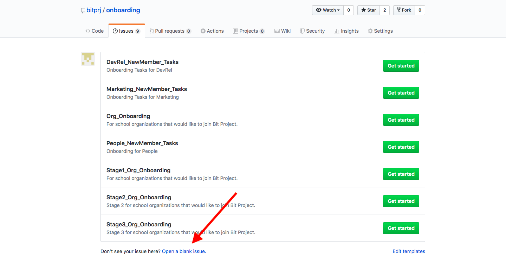

### Step 5: Create the Issue

#### Title

Make sure the title is relevant to the issue so that others who view the issue are able to determine what the task is.

#### Issue / Task Description

Write the specifics of the issue. GitHub supports Markdown so you may arrange your text with Markdown formatting.

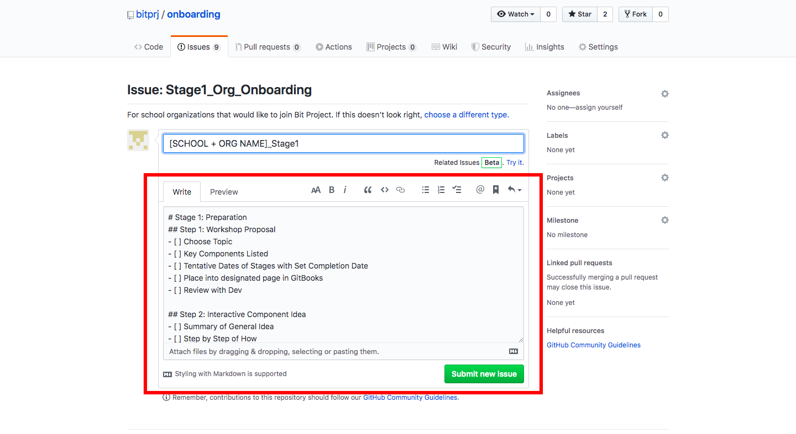

#### Assignees

Assign the Issue by clicking on Assignees on the right hand side. If the prospective assignee is a member of the Bit Project repository, you can find their username. The person will be notified of the issue.

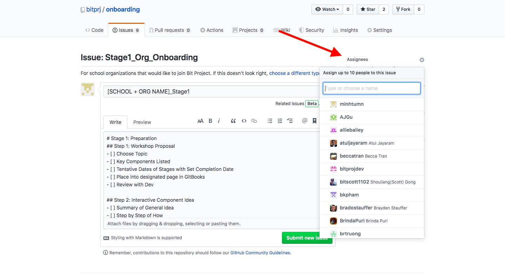

#### Labels

Place a label on the issue to categorize the type of issue.

Select Labels on the right hand side to see the available projects.

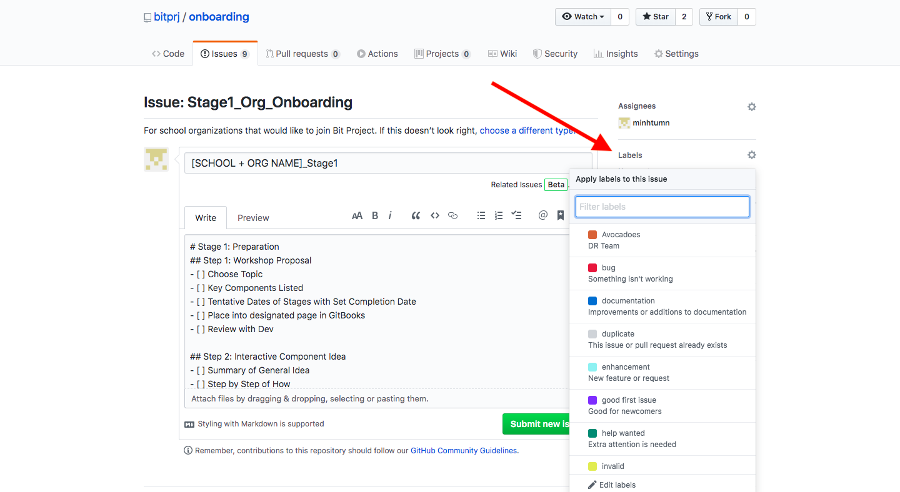

#### Projects

Connect your issue to a project to track the progress of completion for the project through its project board.

Select Projects on the right hand side to see the available projects.

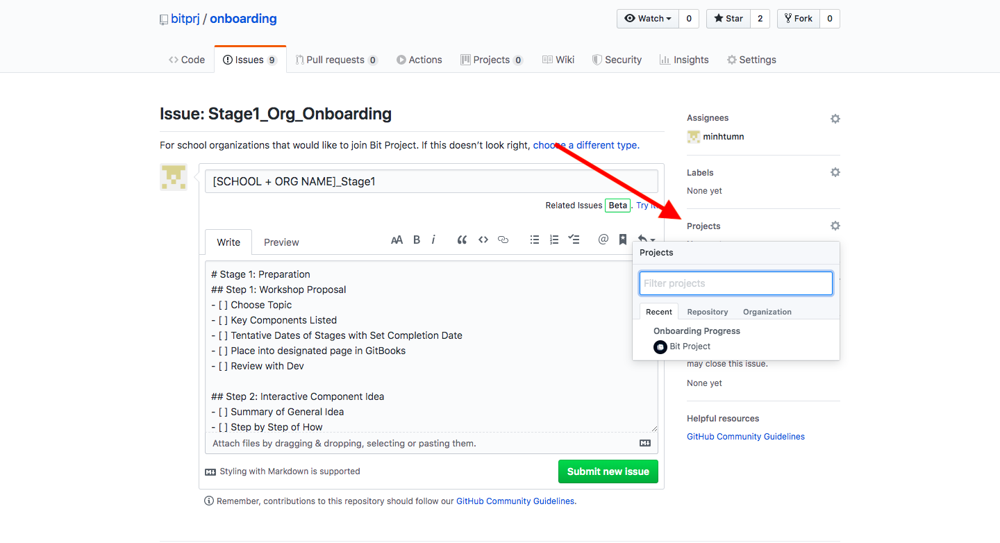

#### Milestone

Connect your issue to a Milestone to track multiple issues at once. It allows an easy visualization to which issues are open and which are closed.

Select Milestones on the right hand side to see the available milestones.

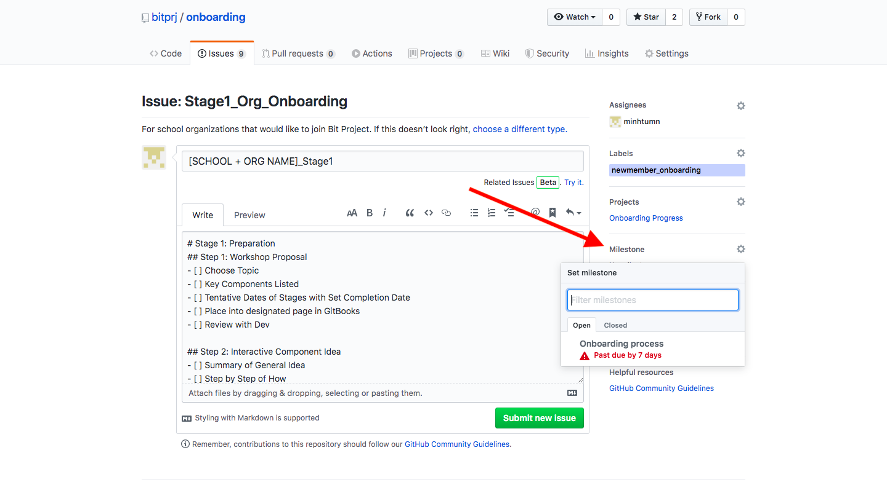

### Step 6: Select Submit New Issue

Once you have created the issue, select the green button Submit new issue at the bottom to submit your issue to the repository.

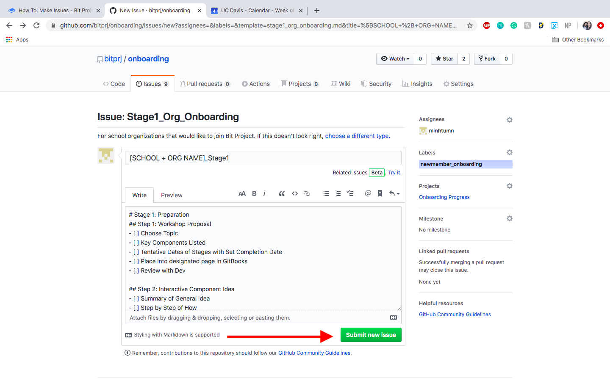

