# How To: Take Meeting Notes

## Making a Copy of Meeting Notes Template

### Step 1: Select "Meetings" Repository

Within the Bit Project GitHub, select "Meetings" repository that you would like to create an issue in.

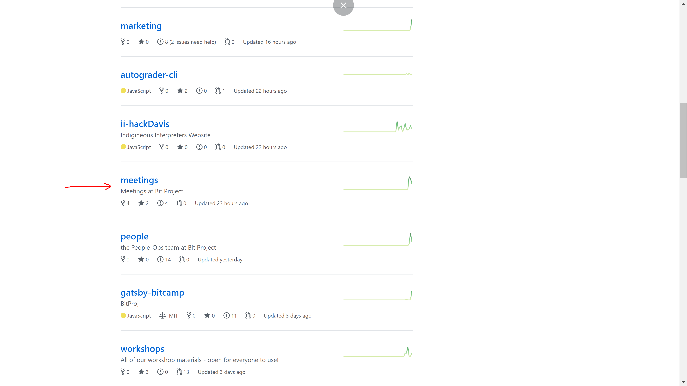

### Step 2: Select "meeting\_template.md" file

Within the "Meetings" repository, open "meeting\_template.md" file.

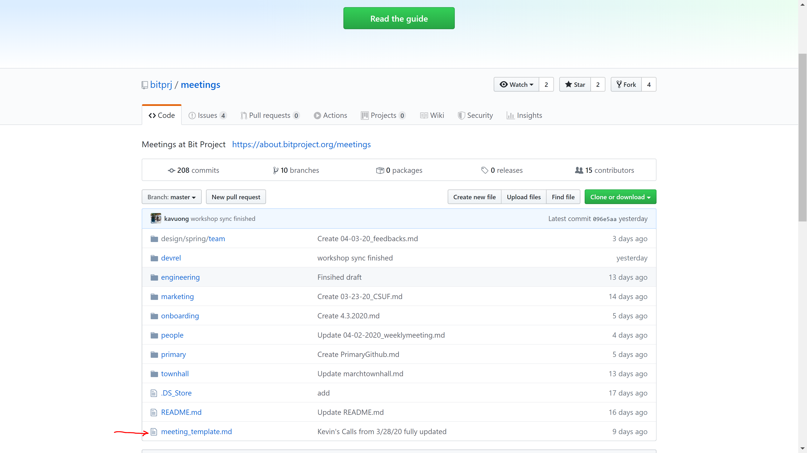

### Step 3: "Edit" the Template

Once "meeting\_template.md" file is opened, copy the markdown file through "edit".

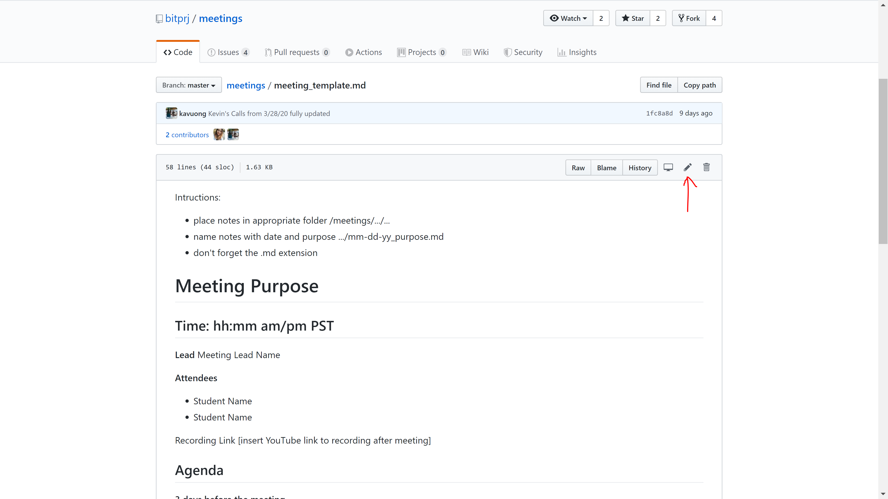

### Step 4: Copy the Template

Select everything on the markdown file then right click to copy all. 

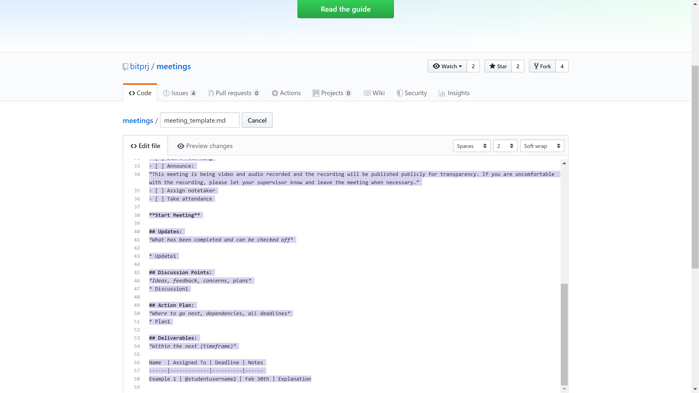

### Step 5: Select your branch in "Meetings" Repository

After you have copied the meeting notes template file, go to the folder that corresponds to your branch in the "Meetings" repository. 

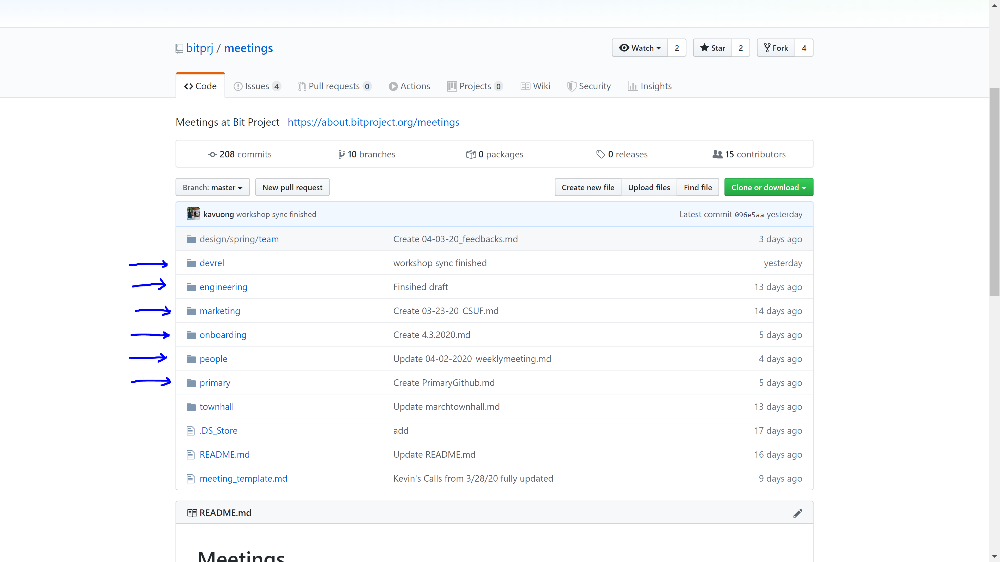

### Step 6: Select a Meeting Folder

Based on whether this is going to be the meeting note for team meeting or 1-on-1 meeting, select the appropriate folder. 

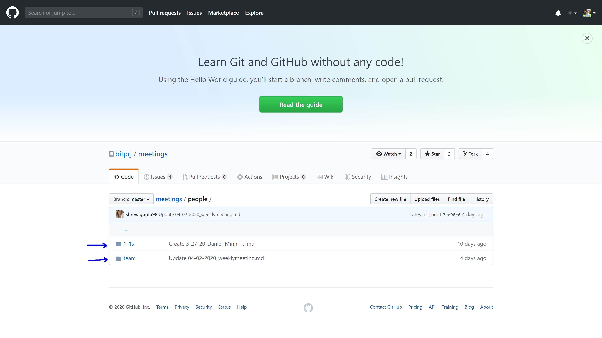

### Step 7: Create a new File

Create a new file and paste your meeting notes template markdown file. 

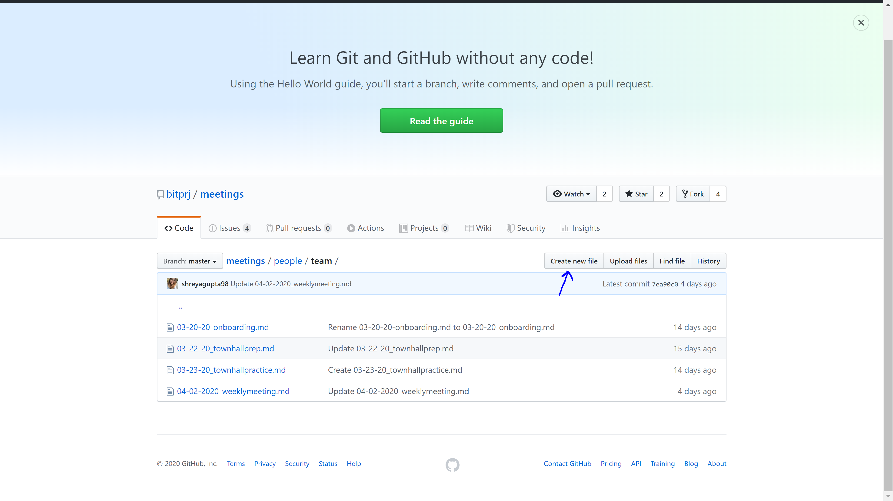

### Step 8: Naming the file

Follow the instruction on the meeting notes template file. Name your meeting note file with the following format: 

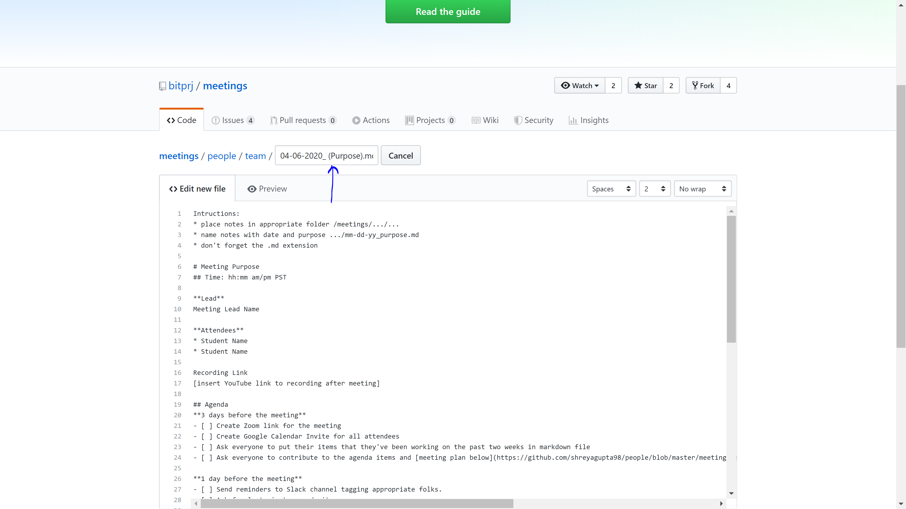

## Taking Meeting Notes

### Step 1: Fill in Meeting Information: Purpose, Time, Lead, Attendees

Replace "Meeting Purpose" with the purpose of the meeting.

Replace "hh:mm am/pm PST" with your meeting time in the "hh:mm am/pm" format. Keep the \#\# in front. 

Replace "Meeting Lead Name" with the name of the person who is leading the meeting. 

Replace "Student Name" with name of students who are attending the meeting. Keep the \* in front of each attendee's name. 

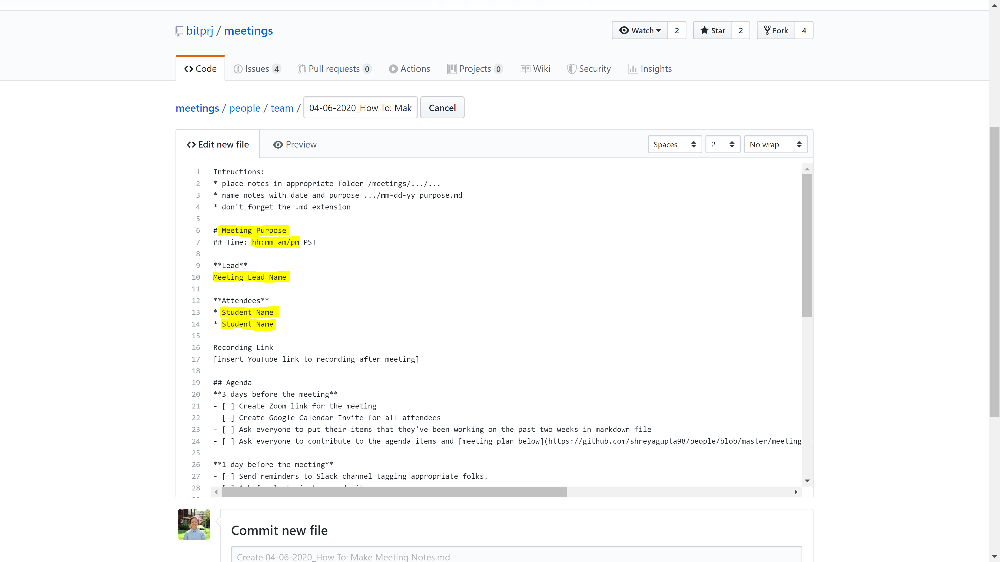

### Step 2: Check off Agenda

The "Agenda" section contains a checklist of things you should do 3 day or 1 day prior to the meeting and at the beginning of the meeting. 

As you finish every step listed in the "Agenda" section, replace the space in \[ \] by putting an "x" in the \[ \]. This checks off the corresponding step. 

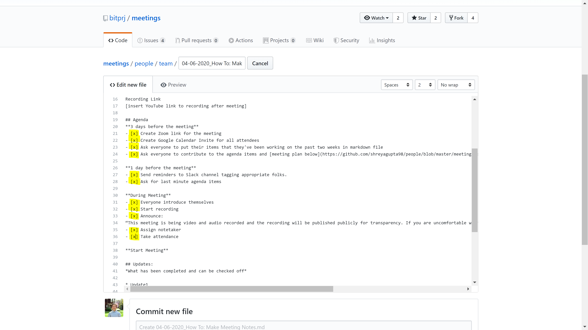

### Step 3: Fill in Updates

During the meeting, you should ask your team members for updates on their tasks. Updates can be tasks that have been completed and can be checked off, or tasks that are still in progress. 

As you get updates from your team during the meeting, fill in the "Updates" section by replacing "Update 1" with your first update.

If you have more than 1 updates, follow the "\*  Update1" format in the next line for subsequent updates. 

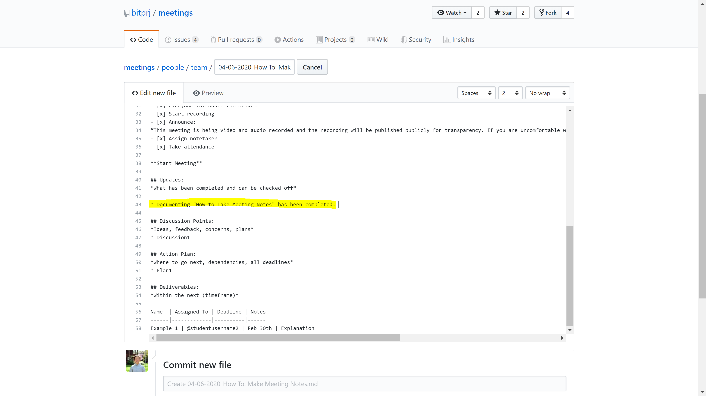

### Step 4: Fill in Discussion Points

"Discussion Points" are things that you and your teammates are discussing during the meeting. It can be, but not limited to, ideas, feedback, concerns, and plans. 

Replace "Discussion1" with the topic of your discussions. 

If you have more than 1 discussion points, follow the "\*  Discussion1" format in the next line for subsequent discussion points. 

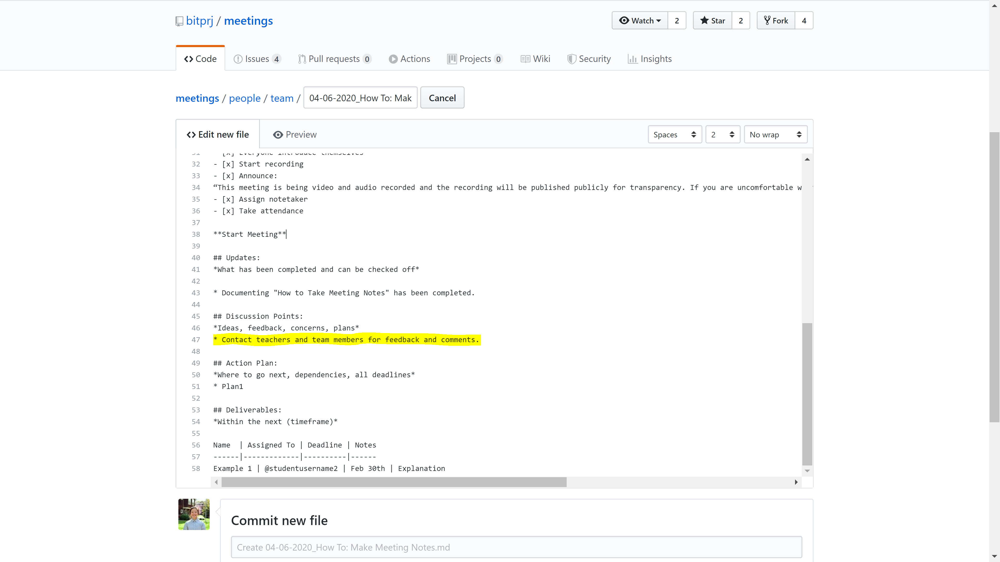

### Step 5: Fill in Action Plan

Fill in "Action Plan" section as you and your teammates come up with new tasks, next steps, and new deadlines. 

Replace "Plan1" with the name of your action plan. 

If you have more than 1 action plan, follow the "\*  Plan1" format in the next line for subsequent actionable steps.

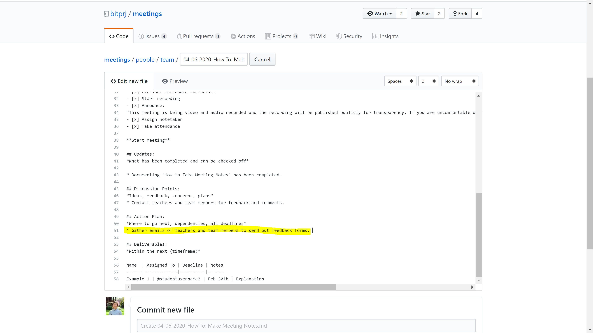

### Step 6: Fill in Deliverables Table

"Deliverables" are tasks with concrete deadlines and due dates coming up in the near future. These are things that can be delivered either as a physical copy or as a document online. 

In the "Deliverable Table":

1. Replace "Example 1" with the name of the task that will be due soon. 
2. Replace "studentusername2" part of the "@studentusername2" with the GitHub username of the student who got assigned to the corresponding task. This step will notify the student of this task. 
3. Replace "Feb 30th" with the due date of the task. 
4. Replace "Explanation" with a short and concise explanation or summary of the task.

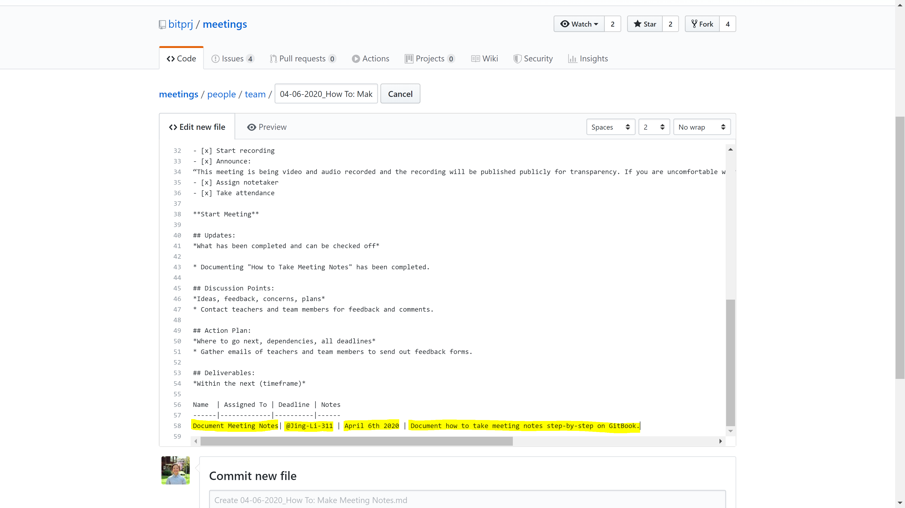

### Step 7: Commit New File

Once you are done with the meeting and you have filled out every section of the meeting note, scroll down to select " Commit directly to the master branch" and "Commit New File" to create this file in your corresponding file location. Then you are done!

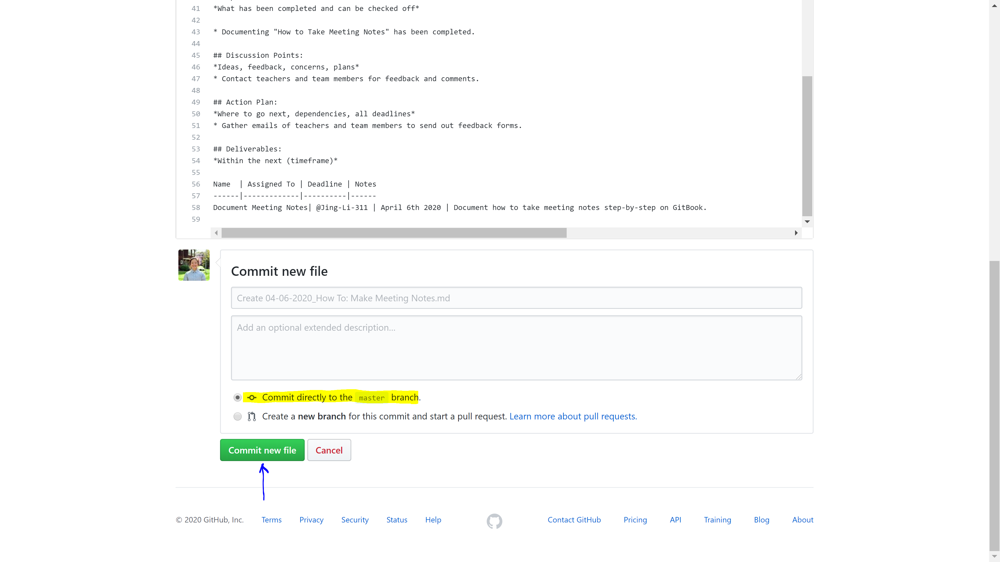

