# How To: Use Issues

## When To Use Issues

### Process

If there is a set process or formality that a member has to follow, we recommend assigning the person an issue. Within the issue should be all the steps listed with checkboxes next time. The member would check of each box once each step is completed until all boxes are marked.

### Tasks

Use issues to assign individual tasks that need to be completed. For example, if you want a member to create an email template to advertise for an API workshop, use an issue to assign the task to that member.

### Bugs

When there are bugs or problems within a file, notify a member of the problem by assigning them an issue within that repository.

## Creating Issues

Refer to [How To: Make Issues](how-to-make-issues.md)

## Completing Issues \(Manager Perspective\)

### 1. Planning

Plan out the specific deliverables that have to be completed. These are essentially the tasks that the manager will have to delegate to the members of the team. Compile these tasks.

### 2. Place plans in meeting notes

Every meeting must have pre-made meeting notes. Place these deliverables / plans into the meeting notes for the upcoming team meeting. This is to have all the tasks in one place and can be seen all at once.

Managers can use the Development-Docs-Sync meeting notes Kevin made above as reference.

### 3. Assignees

Plan out which member will be receiving which task. The manager should have a general idea of which task should go to who based off of interests and strengths. Have an idea of who should be assigned what _before the meeting_

### 4. Meeting

Throughout the meeting, managers will go over completed tasks and new tasks. Every task should be delegated and discussed. Discuss the when the deadline for every task is and make a note of it on the meeting notes.

By the end of the meeting, managers should outline the deliverables very clearly, and get every member _to agree to the provided deadlines._

### 5. Issue Set-Up

Set-up all the tasks as issues. Within the issue should have a checklist of all the tasks that need to be done for the member. The agreed-to deadlines should also be stated within the issues. Remember to the assign the issue to the member so the member can receive a notification and can refer back to it.

Sample: \#30 Bible for Devs issue

### 6. Answer Questions

Make sure to emphasize that as manager, you are very excited and open to answer all questions at any time. It is good to ensure members that it is okay to ask questions whenever they have any.

### 7. New Channel Set-Up \(Onboarding\)

For every major onboarding issue, set-up a channel and encourage the members to ask questions in that group chat. This is so that they have a place to message the manager and the group at the same time. Others may have the same question as well so it is good to have it all in the same place. The members will also know how to contact the manager easily.

### 8. Follow-up \(Part 1\)

The day before the deadline, ask each individual member if they have any questions. Then ensure and clarify that the member will finish their task\(s\) by the agreed deadline\(s\).

### 9. Follow-up \(Part 2\)

On the day of the deadline, check the GitHub issues and see if they have checked off the checkmarks. If the member has not, follow-up with them. Make sure all of their work is in the proper format, if not, please follow-up.

## Completing Issues \(Member Perspective\)

### 1. Receiving Issues

Team managers are in charge of assigning issues. Either through a meeting or via slack, every issue will be discussed and assigned. Managers will discuss deadlines with all the members, coming to an agreement with the due date.

Then the issues and their respective due dates will be placed onto GitHub issues and assigned to the correct individuals. Members should be able to have access to their issues as a task list soon after the meeting or slack conversation.

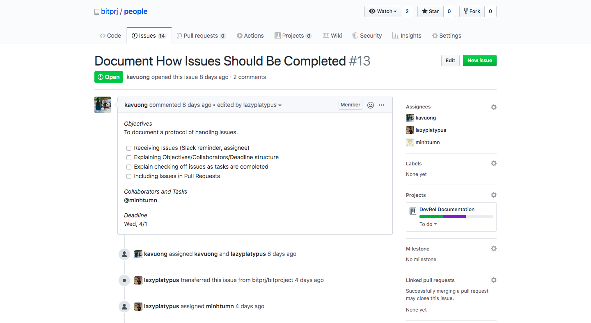

#### Objective:

The objective of these issues is to have a very streamlined and clear way for all members and managers to be on the same page. All the work is outlined in one place that everyone has access to and knows where to find.

#### Collaborator:

#### Deadline:

All deadlines are negotiable, but it is expected that the tasks are completed by the agreed deadline. It is first discussed so that both the manager and member are on the same page, and to determine a reasonable deadline that gives the member enough time to complete.

### 2. Checkmark Tasks

As members go through and completing the tasks on the issues, members should make a habit to checkmark each task once it is finished. This is a good way for members to keep track of which task they have already completed, and it is helpful for managers as they are able to take note of the progress.

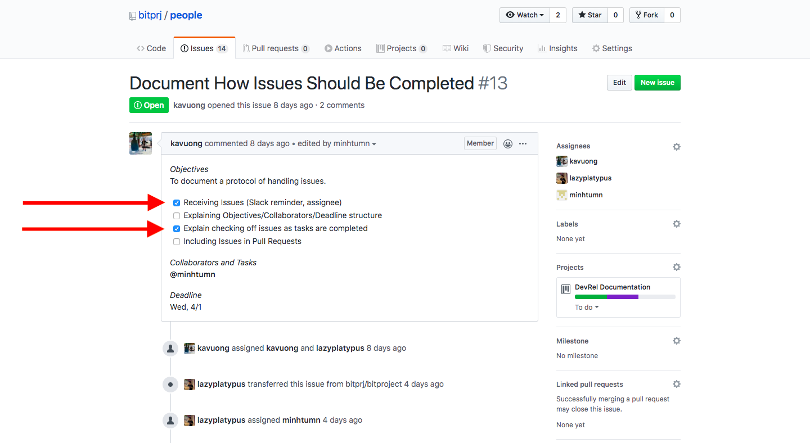

### 3. Including Issues in Pull Requests

Refer to [GitHub Basics](./#making-a-pull-request) for how to make a Pull Request.

When you are submitting a pull request, include your respective issues that you have completed. In the description section, typing in \# will lead to a drop down of the available issues in the repository. Select all of the issues that attain to the pull request.

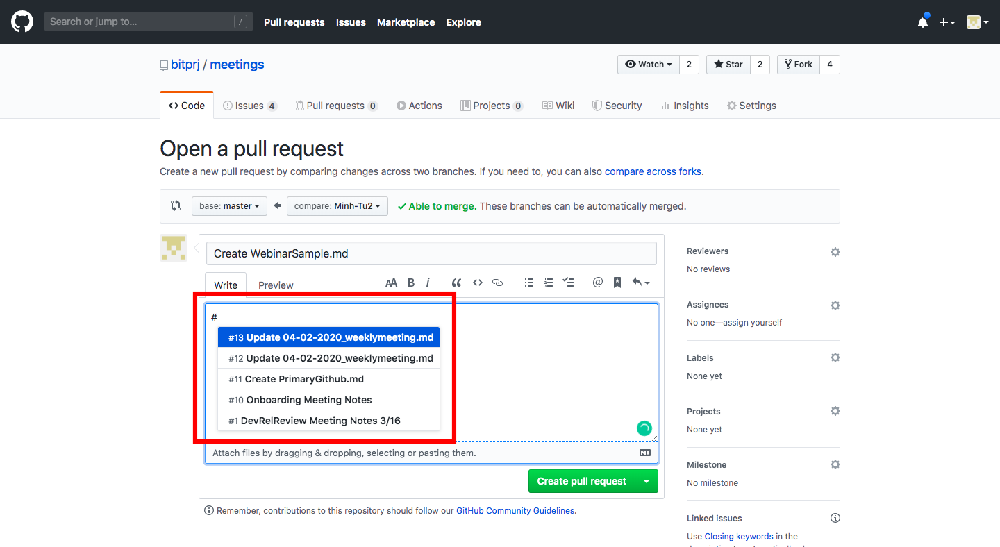

## Tracking Issues \(Milestones\)

Milestones are issue trackers. Managers are able to easily see which issues are open/closed and how much progress is made. If members have multiple issues assigned to them, place the issues into milestones to easily track individual progress. Milestones also allow managers to assign due dates / deadlines.

### How To: Create a Milestone

#### 1. Select the Repository

Select your repository of choice within the Bit Project GitHub.

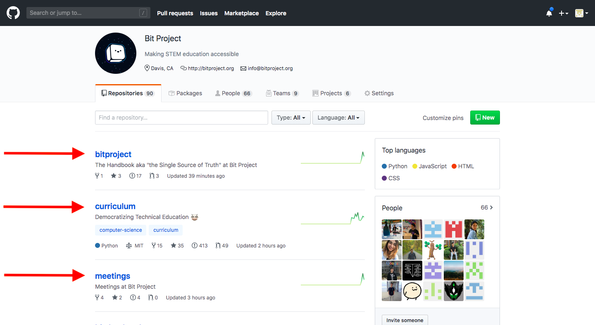

#### 2. Click on Issues

Once you select a repository, click on the issues tab.

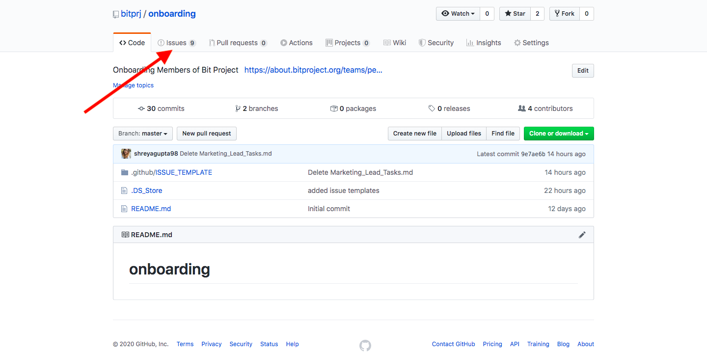

#### 3. Click on Milestones

Then on the right hand side, select Milestones.

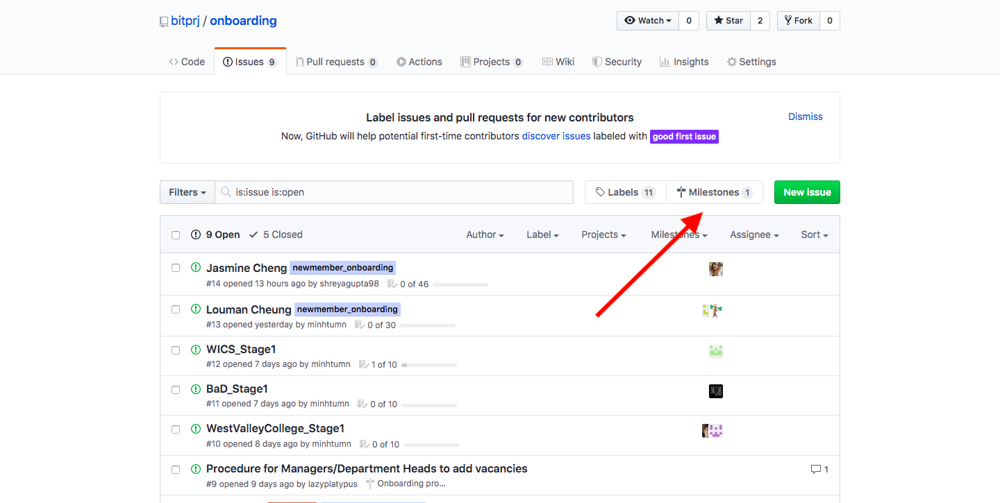

#### 4. Click on New Milestone

Click on the green button on the right hand side that says New Milestone.

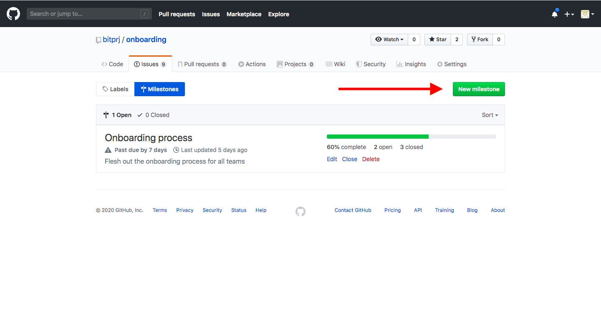

#### 5. Add Details

**Title:** Add a relevant title. For example, if it is a milestone for a specific member, name the milestone \[Insert Name\]'s Milestone.

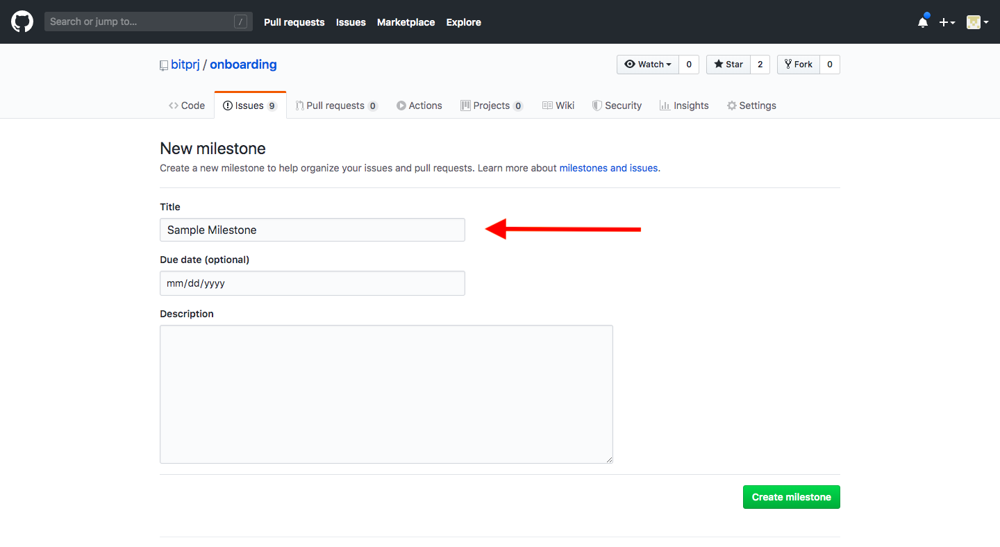

**Due Date:** Set a deadline for when the milestone should be due. This means that all issues within the milestone should be closed by this date.

**Description:** Include a short description of what the purpose of the milestone is.

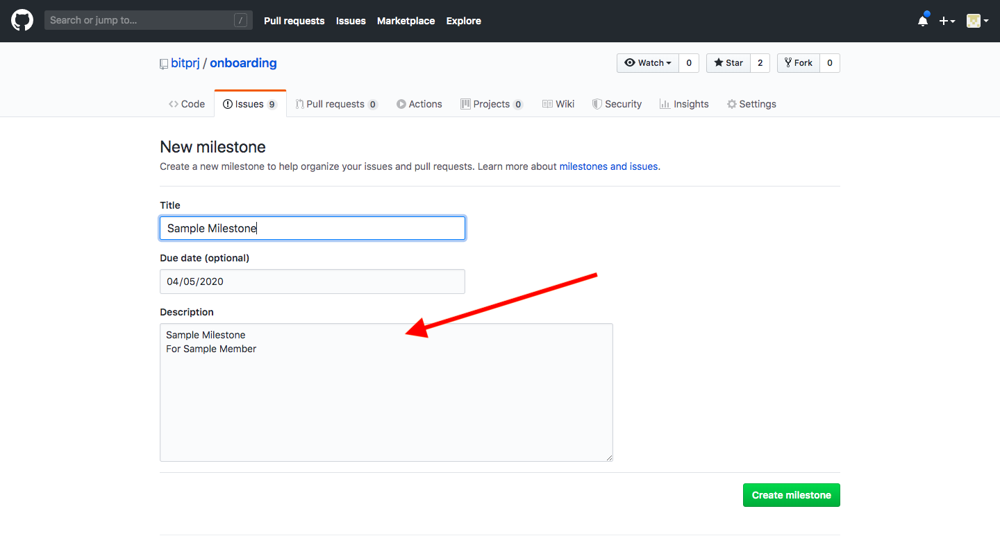

#### 6. Click on Create Milestone

Click on the green button Create Milestone.

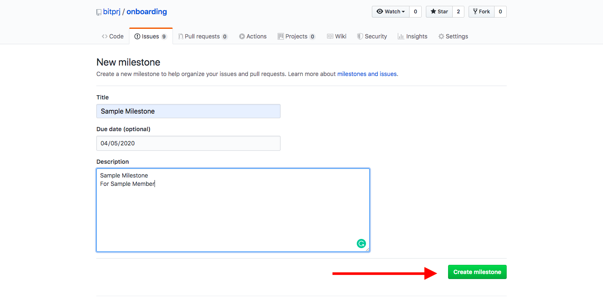

The milestone should then appear within the milestone page.

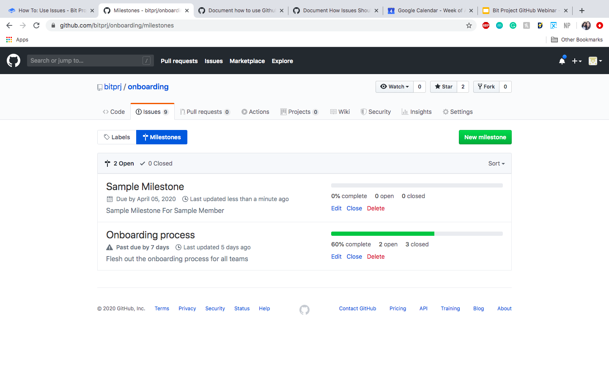

### How To: Assign Issues to a Milestone

When creating an issue \(refer to [How To: Make Issues](how-to-make-issues.md)\) , select Milestone on the right hand side of the page. It would have a drop-down of all the available Milestones within the repository. Select the one you wish to add the issue to.

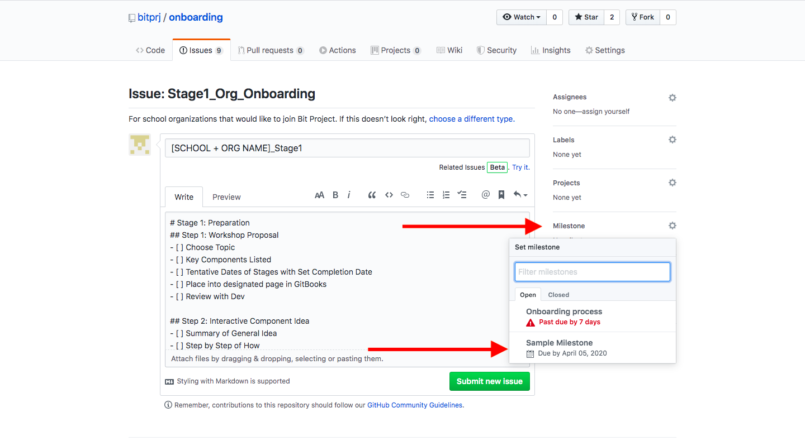

