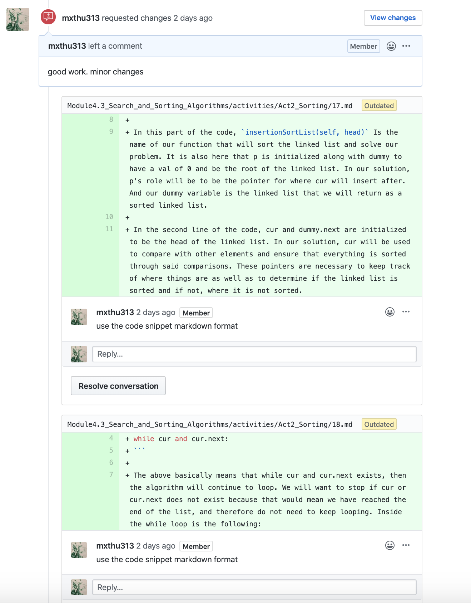
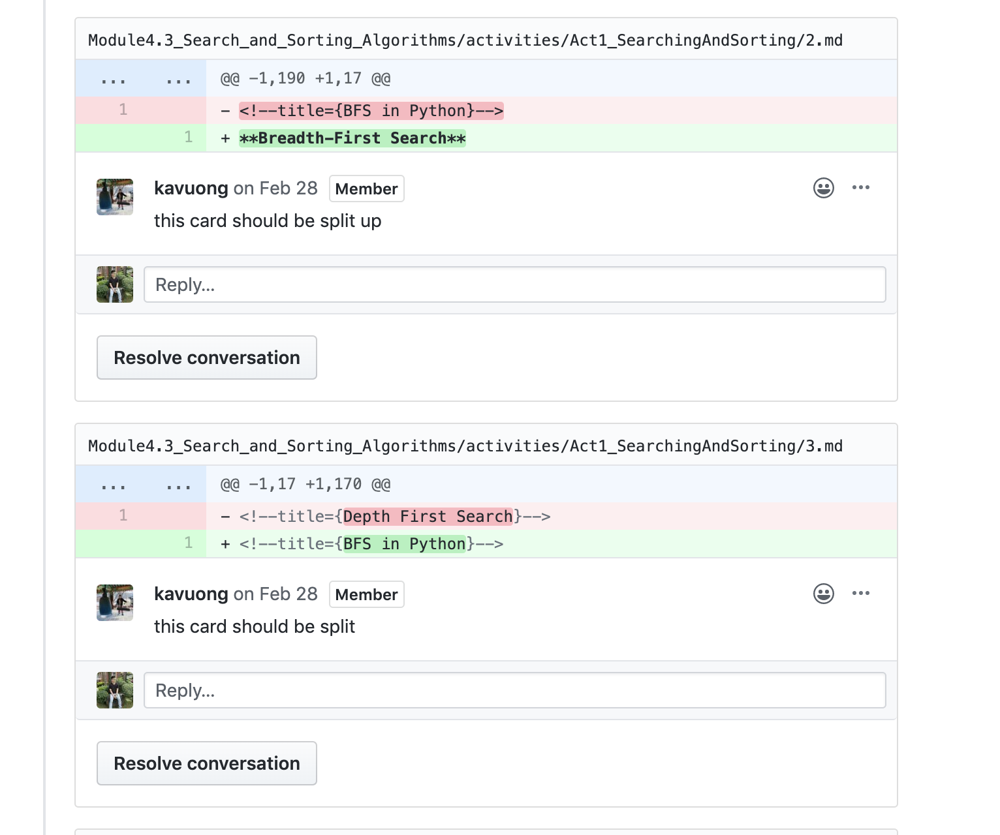

# Bible for Developers

## General Checklist

#### General Items \(Apply to All Stages\)

* [ ] High-schooler friendly writing style, easy to understand
* [ ] Correct numbering
* [ ] Every card has code\* 
* [ ] 1 scroll per card\*\*
* [ ] Proper grammar, punctuation, capitalization, etc.
* [ ] Acceptable Styling per the Pull Request Checklist

\*Exception being hard and medium cards in labs as well as activity cards that just introduce concepts

\*\* If you have to scroll more than once to view the whole card, the card is too long



#### Stage 1 - Starting Content

* [ ] Content of cards is more accessible to beginners
* [ ] Micro to Macro Principle
* [ ] Titles for Concepts associated with each Card

#### Stage 1 - Lab Addendum

* [ ] Hard cards provide enough guidance for the student to finish task
* [ ] Mediums bridge Hards and Easys
* [ ] Easy cards provide solution, are line-separated
* [ ] Solution and starter code in Airtable and GitHub
  * [ ] Code is testable, not too general



#### Stage 2 - Finishing Content

* [ ] Logical card progression 
* [ ] Ample pictures/custom visuals \(copyright-free, Pexels is a great source\) 
  * [ ] Images placed _locally_ with &lt;img&gt; NOT Markdown 
  * [ ] all &lt;img&gt; tags should close properly &lt;img ... /&gt;
* [ ] \(For activities\) Fleshed-out, real-life scenarios
* [ ] 2-3 Checkpoints \(Types: Short Answer, Image, Multiple Choice, Video, Autograder/Code\)
* [ ] All concepts fleshed out

#### Stage 2 - Lab Addendum

* [ ] Medium and easy cards split into hints 
* [ ] 2-3 code checkpoints, depending on length of lab
  * [ ] Solution Code for checkpoints



#### Stage 3 - Finishing Touches

* [ ] Correct formatting according to READMEs
  * [ ] Modules
  * [ ] Activities
  * [ ] Labs
  * [ ] Hints \(Medium + Easy Cards\)
  * [ ] Concepts
  * [ ] Checkpoints
  * [ ] With test cases for checkpoints if applicable
* [ ] Concepts for each card completely finalized, with correct README formatting

**Stage 3 - Lab Addendum**

* [ ] 5-10 test cases, correctly formatted according to READMEs



#### Stage 4 - For Reviewers Only

* [ ] Assigned modules' folders properly structured within topics
* [ ] Gem Amounts 
  * Labs: calculated using John's Code 
  * Activities: Predetermined amounts
* [ ] Have curriculum proofread by writing team \(currently Victoria Xu @vkxu657\)



## How This Checklist Is Used Beyond Development

### Developer

For Developers, this checklist will be used to help guide them in the production of curriculum. It will serve as a checklist to help determine what a developer should or should not do when they are creating labs and activities.

For example, as developers are doing the activity cards, there is a checklist box that states that there must be 2-3 checkpoints in the activity. By using this checklist as a guide, developers would then remember to add checkpoints somewhere in the list. This would then save the developer's reviewer's time as the reviewer would not have to ask the developer to add the missing content and wait again for the developer to implement what is missing.

### Manager

For Managers, this guide will be useful for checking on the work of the developers, streamlining the process of giving feedback.

For example, In the following we have Michelle as a Manager/Reviewer. In the pull request Checklist portion of this page, there is a checkbox that states "Correct Markdown Formatting", and as seen below, that checkbox was put to good use. By checking in this page, it is now easier to spot what needs to be revised, leading to faster and more efficient feedback given to the developer.

### Kevin

This is the second layer for reviewing the curriculum. Kevin is in charge of the pull requests made by the managers. As a result, he needs to review a lot of curriculum, and using this checklist will further help save time and work in the reviewing process.

In the following example, Kevin saw the 1 scroll per card checkbox, and therefore made the following review:

### Daniel

Our Leader Daniel is the final layer in the review process. He Double checks what Kevin reviews and makes sure that the curriculum being used is as close to perfection as possible. And it is through this checklist that his job can be made easier as he just needs to use it as a guide to see what the other reviewers may have missed out on.

