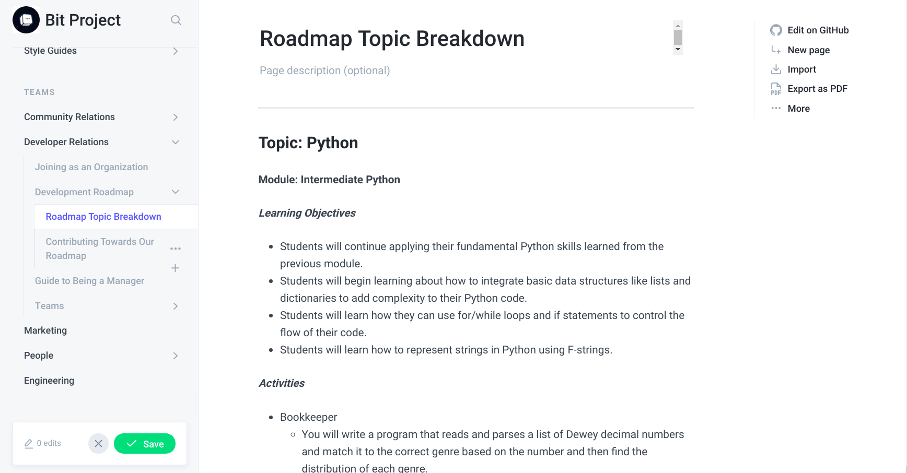

# Contributing Towards Our Roadmap

## Road Map Checklist

Each Bit member looking to contribute towards the road map must complete the following checklist:

### Pre-approval

* [ ] Asked a head \(Kevin\) to give you write access to GitBooks
* [ ] For each module: 
  * [ ] 3-4 relevant learning objectives
  * [ ] 4-5 sample activities with a one-sentence description
  * [ ] 2-3 sample labs with a one-sentence description
  * [ ] \(if applicable\) modules on road map before it and after it  
* [ ] GitBook Variant/GitHub branch set up with your modifications in the page "Roadmap Topic Breakdown"
* [ ] Content all correctly formatted

### **Post-approval**

* [ ] Placing modules appropriately within the Lucidchart road-map

Note that if you are looking to add to the road-map, you should make an issue on our dedicated About Repo [here](https://github.com/bitprj/bitproject).

## How to Complete this Checklist

Upon receiving a road map assignment, the above checklist will be assigned to you as an issue in our `bitproject` [repository](https://github.com/bitprj/bitproject). This checklist should be completed within **2 days.** 

To begin the process, please log into Bit Project's GitBooks. If you do not have access, please message Kevin \(@Kevin V\) on Slack as soon as possible.

### Pre-approval

#### Variants

You should then immediately make a **variant** on GitBooks, named `xxx-modules`, and the xxx should be filled in with your module name. Making a variant essentially starts a new version of our About page, that is independent of the `master` version. It will also automatically make a new branch on GitHub as well. Please follow this [guide](https://docs.gitbook.com/editing-content/variants) provided by GitBooks for how to create a variant. 

#### Development

You can then begin putting your ideas on paper! All of your work should go in the "Roadmap Topic Breakdown" page. \(Teams &gt; Developer Relations &gt; Development Roadmap &gt; Roadmap Topic Breakdown\)

You should put all of your learning objectives, activities, labs and descriptions here.

**Please start a new section for your topic. You should use the exact same formatting as the given Python topic.** The Intermediate Python module is an example to follow. 

**Make sure to click Save** \(green button\) **and Merge** \(purple button\) to completely ensure your work is saved!!

When you are done working, head back to [GitHub](https://github.com/bitprj/bitproject) and submit a pull request to `master` from the branch you created. When you made a variant, it automatically made a branch in GitHub, so you should make a pull request from `xxx-modules` to `master`. Make sure you have completed everything in the checklist before submitting your pull request!

### Post-approval

Please place your modules into Lucidchart. If you do not have access, contact @Kevin V on Slack. If there is any questions about the exact placement of your modules within the road map, do contact Kevin, another sync may be needed.

## Example of a Module Breakdown

**Module: Intermediate Python**

_**Learning Objectives**_

* Students will continue applying their fundamental Python skills learned from the previous module.
* Students will begin learning about how to integrate basic data structures like lists and dictionaries to add complexity to their Python code.
* Students will learn how they can use for/while loops and if statements to control the flow of their code.
* Students will learn how to represent strings in Python using F-strings.

_**Activities**_

* Bookkeeper
  * You will write a program that reads and parses a list of Dewey decimal numbers and match it to the correct genre based on the number and then find the distribution of each genre.
* Creating a Menu
  * You will write a simple menu program which prints a menu and behaves according to user input.
* Message Cipher
  * Encode user input with both a Caesar Cipher and a Symmetric Cipher.

_**Labs**_

* Word Translation Calculator
  * You are going to write a program that calculates how often a word appears in a given string.
* Basic Calculator
  * Create a functional calculator in python that can do simple arithmetic operations on two numbers.
* Tic-Tac-Toe
  * Write a Tic-Tac-Toe game, and you will play against an AI which chooses random moves.

