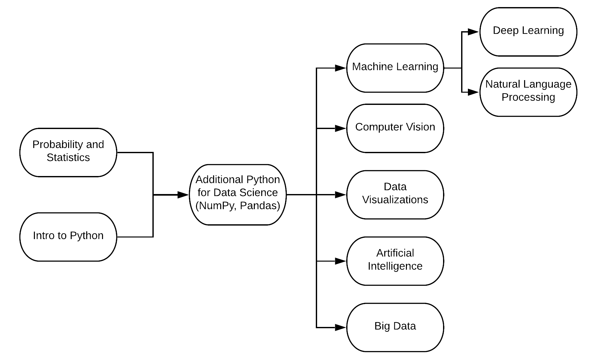

# Data Science Roadmap

## Topical Breakdown

* Probability and Statistics
  * Basic Statistical Concepts: Population, Sample, Variance, etc.
  * Descriptive Statistics: Mean, Median, Percentiles, etc.
  * Probability Distributions
  * Sampling Distributions
  * Statistical Inference
  * Significance Testing
* Intro to Python
  * Python Fundamentals
  * Intermediate Python
  * Essential Python Applications
* Additional Python for Data Science
  * Introduction to NumPy
  * Introduction to Pandas
  * Introduction to Matplotlib
  * Making Visualizations Pretty with Seaborn
* Machine Learning with Scikit-Learn
  * Review of Prerequisites: Linear Algebra, Gradient Descent, Probability
    * Supervised Learning
    * Linear Regression
    * Multiple Linear Regression
    * Logistic Regression
    * Neural Networks 
    * Support Vector Machines
    * Naive Bayes Classifiers
    * K-Nearest Neighbors
    * Decision Trees
  * Unsupervised Learning
    * K-Means Clustering
    * Dimensionality Reduction \(t-SNE, PCA\)
* Computer Vision
  * Features and Filters
    * Linear filters
    * Edge detection and image gradients
    * Edges, contours, and binary image analysis
    * Texture
    * Color
  * Grouping and Fitting
    * Gestalt properties
    * K-means, Mean-shift, Spectral clustering
    * Hough transform
    * Deformable contours
    * RANSAC
    * Homography
    * Recognition
  * Local Invariant feature detection and description
    * Indexing local features
    * Instance recognition
    * Generic category recognition
    * Discriminative classifiers \(Nearest Neighbors, Support Vector Machines, Boosting\)
    * Window-based models
    * Part-based models
* Data Visualization \(with Tableau\)
  * Tableau Essentials & Basic Operations
  * Connecting to Data in Tableau
  * Visual Analytics
* Artificial Intelligence
  * Searching Algos: Uniform-cost Search, Greedy Search, A\* Search, Heuristics
  * Constraint Search Problems
  * Game Trees, Minimax Search, Expectimax Search
  * Markov Decision Problems
  * Reinforcement Learning
  * Review of Probability
  * Bayes' Nets
  * Hidden Markov Models
* Big Data
  * Intro to Hadoop
  * HDFS, MapReduce, Sqoop
  * Apache Hive and Impala
  * Apache Pig
  * Basics of Apache Spark
  * Parallel Processing and Optimization with Apache Spark
* Deep Learning
  * Review of Prerequisites: Linear Algebra, Probability, Gradient Descent
  * Feed-Forward Neural Networks \(FFNNs\)
  * Convolutional Neural Networks \(CNNs\)
  * Recurrent Neural Networks \(RNNs\)
* Natural Language Processing
  * Text Classification
  * Language Modeling
  * Vector Semantics and Embeddings
  * Part-of-Speech Tagging
  * Sequence Processing with Neural Networks
  * Context-Free Syntax
  * Context-Free Parsing Algos

