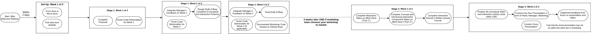
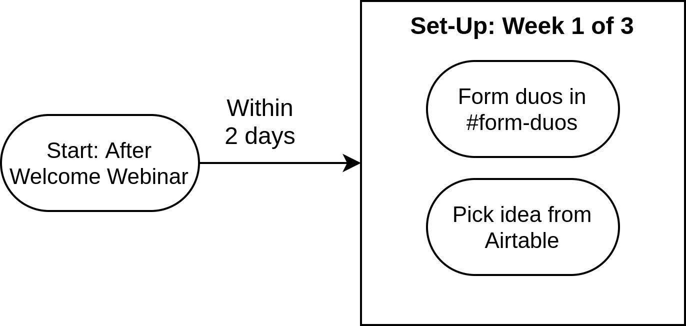

# Introducing Workshops

## Introduction

Workshops are Bit Project's next endeavor in our efforts to democratize technical education. Up until now, we've been working on Labs and Activities, but we want to begin the shift to a more exciting and interactive way of teaching. We will be creating presentations to teach students through a live workshop at the end of the workshop cycle.

### Why Workshops?

The hope is that workshops will be a more hands-on, purposeful method of both teaching and learning. On the development and teaching end, we will get the opportunity to curate a project that we are personally interested in along with a partner who is equally engaged with the material. For students, the learning process will be visual and engaging, including a chance to apply newly learned skills in a fun way.

### Contributing to Workshops

#### Teams

Within our current teams, we will pair up with another team member based on a shared interest in a topic. We will get a list of topics we are interested in, and each choose what we think is exciting. This is will ensure you are working with someone who will be equally as enthusiastic about the subject matter. Then, you will collaborate to create a proposal of how you will present the topic to students, and eventually create an entire workshop together.

#### Workshop Components

There will be two versions of every workshop: slides and labs. The labs are similar to what we've already been working on. This time, though, we will be creating the presentation slides first, and then converting them into labs. This will help foster the excitement for developers, since the presentation is what we will be directly involved with. Presentations will be around 90 minutes long, so there should be enough slides to cover the material in-depth. The slides will include a general overview of the concept and then an interactive activity the students will participate in. Then, the labs are created so online access is available later.

#### Roles

Each pairing will be composed of two **Workshop Developers.** The two developers should delegate tasks equally, with the assistance of their manager.

## What are you delivering?

A workshop development cycle will typically last five weeks, and be split into Stage 1 \(Blog\) and Stage 2 \(Presentation\).

Every duo will complete Stage 1: Blog. In Stage 1, duos will first work together to come to a consensus on an original workshop idea. With that idea in hand, in the first _three weeks_, each duo will complete:

1. A **blog post** that describes how to code out the idea
2. **Code** Behind Idea 
3. A GitHub repository containing all code behind the workshop, commented with explanations

 Note that the blog post will describe the code in lots of detail, and should explain .

After three weeks, the marketing team will edit your blog for marketing purposes and your work will be published. If your blog generates a lot of traffic, the marketing team will ask your duo to fully develop and present a workshop out of it. You will then complete the following in the next _two weeks_:

1. MDX-Deck **presentation slides** on concepts
2. **Written activity** on interactive portions
3. A live presentation 

Your presentation slides should be in MDX-Deck format. Documentation can be found [here](https://github.com/bitprj/mdx-deck). 

At the end of two weeks, your presentations will be held. They will be recorded and put on YouTube.

## Process

The entire process can be found in this flow chart:

This flow chart will be explained in the following sections.

### Starting Out

* [ ] Form duos
* [ ] Pick Idea from Airtable

You and your partner must decide on a topic. Please consult our [Airtable](https://airtable.com/shr12uFGnpHyIM6bU) spreadsheet of ideas. Note that each duo should pick a **dataset** of their interest, and the sample ideas are just there to help inspire ideas you may have.

After completing those introductory tasks above, your duo will continue with a 3 week process to produce a blog post \(Stage 1\). Click the following link to continue:



Your blog will be published by the marketing team, and your duo will immediately proceed to work on another workshop. After three weeks, if your blog performs well and is picked by the marketing team as a workshop to pursue, your duo would proceed to develop a workshop based on that blog \(Stage 2\). Click the following link to continue:



### Choosing an Idea Workflow \[OUTDATED\]

Note that this is an **outdated** workflow and may be continued in the future.

If you _choose an idea_, your duo will follow a **3 week process** to prepare your deliverables.



### General Slide Checklist

After looking into the specific requirements for the content of each individual part of the workshop, here are some requirements that all of the slides should fulfill **every week**:

* [ ] Precise headers
* [ ] Appropriate formatting 
* [ ] Correct spelling, grammar, and punctuation
* [ ] Concise text \(includes clear descriptions without tangents\)
* [ ] Smooth transitions \(includes references to previous slides, if needed\)
* [ ] Consistent pacing \(includes significant and meaningful content\)

## Miscellaneous Resources

Here are some resources that may help you with workshops:







