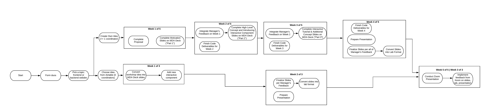

# Introducing Workshops

## Introduction

Workshops are Bit Project's next endeavor in our efforts to democratize technical education. Up until now, we've been working on Labs and Activities, but we want to begin the shift to a more exciting and interactive way of teaching. We will be creating presentations to teach students through a live workshop at the end of the workshop cycle.

### Why Workshops?

The hope is that workshops will be a more hands-on, purposeful method of both teaching and learning. On the development and teaching end, we will get the opportunity to curate a project that we are personally interested in along with a partner who is equally engaged with the material. For students, the learning process will be visual and engaging, including a chance to apply newly learned skills in a fun way.

### Contributing to Workshops

#### Teams

Within our current teams, we will pair up with another team member based on a shared interest in a topic. We will get a list of topics we are interested in, and each choose what we think is exciting. This is will ensure you are working with someone who will be equally as enthusiastic about the subject matter. Then, you will collaborate to create a proposal of how you will present the topic to students, and eventually create an entire workshop together.

#### Workshop Components

There will be two versions of every workshop: slides and labs. The labs are similar to what we've already been working on. This time, though, we will be creating the presentation slides first, and then converting them into labs. This will help foster the excitement for developers, since the presentation is what we will be directly involved with. Presentations will be around 90 minutes long, so there should be enough slides to cover the material in-depth. The slides will include a general overview of the concept and then an interactive activity the students will participate in. Then, the labs are created so online access is available later.

#### Roles

Each pairing will be composed of two **Workshop Developers.** The two developers should delegate tasks equally, with the assistance of their manager.

## What are you delivering?

1. MDX-Deck presentation slides
2. Lab converted from slides
3. A live presentation 

Your presentation slides should be in MDX-Deck format. Documentation can be found here: \[TO BE DONE\]

During the preparation of your slides, you will also work with your partner to create a lab out of your workshop.

At the end of each cycle, you will hold a presentation for your manager and everyone in Bit. Presentations will be recorded and put on YouTube.

Every month, each manager will **designate** **two duos** that will have their workshops marketed for technical communities around the nation. These workshops will be presented to a broader audience. 

## Process

The entire process can be found in this flow chart:

This flow chart will be explained in the following sections.

### Starting Out

* [ ] Form duos
* [ ] Pick Topic
* [ ] Decide whether to choose existing idea \(3 weeks\) or pursue original idea \(5 weeks\)

You and your partner must decide on a topic. Please consult our [roadmap](../development-roadmap/#current-topics-in-focus) for the current topics we are covering.

Also, each duo must decide whether they would like to pursue an workshop idea. By default, you can choose an idea from our pre-compiled list on Airtable. Please ask a manager to share the Airtable with you.

### General Slide Checklist

After looking into the specific requirements for the content of each individual part of the workshop, here are some requirements that all of the slides should fulfill **every week**:

* [ ] Precise headers
* [ ] Appropriate formatting 
* [ ] Correct spelling, grammar, and punctuation
* [ ] Consise text \(includes clear descriptions without tangents\)
* [ ] Smooth transitions \(includes references to previous slides, if needed\)
* [ ] Consistent pacing \(includes significant and meaningful content\)

### Creating Your Own Idea

If you _create your own idea_, your duo will follow a **5 week process** to prepare your deliverables.

Note that if you chose a dataset you are going down this path.



### Choosing an Idea

If you _choose an idea_, your duo will follow a **3 week process** to prepare your deliverables.



### 

## Miscellaneous Resources

Here are some resources that may help you with workshops:







