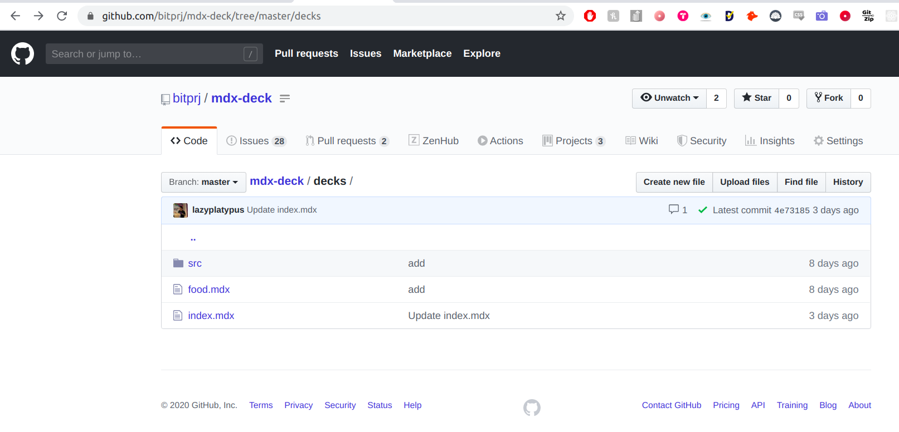
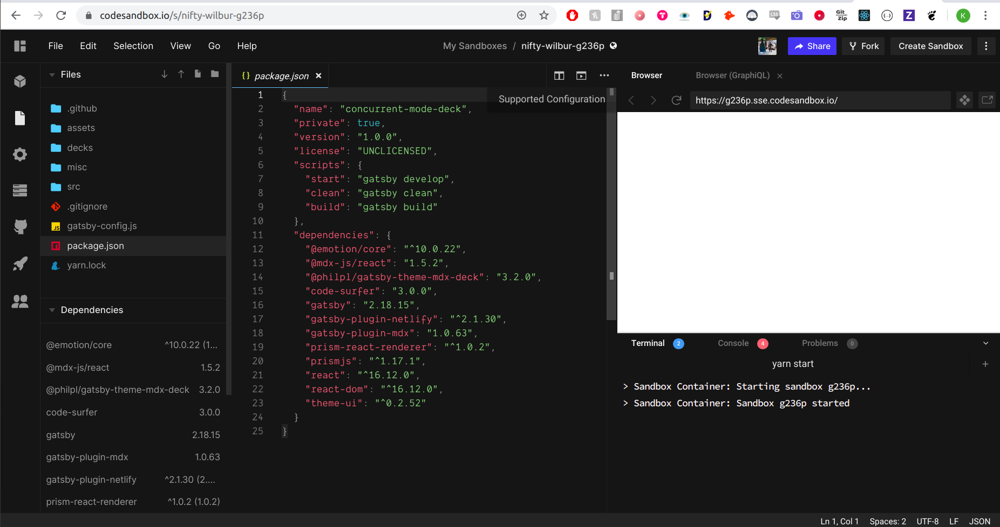
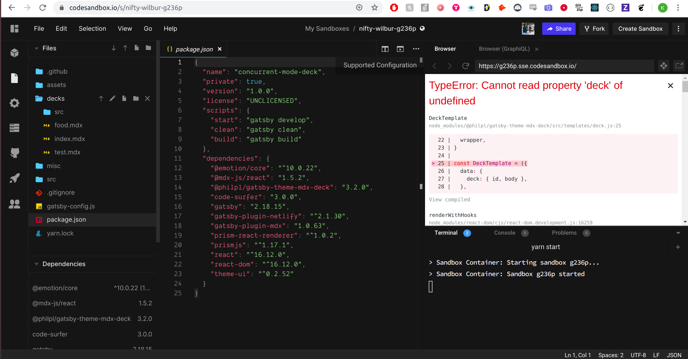
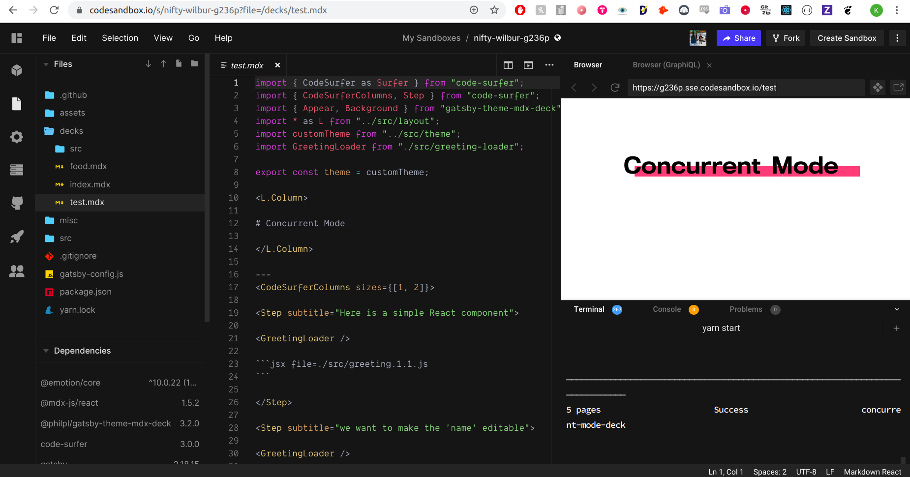

# New Managers' Task

**Goal**: create a 30-60 minute **interactive, fun and relatable** presentation in MDX-Deck, on any set of modules covered on our road map. You will be assigned a _GitHub issue_ for this task, and by the deadline, you will set up a **pull request** with your presentation to our workshop repository.

You must make your presentation as a .mdx file compatible with MDX-Deck. A week from your initial 1-1 with the head of Developer Relations, you must have set up a pull request to [this repository](https://github.com/bitprj/mdx-deck). 

Your .mdx file should go under the **decks folder** in that repository. 

## Code Sandbox

There is no need to install MDX-Deck on your local machine. You should set up a GitHub branch and Code Sandbox based on the guide [here](https://about.bitproject.org/teams/developer-relations/setting-up-code-sandbox).

When you click on the Sandbox, your browser should look like this:

You should wait till the bottom-right corner has a success message - usually along the lines of "Sandbox Started".

The decks to be edited are all located in the `decks` folder. The file manager to access this folder is on the far left.

If I wanted to work on `food.mdx`, I can open the `food.mdx` file from the `decks` folder, and **add /food to the Sandbox URL to the Browser** on the right side of my screen:

Now I can see the presentation indicated by food.mdx in my screen. 

Please start your work by creating your **own** .mdx file within the decks folder, with an appropriate workshop name. 

To start your work with a slide template, **copy all content from food.mdx to your new file.**

Try loading your own .mdx file by adding **/&lt;insert\_name\_here&gt;** to the Sandbox URL.

Please make your presentation within this .mdx file. You can use the existing slide templates already given to make your presentation \(do not worry about styling for now\). Instructions on how to write-up your .mdx file can be found in the README of the GitHub repository. 

When finished or want to save your work, you should **fork the GitHub repository, make a new .mdx file under the decks folder, and copy the content of your .mdx file over.**

Before your presentation, make sure to **set up a pull request from your fork to `master`** with the label "new-manager-task". Your pull request should also **close your assigned issue.**

