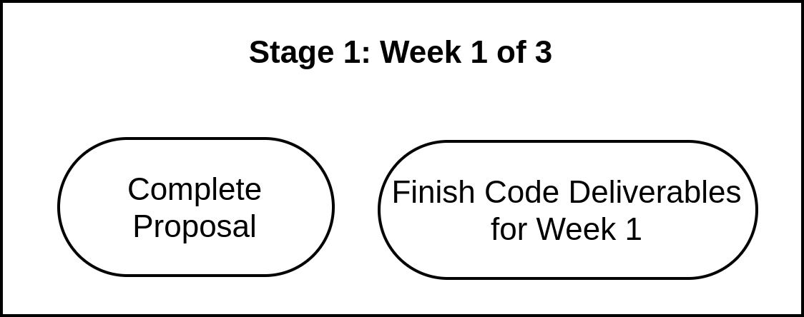
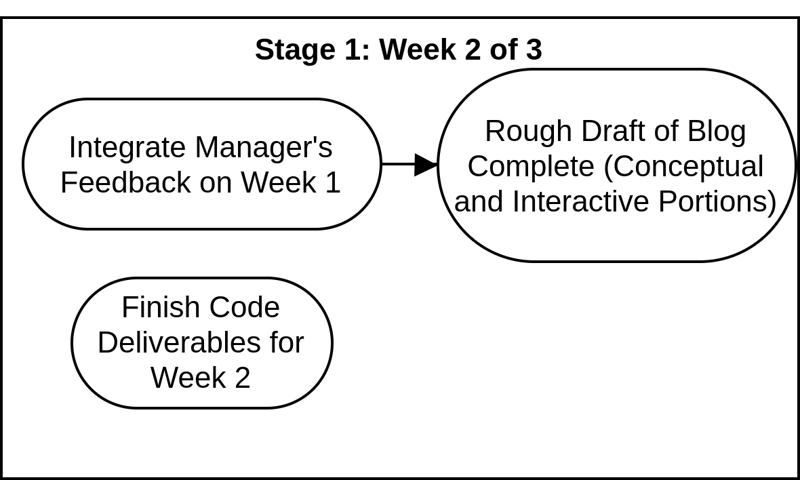
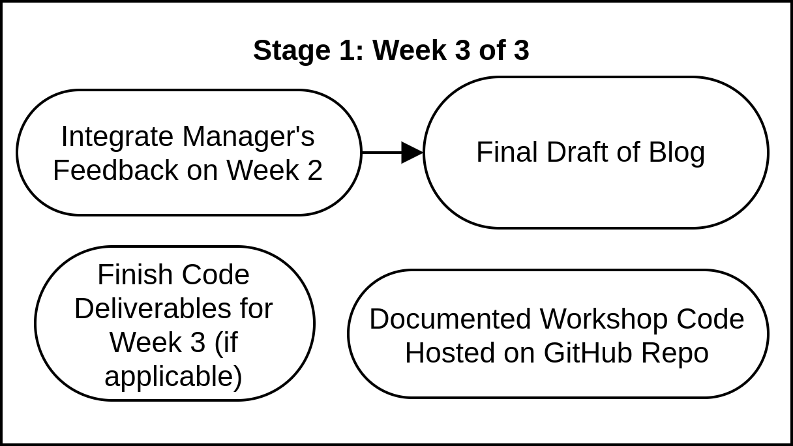

# Responsibilities for Stage 1: Blog

As a manager, you should always be completing all of your work in GitHub, and be updating the Epics and issues referenced above. Your head will be periodically monitoring your project, Epics and issues.

## Week 1 of 3: Formalizing Your Idea

**Week 1 Checklist for Developers**

_This checklist should have the label `weekly-dev`with a title format: \[Topic Name\] \[Project Name\] Stage 1 - Week 1 of 3: Dev Tasks._

* [ ] Proposal
  * [ ] Specific Idea
  * [ ] Interactive Component
  * [ ] Code Deliverables
  * [ ] Slide Outline
  * [ ] Timing
  * [ ] Motivation Behind Project
  * [ ] Difficulty/prior experience
  * [ ] Technologies that will be used
* [ ] Complete Code Deliverables Planned for Week 1

### Week 1 Checklist for Managers

_This checklist should have the label `weekly-manager`with a title format: \[Topic Name\] \[Project Name\] Stage 1 - Week 1 of 3: Manager Tasks._

* [ ] Follow-up on proposal, ensure proposal is **detailed** and **specific**
  * [ ] Proposals should be labelled with a title of \[Topic\]-\[Workshop Name\]-Proposal.md AND in the [proposals](https://github.com/bitprj/mdx-deck/tree/master/misc/proposals) folder
* [ ] "General Manager Responsibility" [checklist](./#general-weekly-responsibilities-for-managers) should be completed 
* [ ] Generate an **Epic** issue on `bitprj/mdx-deck` for _Week 2_ with the following format: \[Topic Name\] \[Workshop Name\] Stage 1 Week \[x\] of \[y\]: Dev Tasks
  * [ ] Set label as `weekly`
  * [ ] Have appropriate checklist within issue
  * [ ] Include deadline in issue
  * [ ] Set devs as assignees
  * [ ] Link these epics with your project epic \(yes, epics can be linked to epics!\)

It's important to get started on the right foot. For this week, it is imperative that all managers coordinate and determine **specific steps** for the developers to complete their tasks. **Communication of these responsibilities is key.**

## Week 2 of 3: Blog Rough Draft

### Week 2 Checklist for Devs

_This checklist should have the label `weekly-dev`with a title format: \[Topic Name\] \[Project Name\] Stage 1 - Week 2 of 3: Dev Tasks._

* [ ] Fully integrate manager’s feedback on Week 1
* [ ] Rough Draft of Blog on conceptual and interactive portions of workshop
  * Note that blog should cover the following general sections:
    * Idea/Motivation behind project
    * Concepts 
    * Code Walkthrough
    * Interactive Component
* [ ] Finish Code Deliverables for Week 2
  * [ ] Document how to replicate the running of their code in a README
  * [ ] Code should be commented in GitHub for blog viewers

### Week 2 Checklist for Managers

_This checklist should have the label `weekly-manager`with a title format: \[Topic Name\] \[Project Name\] Stage 1 - Week 2 of 3: Manager Tasks._

* [ ] Ensure feedback from last week is fully integrated
* [ ] Nail down specifics of interactive component with devs
* [ ] Ensure that rough draft of blog is complete, covering the following info
  * [ ] Idea/Motivation behind project
  * [ ] Concepts 
  * [ ] Code Walkthrough
  * [ ] Interactive Component
* [ ] Run their code for Week 2, ensure that their code can run on your computer and that their README is updated accordingly
* [ ] "General Manager Responsibility" [checklist](https://app.gitbook.com/@bit-project/s/bit-project/~/drafts/-M5PVZ6mkgGEo9LUB4KK/teams/developer-relations/future-workshop-plan/managers-responsibilities#general-weekly-responsibilities-for-managers) should be completed 
* [ ] Generate an **Epic** issue on `bitprj/mdx-deck` for _Week 3_ with the following format: \[Topic Name\] \[Workshop Name\] Stage 1 Week \[x\] of \[y\] Dev Tasks
  * [ ] Set label as `weekly-dev`
  * [ ] Have appropriate checklist within issue
  * [ ] Include deadline in issue
  * [ ] Set devs as assignees
  * [ ] Link these epics with your project epic \(yes, epics can be linked to epics!\)

This week, managers should work to ensure their feedback is aware to the devs. Everyone should be on the same wavelength on the four blog sections above.

## Week 3 of 3: Finalizing Blog

### Week 3 Checklist for Devs

_This checklist should have the label `weekly-dev`with a title format: \[Topic Name\] \[Project Name\] Stage 1 - Week 3 of 3: Dev Tasks._

* [ ] Ensure feedback from last week is fully integrated
* [ ] Fully integrate manager’s feedback on Week 2
* [ ] Blog should be fully complete with the following information covered:
  * [ ] Idea/Motivation behind project
  * [ ] Concepts 
  * [ ] Code Walkthrough
  * [ ] Interactive Component
* [ ] Blog should be written professionally and tailored for students of your subject
* [ ] Finish Code Deliverables for Week 3
  * [ ] Update README based on additional code deliverables developed
  * [ ] Comment all GitHub code for readability
  * [ ] GitHub Repository completely set up for public use and linked in blog post

### Week 3 Checklist for Managers

_This checklist should have the label `weekly-manager`with a title format: \[Topic Name\] \[Project Name\] Stage 1 - Week 3 of 3: Manager Tasks._

* [ ] Ensure feedback from last week is fully integrated
* [ ] Blog should be fully complete with the following information covered:
  * [ ] Idea/Motivation behind project
  * [ ] Concepts 
  * [ ] Code Walkthrough
  * [ ] Interactive Component
* [ ] Blog should be written professionally and tailored for students of your subject
* [ ] Determine how interactive tutorial will be presented, slide by slide, with devs
* [ ] Run all code, ensure that their code can run on your computer and that their README is updated accordingly
  * [ ] All code should be **commented with explanation** and organized in an orderly fashion
  * [ ] Code comments should relate to the blog to make the blog and code more cohesive
  * [ ] README.md file explaining how to replicate project on own machine should be fully complete
* [ ] "General Manager Responsibility" [checklist](https://app.gitbook.com/@bit-project/s/bit-project/~/drafts/-M5PVZ6mkgGEo9LUB4KK/teams/developer-relations/future-workshop-plan/managers-responsibilities#general-weekly-responsibilities-for-managers) should be completed 

By this week, the blog should be fully done, complete with all the sections and a link to a GitHub repository with all of the code. The GitHub repository should have all of the code, commented with explanations that directly reference the language used in the writing of the blog.

