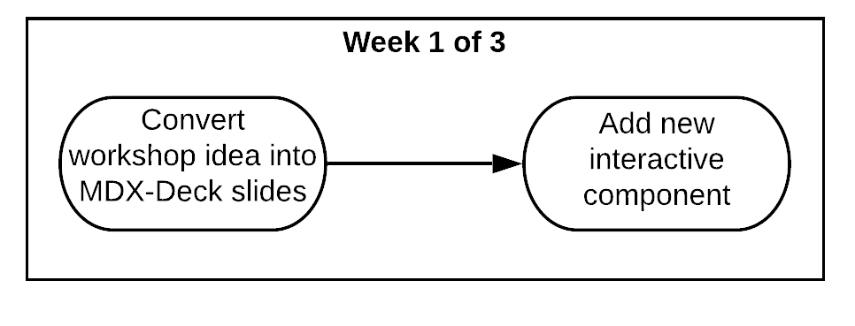
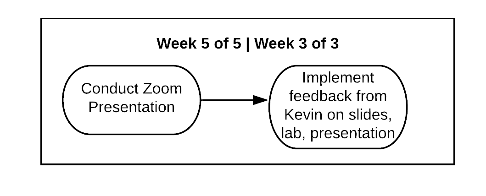

# Workshops: Choosing Your Idea

Please ensure you **completely confirm your idea** before moving on with this process.

## Week 1 of 3: Getting Ideas on \(MDX-Deck\) Paper

**For first-timers to MDX-Deck:**

* [ ] Clone MDX-Deck [Repository](https://github.com/bitprj/mdx-deck) locally
* [ ] Navigate to local repo folder, run commands `npm install` and `npm start`
  * [ ] Check that your site is running at `localhost:8000`
* [ ] Create new .mdx file under `mdx-deck/decks` folder
  * [ ] Change this file
  * [ ] See changes in your .mdx file at `localhost:8000`

**Week 1 Checklist**

* [ ] Go through entire workshop
  * [ ] Make sure it **completely works on your computer**\* _\*\*_
  * [ ] Understand at a high level what is happening
* [ ] Convert workshop idea into MDX-Deck Slides on bitprj/mdx-deck
  * [ ] Make speaker notes for all slides
* [ ] Add new interactive component
* [ ] Finalize date and time with Head
* [ ] ["General Slide Checklist"](./#general-slide-checklist) should be completed for your slides

_\*Some workshops may be outdated or incomplete. It would be up to you to coordinate with your manager to fill in the gaps._

Each duo should first convert each workshop article into slides. Detailed speaker notes should be made for all slides.

Then you should consult with your manager to formulate and come together on an idea for your new interactive component. This idea should be fully addressed in your MDX-Deck slides.

Lastly, for planning purposes, the date and time of your presentation should be finalized with the Head of DevRel.

## Week 2 of 3: Finalizing Materials

* [ ] Finalize slides per manager's feedback
* [ ] Convert slides into lab format
* [ ] Prepare presentation
  * [ ] Finalize speaker notes
  * [ ] Confirm date and time with Head
* [ ] ["General Slide Checklist"](./#general-slide-checklist) should be completed for your slides

As developers, you should fully integrate your manager's feedback on your slides for this week. While finalizing your slides, you should also convert these slides into a lab format. Please consult with your manager closely on both the slides and the lab conversion during meetings/follow-ups.

Lastly, for the presentation, speaker notes should be fully fleshed out in MDX-Deck. Please confirm your presentation time with your manager and head.

## Week 3 of 3: Presentation, Implementing Feedback

* [ ] Conduct Zoom Presentation
* [ ] Integrate all Feedback on Slides, Lab and Presentation

In the final week, you will present your workshop to all members of Bit, and to the general public. After your presentation, you should work to integrate all feedback on your slides, lab and presentation by the end of the week.

Then the cycle starts anew!

