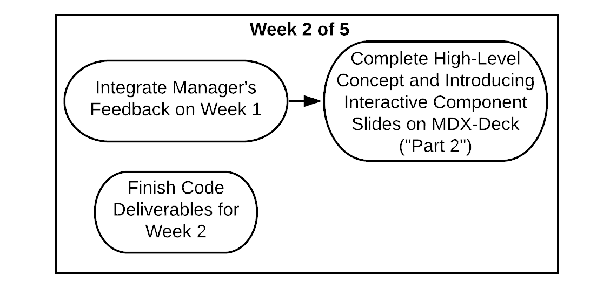
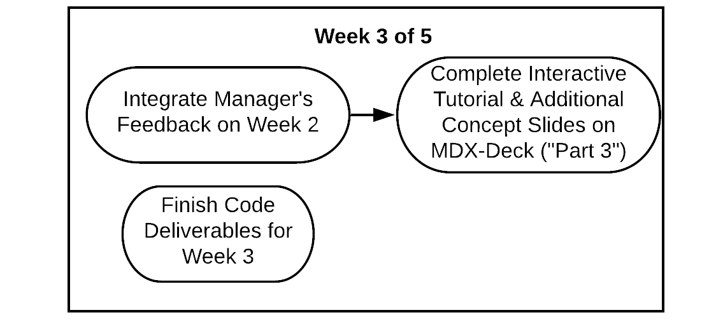
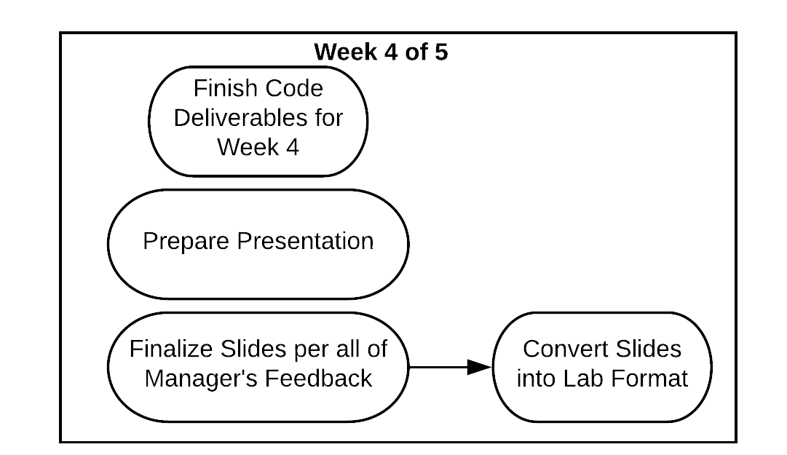

# Workshops: Creating Your Own Idea

Please ensure you **have a solid grasp on what your idea will be** before moving on with this process.

## Week 1 of 5: Formalizing Your Idea

**Setting up MDX-Deck:**

Please set up your MDX-Deck workspace on Code Sandbox. Follow the guide [here](https://about.bitproject.org/teams/developer-relations/setting-up-code-sandbox).

**Week 1 Checklist**

* [ ] Have Code Sandbox completely set-up
* [ ] Proposal
  * [ ] Specific Idea
  * [ ] Interactive Component
  * [ ] Code Deliverables
  * [ ] Slide Outline
  * [ ] Timing
  * [ ] Motivation Behind Project
  * [ ] Difficulty/prior experience
  * [ ] Technologies that will be used
* [ ] Complete "Part 1" [Slides](workshops-creating-your-own-idea.md#part-one-idea-motivation)
* [ ] Finalize date and time of presentation \(in Week 5\) with Head
* [ ] [General Slide Checklist ](./#general-slide-checklist)Fulfilled

The first step in creating a workshop is making a **proposal**. Your proposal must be very detailed. A guide on how to pursue a workshop idea, how to compose a proposal, as well as a template can be found here:

[Workshop Proposal Guide](../workshop-proposal-guide.md)

The workshops will be created over a five-week period. Each week there will be new goals that help you complete the workshop by the end of the cycle.

Using the guide above, you and your teammate will create a proposal. Here you will include the main concepts covered in the workshop, an outline of the slide breakdown and how the code elements will be presented as deliverable items. This will be covered more later, but essentially you need to cover how the code related to your concepts will be presented in the slides for every week, what we will call **code deliverables**. The proposal should be done by Friday of the first week, so over the weekend the proposal can be finalized before you begin your work. You will also need create slides that discuss the idea and motivation behind teaching the material, like the real-world applications of it. Throughout the week, the manager will be checking in to ensure it's done on time.

## Week 2 of 5: Finalizing Week One and Creating Concept Slides

* [ ] Fully integrate manager’s feedback on Week 1
* [ ] Complete MDX-Deck slides on High-Level Concepts and Introducing Interactive Component
* [ ] Finish Code Deliverables for Week 2
  * [ ] Begin documenting how to replicate the running of their code in a README
* [ ] ["General Slide Checklist"](./#general-slide-checklist) should be completed for your slides

You should try to be done with week one's work before moving on. This will make the rest of the process much easier, and allow you to focus on the new tasks at hand. After finalizing week one with your manager's help, you can start on the code deliverables for week two. You should execute the plan outlined in the proposal for how you will deliver code in the slides. This week's slides \(and code deliverables\) should relate to the main concept you cover in the workshop. This is the bulk of the content related to your main topic. Then, you should work on some slides that introduce the interactive component of the workshop.

## Week 3 of 5: Finalizing Week Two and Creating Interactive Component

* [ ] Fully integrate manager’s feedback on Week 2
* [ ] Complete MDX-Deck ["Part 3"](workshops-creating-your-own-idea.md#part-two-concepts-interactive-introduction)
  * [ ] Interactive Tutorial
  * [ ] Additional Concepts
* [ ] Finish Code Deliverables for Week 3
  * [ ] Continue updating README based on additional code deliverables
* [ ] ["General Slide Checklist"](./#general-slide-checklist) should be completed for your slides

After finishing up week two slides, start on week three's code deliverables, if necessary. The recommended workflow for code deliverables is being done by week two, but if it takes until week three that is okay. Then you want to complete the interactive slides. These will apply the concepts from week two's slides to some sort of activity for the students, so make sure it's made clear that this is the goal of this part of the presentation \(applying the new skills\). Any additional components that weren't covered in week two's slides can also be added here.

## Week 4 of 5: Finalizing

* [ ] Fully integrate manager’s feedback on Week 3
* [ ] Finalize MDX-Deck Slides for ["Part 3"](workshops-creating-your-own-idea.md#part-three-interactive-tutorial-additional-concepts)
* [ ] Put finishing touches on all slides for presentation
* [ ] Convert presentation into lab format
* [ ] Finish Code Deliverables for Week 4 \(if applicable\)
* [ ] Prepare presentation
  * [ ] Finalize speaker notes
  * [ ] Confirm date and time with Head
* [ ] ["General Slide Checklist"](./#general-slide-checklist) should be completed for your slides

If there are more code deliverables to be completed, make sure they are done this week. Other than that, this week is for finishing up week three's work, and reviewing the overall presentation. Check for spelling, grammar, clarity of ideas, images needed, code deliverables, and any other aspect of the presentation that needs to be edited. Lastly, you will develop a plan for how the slides will be converted into a lab. This only needs to be a summary of that process.

## Week 5 of 5: Presentation, Implementing Feedback

* [ ] Conduct Zoom Presentation
* [ ] Integrate all Feedback on Slides, Lab and Presentation

In the final week, you will present your workshop to all members of Bit, and to the general public. After your presentation, you should work to integrate all feedback on your slides, lab and presentation by the end of the week.

Then the cycle starts anew!

## Slide Deliverables

### Three-Part Delivery

The slides in the workshop will be split into three parts in order to create an informative and interactive experience for the audience, and the developer duo can use the information below to check and see if their slides are ready for slide reviews, which will be performed by the manager every week.

#### Part One: Idea/Motivation

The first draft of these slides must be completed by the end of Week One and reviewed by the manager at the start of Week Two, and the final draft of these slides should be completed during Week Two and finalized during Week Three. Part One slides should fulfill the following:

* [ ] Clear learning objective
* [ ] Important buzz-words
* [ ] Examples and applications \(describes how far the world has come\)
* [ ] Use cases \(explains why the topic of the workshop is useful\)

#### Part Two: Concepts + Interactive Introduction

The first draft of these slides must be completed by the end of Week Two and reviewed by the manager at the start of Week Three, and the final draft of these slides should be completed during Week Three and finalized during Week Four. Part Two slides should fulfill the following:

* [ ] Highly-developed concepts
  * [ ] Verbal descriptions \(explains the preparations behind the slides\)
  * [ ] Speaker notes \(supplements explanations given to the audience\)
* [ ] Bridge between concepts and the interactive activity
* [ ] Explanation of code's development and support
* [ ] Introduction to interactive activity

#### Part Three: Interactive Tutorial + Additional Concepts

The first draft of these slides must be completed by the end of Week Three and reviewed by the manager at the start of Week Four, and the final draft of these slides should be during Week Four and finalized during by the end of Week Four, finishing the workshop. Part Three slides should fulfill the following:

* [ ] Ample screenshots or photos
* [ ] Clear instructions \(on the slide or verbally given\)
* [ ] Step-by-Step slides for interactive activity
* [ ] Functioning interactive activity

