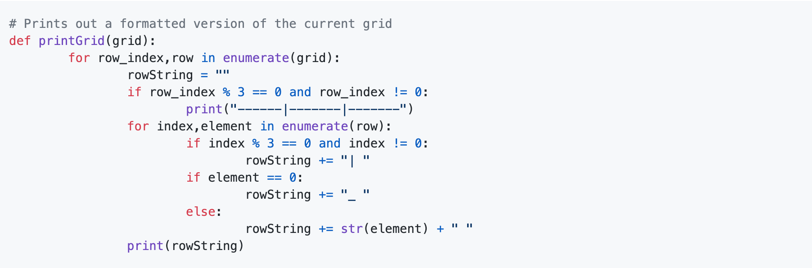

# Guide to Being a Manager

Reviewers are in charge of **curriculum teams.** Each team consists of 4-6 people who work on different modules of curriculum. They will be tasked with a project, usually covering a topic, and a deadline. By this deadline, all activities, labs and workshops for that project should be completed.

## Starting Off: Receiving Module Assignments

All reviewers will be assigned an issue in the **bitproject** repository, to be completed within _3 days of assignment._

### Pre-approval Checklist

* [ ] Confirm modules to be done
* [ ] Finalize activities, labs and workshop list
* [ ] Confirm overall project deadline

### Post-approval Checklist

* [ ] Making Epics in a Project \[THIS SHOULD BE DONE ASAP post-approval\]
  * [ ] If applicable, make modules as Epics on Zenhub
  * [ ] Post activities, labs and workshops on Zenhub as Epics under the appropriate module
* [ ] First week's issues \[THIS SHOULD BE DONE ASAP post-approval\]
  * [ ] Generate issues that should be completed in the first week
  * [ ] Assign to a milestone for the team
  * [ ] Inform team that their milestone is ready and that it is due in a week
* [ ] Have long-term, week-by-week plan under each activity/lab/workshop Epic describing what should be done by the team each week
* [ ] Generate all issues for all weeks 
  * [ ] Make sure each issue is added to the appropriate Epic
* [ ] Assign Epic Points to each module, activity, lab and workshop
* [ ] Set timeline for module, activity, lab and workshop Epics in Zenhub Calendar

This checklist will be posted within the issue and should all be completed within 3 days of assignment.

### Pre-approval: What To Do

* [ ] For each module,create a document that outlines the planned curriculum\(make sure to format it properly and according to the example\)
  * [ ] Make sure learning objectives are written and formatted properly
  * [ ] Make sure activity titles and descriptions written and formatted properly
  * [ ] Make sure lab titles and descriptions written and formatted properly

### Role of Epics + Assigning Epic Points

Epics represent long-term \(in the form of GitHub issues\) that will keep you on track to finish weekly assignment,activities & labs, and entire modules. These epics should be assigned points not based on how long they will take to complete but the overall, implementation based difficulty. Activity,Lab ,and workshop epics are assigned different points and they add up to represent the total weight/points of an entire module.

### Explanation of Role of Issues \(curriculum issues\)

Issues are assigned weekly to developers and represent a week's work that will help you reach your epics. These issues should help you push yourself further down your Epics. They should be succinct enough\(and must also follow the given format on GitHub\) for developers to understand but not get overwhelmed by too many details or work.

### Explanation of Role of Milestones

Milestones represent a person's and a team's weekly goals. They are comprised of curriculum issues and represent how much progress a team or person has made during a week. They will help you keep track of everyone's weekly work quota and your own work.

### Adding Issues to Epics \(Modules + Activities + Labs\)

Issues\(GitHub\) should be added to Epics. On a higher level, they represent what things need to be down in order to take down an Epic and will help you breakdown your goals into more tangible ideas and tasks. Module,activities, and lab Epics will be given smaller issues that break them into more ,as previously stated, bit-sized chunks that you can further break down into weekly issues and Milestones.

### Long-term Plan

A long-term plan should be clear for not only yourself but outsiders who might view it as well. It should follow a set format\(as shown below\) and should outline both major points that need to worked on and the time frame on when these issues will be dealt with. It should be realistic and extra care should be taken into considering that deadlines that you set might need to be adjusted\(so give yourself some "wiggle room"\)

`Overview of things to do:`

* `Create section on Python Class and other OOP concepts`
* `...`
* `Recycle older tutorials into new sections for the current module`
* `Add more descriptive visuals to currently-made activities`

`Weekly Goals:`

`Week of April 23th: Start outlining foundation cards`

`Week of April 30th: Start recycling older cards for the new Python tutorial module`

`...`

### ZenHub Calender

You should use ZenHub as a visual deadline guide and reminder. You will create Epics that will represent blocks on ZenHub. You will then adjust their size according to their perceived start date and deadline. You will also create sub-epics\(i.e activity,workshop labs, etc.\) that will also have their own deadlines\(that will build up the main module epic\).

## Weekly Manager Checklist

* [ ] Review developers' work and provide a review according to the Pull Request Checklist 
* [ ] Ensure "first draft" pull requests are in **by Friday**
* [ ] "Final draft" pull request to `master` should be in by **Sunday**
* [ ] Generate issues for the project based on feedback received and progress made the week prior
  * [ ] Ensure issues are made and set-up for next week's tasks 
  * [ ] Designate two issues _not being solved_ to be "first timer only" issues
  * [ ] Milestone should be set-up
* [ ] Adjust long-term plan and epic points for each module epic based on feedback and progress
  * [ ] Ensure General Review Checklist is being updated based on the developers' progress
* [ ] Adjust timeline in Zenhub Calendar

## Pull Request Checklist

Every week, there are a couple essential things that every manager should take care in pull requests. This checklist applies to both pull requests from developers' branches to managers' branches and from managers' branches to `master`.

* [ ] **Branch updated from `master`**
* [ ] Spelling and grammar errors fixed
* [ ] Correct Markdown Formatting
* [ ] Adjust timeline in Zenhub Calendar
* [ ] Correctly spaced code snippets
* [ ] Code style followed
* [ ] Local images with &lt;img&gt; NOT Markdown 
* [ ] Splitting Up Cards \(no more than one scroll a card\)
* [ ] Readability Test: Automated Readability Index result of _9th grade or under_ \([https://readabilityformulas.com/free-readability-formula-tests.php](https://readabilityformulas.com/free-readability-formula-tests.php)\)
* [ ] Visuals make sense
  * [ ] Alternate text for visuals
* [ ] Specific micro-issues addressed in pull request 
* [ ] Specific "checkbox" areas addressed in pull request for each activity and lab Epic that was worked on 
  * from General Development Review Checklist
* [ ] Pull Request properly named
  * [ ] If manager: \[Module Name\] Week of \*/\*\*: \*Manager Name\*
  * [ ] If developer: \[Activity/Lab Code\] \[Activity/Lab Name\] Week of \*/\*\*: \*Reviewer Name\*
* [ ] Proper Stage Label per the General Development Review Checklist
* [ ] Proper Project Label

This checklist should be pasted into each review, and checked off completely by Sunday.

## General Development Review Checklist

The following checklist must be fully completed before an Epic deadline, and also serve as a general guide to development.

This checklist should be maintained and updated

#### The General Checklist for Devs

Developers should be developing curriculum with all of those requirements in mind. Each issue they are assigned should address items on this checklist directly.

Additionally, each pull request should have stage labels corresponding to the four stages. Please apply as many labels as applicable, for every item addressed in a stage, there should be that corresponding stage label applied.

#### The General Checklist for Reviewers

With regards to this checklist, reviewers should do the following:

* Paste this checklist into their Epic's description, and continually update it every week
* Provide _comments_ on developers' pull requests that **directly reference items on the checklist**
* In pull requests to `master`, reference stages or items that are completed
* Ensure that stage labels are being properly marked
* When entire checklist is checked off for an Epic, then that Epic should be completed and linked within a pull request to `master` to indicate completion

### General Checklist \(Applies to All Stages\)

Before going into a stage-by-stage breakdown, here's a general overview of things to keep in mind.

#### Writing Style

First and foremost, we want all of our curriculum developers to use a _**conversational writing style**_ when making cards. Strive to make card content accessible and engaging—students should not have to sit through boring lectures to obtain a technical education! Writing as if you're having a conversation will keep students more engaged. When in doubt, think _**blog post**_ instead of _**dry CS lecture!**_

#### Numbering

It's crucial that each card is numbered correctly so developers can keep lessons organized and students can follow a logical progression. Bit Project uses two numbering schemes, one for Activities and one for Labs. 

Here's an example of how to number _**Activity**_ cards \(pretty self-explanatory\):

And here's an example of how to number _**Lab**_  cards \(a bit more complicated, so we'll explain it after the image\):

Each hard card is labelled as a _**single number**_.   
Going off of the above example, _**"1.md " is the first hard card**_, and _**"2.md" is the second hard card**_. 

To label medium cards, simply add another number associated with its order \(2 numbers total\).   
In the above example, _**"11.md"  is the first medium card associated with the first hard card**_, and   
_**"21.md" is the first medium card associated with the second hard card**_.

To label easy cards, add another number associated with its order \(3 numbers total\).  
In the above example, _**"111.md" is the first easy card associated with the first medium card associated with the first hard card.**_ ****

* [ ] High-schooler friendly writing style, easy to understand
* [ ] Correct numbering
* [ ] Every card has code\* 
* [ ] 1 scroll per card\*\*
* [ ] Proper grammar, punctuation, capitalization, etc.
* [ ] Acceptable Styling per the Pull Request Checklist

Cards should be concise. Stuffing a ton of information in a single card can be too overwhelming, so try to keep things brief and split up topics as much as possible. Ideally, you should not have to scroll more than once to view the whole card.

#### Writing Conventions

Proper writing conventions such as grammar, punctuation, capitalization, etc. should be utilized. 

**Code**

Since we teach programming-related topics, your cards are going to contain code. That said, only include code if it _**serves a purpose.**_ 

Here are some more specific guidelines to follow: 

* Activities introduce concepts; thus, showing code is not a primary purpose
* Labs push students to apply the concepts they've learned to a problem and will thus be more code-heavy \(more on this in the "Stage 1—Lab Addendum" section below\)

### Stages

Here's an in-depth breakdown of how managers should check card progress in the Bit Project system. We've split up the process into 4 stages. Read on to familiarize yourself! 

#### Stage 1 - Starting Content

We really can't stress enough how much we love educational content that _**speaks to students.**_ Please use a conversational writing style! 

When walking students through code, progress as though you are writing a piece of software yourself. Start with the simplest pieces, like variables and functions that _**don't depend on any other code.**_ Progressively work your way up until `main()`. We call this the _**Micro to Macro Principle.**_ 

_**Card length**_ should be reasonable. Ideally, keep the entire card viewable with at most one scroll. Students will have a hard time staying focused if a card is too long, and shorter cards are easier to digest. 

**.**

**.**

**.**

#### Stage 1 - Lab Addendum

When creating a Lab, you are essentially giving the student a problem to solve, breaking it down into steps, with each step subdivided into cards of hard, medium, and easy difficulty. An example of a Lab might be to code a Python program that can solve Sudoku. 

When it comes to Labs, there are a number of things to keep in mind.

**Hard cards** should present a _**high-level overview**_ of the problem_._ Keep in mind that, although this card should stretch the student's brain, it should also provide all the relevant information for the student to finish the task. A hard card for the Sudoku Solver Lab might explain the game of Sudoku and have a bit of starter code ****to point students in the right direction. Example [here](https://github.com/bitprj/curriculum/blob/master/Data-Structures-and-Algos-Topic/labs/Lab6_Sudoku_Solver/Cards/1.md). 

**Medium cards** should start to shed some more light on the problem. For instance, you can let students know what kinds of variables to keep track of, what data structures to use, or how to set up a certain function. Provide some hints, but don't give it all away. Example [here](https://github.com/bitprj/curriculum/blob/master/Data-Structures-and-Algos-Topic/labs/Lab6_Sudoku_Solver/Cards/11.md).

**Easy cards** should _literally_ walk the student through a section of the problem step-by-step. Functions should be completely written out, and code should be explained line-by-line_._ Example [here](https://github.com/bitprj/curriculum/blob/master/Data-Structures-and-Algos-Topic/labs/Lab6_Sudoku_Solver/Cards/111.md).

A word about **code**. All Lab cards should contain code, with varying degrees depending on card difficulty \(hard = not much code, medium = some more code, easy = ALOT of code\). Make sure code is _testable_ and works on multiple operating systems—students should be able to copy-paste your code into an IDE and tinker with it on their own. Here's an illustrative example from an easy hard:

#### Stage 2 - Finishing Content

Your cards should be almost finished by this stage. This section contains a few more crucial characteristics to top off your content.

_**Images!**_  Make liberal use of them in your cards. Concepts don't fully click until students can visualize them. Please use copyright-free images, Pexels is a great source. Since we use markdown to construct our cards, make sure images are embedded using _**local &lt;img&gt; tags**_ \(don't use URLs\).

_**Cards need to follow a logical progression**_. For Activities, this means that you start by introducing a concept in the first card, then move on to specifics of that concept in subsequent cards. For Labs, this means you walk the student through the problem step-by-step.

#### Stage 2 - Lab Addendum

_**Checkpoints**_ are crucial for checking students' progress in Activities and Labs. Checkpoints come in different types:

* Multiple choice prompts
* Short answer prompts
* Images
* Videos
* Autocheck Graders

There should be about 2-3 of these per Lab.

#### Stage 3 - Finishing Touches

* [ ] Correct formatting according to READMEs
  * [ ] Modules
  * [ ] Activities
  * [ ] Labs
  * [ ] Hints \(Medium + Easy Cards\)
  * [ ] Concepts
  * [ ] Checkpoints
  * [ ] With test cases for checkpoints if applicable
* [ ] Concepts for each card completely finalized, with correct README formatting

**Stage 3 - Lab Addendum**

* [ ] 5-10 test cases, correctly formatted according to READMEs

#### Stage 4 - For Reviewers Only

* [ ] Assigned modules' folders properly structured within topics
* [ ] Gem Amounts 
  * Labs: calculated using John's Code 
  * Activities: Predetermined amounts
* [ ] Have curriculum proofread by writing team \(currently Victoria Xu @vkxu657\)

### 

### 

