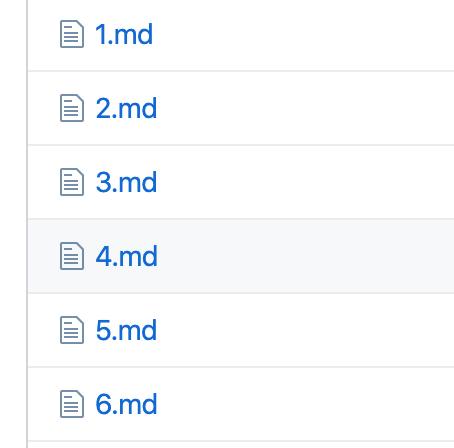
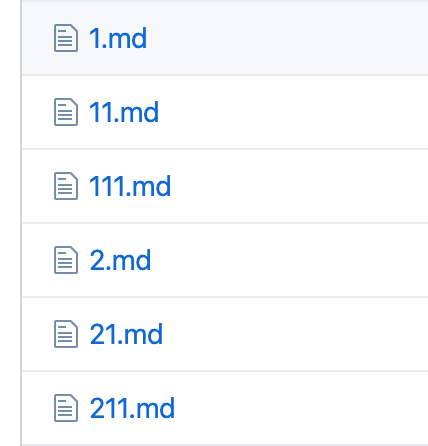
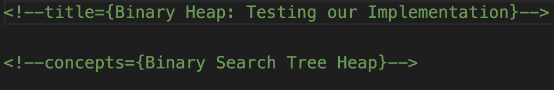
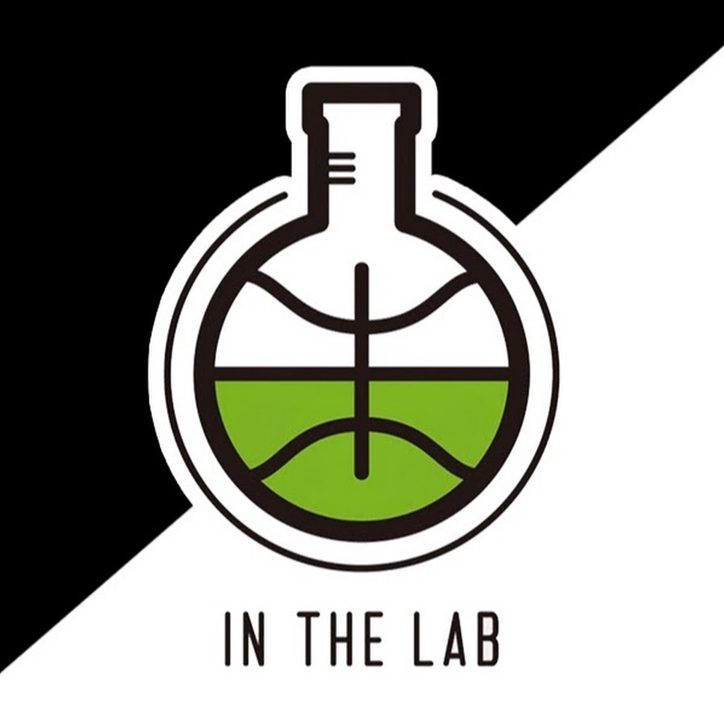
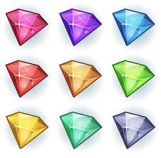
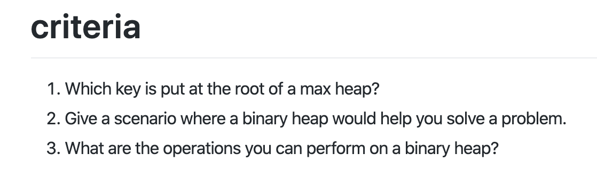
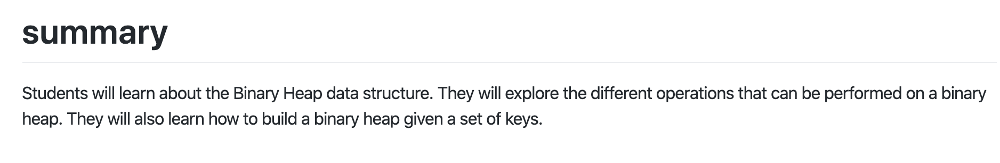

# Guide to Being a Manager

Reviewers are in charge of **curriculum teams.** Each team consists of 4-6 people who work on different modules of curriculum. They will be tasked with a project, usually covering a topic, and a deadline. By this deadline, all activities, labs and workshops for that project should be completed.

## Starting Off: Receiving Module Assignments

All reviewers will be assigned an issue in the **bitproject** repository, to be completed within _3 days of assignment._

### Pre-approval Checklist

* [ ] Confirm modules to be done
* [ ] Finalize activities, labs and workshop list
* [ ] Confirm overall project deadline

### Post-approval Checklist

* [ ] Making Epics in a Project \[THIS SHOULD BE DONE ASAP post-approval\]
  * [ ] If applicable, make modules as Epics on Zenhub
  * [ ] Post activities, labs and workshops on Zenhub as Epics under the appropriate module
* [ ] First week's issues \[THIS SHOULD BE DONE ASAP post-approval\]
  * [ ] Generate issues that should be completed in the first week
  * [ ] Assign to a milestone for the team
  * [ ] Inform team that their milestone is ready and that it is due in a week
* [ ] Have long-term, week-by-week plan under each activity/lab/workshop Epic describing what should be done by the team each week
* [ ] Generate all issues for all weeks 
  * [ ] Make sure each issue is added to the appropriate Epic
* [ ] Assign Epic Points to each module, activity, lab and workshop
* [ ] Set timeline for module, activity, lab and workshop Epics in Zenhub Calendar

This checklist will be posted within the issue and should all be completed within 3 days of assignment.

## Weekly Manager Checklist

* [ ] Review developers' work and provide a review according to the Pull Request Checklist 
* [ ] Ensure "first draft" pull requests are in **by Friday**
* [ ] "Final draft" pull request to `master` should be in by **Sunday**
* [ ] Generate issues for the project based on feedback received and progress made the week prior
  * [ ] Ensure issues are made and set-up for next week's tasks 
  * [ ] Designate two issues _not being solved_ to be "first timer only" issues
  * [ ] Milestone should be set-up
* [ ] Adjust long-term plan and epic points for each module epic based on feedback and progress
  * [ ] Ensure General Review Checklist is being updated based on the developers' progress
* [ ] Adjust timeline in Zenhub Calendar

## Pull Request Checklist

Every week, there are a couple essential things that every manager should take care in pull requests. This checklist applies to both pull requests from developers' branches to managers' branches and from managers' branches to `master`.

* [ ] **Branch updated from `master`**
* [ ] Spelling and grammar errors fixed
* [ ] Correct Markdown Formatting
* [ ] Adjust timeline in Zenhub Calendar
* [ ] Correctly spaced code snippets
* [ ] Code style followed
* [ ] Local images with &lt;img&gt; NOT Markdown 
* [ ] Splitting Up Cards \(no more than one scroll a card\)
* [ ] Readability Test: Automated Readability Index result of _9th grade or under_ \([https://readabilityformulas.com/free-readability-formula-tests.php](https://readabilityformulas.com/free-readability-formula-tests.php)\)
* [ ] Visuals make sense
  * [ ] Alternate text for visuals
* [ ] Specific micro-issues addressed in pull request 
* [ ] Specific "checkbox" areas addressed in pull request for each activity and lab Epic that was worked on 
  * from General Development Review Checklist
* [ ] Pull Request properly named
  * [ ] If manager: \[Module Name\] Week of \*/\*\*: \*Manager Name\*
  * [ ] If developer: \[Activity/Lab Code\] \[Activity/Lab Name\] Week of \*/\*\*: \*Reviewer Name\*
* [ ] Proper Stage Label per the General Development Review Checklist
* [ ] Proper Project Label

This checklist should be pasted into each review, and checked off completely by Sunday.

## General Development Review Checklist

The following checklist must be fully completed before an Epic deadline, and also serve as a general guide to development.

This checklist should be maintained and updated

#### The General Checklist for Devs

Developers should be developing curriculum with all of those requirements in mind. Each issue they are assigned should address items on this checklist directly.

Additionally, each pull request should have stage labels corresponding to the four stages. Please apply as many labels as applicable, for every item addressed in a stage, there should be that corresponding stage label applied.

#### The General Checklist for Reviewers

With regards to this checklist, reviewers should do the following:

* Paste this checklist into their Epic's description, and continually update it every week
* Provide _comments_ on developers' pull requests that **directly reference items on the checklist**
* In pull requests to `master`, reference stages or items that are completed
* Ensure that stage labels are being properly marked
* When entire checklist is checked off for an Epic, then that Epic should be completed and linked within a pull request to `master` to indicate completion

### General Checklist \(Applies to All Stages\)

Before going into a stage-by-stage breakdown, here's a general overview of things to keep in mind.

#### Writing Style

First and foremost, we want all our developers to use a conversational writing style when making cards. This is because the target audience for our curriculum is high school students, and our goal is to make technical education as accessible as possible. Writing as if you're having a conversation will keep students more engaged. When in doubt, think **blog post** instead of **calculus textbook**.

#### Numbering

It's crucial that each card is numbered correctly so developers can keep lessons organized and students can follow a logical progression. Bit Project uses two numbering schemes, one for Activities and one for Labs. 

Here's an example of an Activity \(pretty self-explanatory\):

And here's an example of a Lab:

Each hard card is labelled as a single number.   
Going off of the above example, **1.md is the first hard card**, and **2.md is the second hard card**. 

To label medium cards, simply add another number associated with its order.   
In the above example, **1-1.md is the first medium card associated with the first hard card**, and   
**2-1.md is the first medium card associated with the second hard card**.

To label easy cards, add another number associated with its order \(3 numbers total\).  
In the above example, **1-1-1.md is the first easy card associated with the first medium card associated with the first hard card.** Can you translate 2-1-1.md into plain English?

#### Card Length

Cards should be concise. Ideally, you should not have to scroll more than once to view the whole card. Stuffing a ton of information in a single card can be too overwhelming, so try to keep things brief and split up topics as much as possible. 

#### Writing Conventions

Last but certainly not least, proper writing conventions such as grammar, punctuation, capitalization, etc. should be utilized. 

### Stages

Here's an in-depth breakdown of how cards progress in the Bit Project system. 

#### Stage 1 - Starting Content

**Card content should be accessible to beginners**, meaning someone with no prior knowledge should be able to follow the content. This goes hand-in-hand with using a  conversational writing style.

Next up is what we call the **Micro to Macro Principle**. For labs and activities, please start at a micro level and then move up. For example, students should not code the main\(\) function first. As a rule of thumb, you should never have to utter the words “this function will be coded in a later part”. Every hard card should work on its own and not have to rely on later work for it to work out.

**Images**! Make liberal use of images \(like the one above\) in your cards. It's much easier to visualize a concept than to read three paragraphs of text. Obviously, text is necessary, but pairing text with visuals is immensely helpful. Also, images help break up blocks of text, making it easier on the eyes. Please use copyright-free images, Pexels is a great source. Make sure images are embedded using &lt;img&gt; tags and not URLs.

Activities and Labs will feature coding tasks for students to complete. For these, developers should implement what we call **checkpoints**—Python console output that serves as a frame of reference for students to make sure their code is doing what it's supposed to be doing. 

**Titles**. These should be included in HTML comments at the top of each card, not in the file name itself \(remember, cards are named numerically\). Along with titles, **concepts** covered in the card should also be contained in HTML comments. Here's an example:

**Card length** should be reasonable. Ideally, keep the entire card viewable with at most one scroll.  
Students will have a hard time staying focused if a card is too long, and shorter cards are easier to digest. Try to split up topics as much as possible. 

This one is pretty self-explanatory, but make sure your cards progress in a way that makes sense. 

#### Stage 1 - Lab Addendum

When creating a Lab, you are essentially giving the student a problem to solve, breaking it down into steps, with each step subdivided into cards of hard, medium, and easy difficulty. An example might be to code a Python program that can solve Sudoku. 

When it comes to Labs, there are a number of things to keep in mind.

**Hard cards** are, by definition, _hard._ A hard card for the Sudoku Solver Lab might explain the game of Sudoku and have a teeny-tiny bit of **starter code** at the end. Keep in mind that, although this card should stretch the student's brain, it should also provide just enough guidance for the student to finish the task. The main thing to keep in mind is you _should NOT_ leak any hints_._ Example [here](https://github.com/bitprj/curriculum/blob/master/Data-Structures-and-Algos-Topic/labs/Lab6_Sudoku_Solver/Cards/1.md). 

**Medium cards** are probably the most difficult cards to make, since you have to find a delicate middle ground between hard and easy. That said, keep in mind that the goal of medium is to serve as a bridge between hard and easy. You start to squeeze out a few hint droplets into the student's cup, but don't fill the entire cup. Example [here](https://github.com/bitprj/curriculum/blob/master/Data-Structures-and-Algos-Topic/labs/Lab6_Sudoku_Solver/Cards/11.md).

**Easy cards** should literally walk the student through the problem step-by-step. Imagine leading a blindfolded person through a mine\(sweeper\) field. Functions should be completely written out, and explanations should be given for _everything._ Expanding on the juice analogy—fill the student's cup! Example [here](https://github.com/bitprj/curriculum/blob/master/Data-Structures-and-Algos-Topic/labs/Lab6_Sudoku_Solver/Cards/111.md).

It's probably a good idea to first make your hard and easy cards for a topic, then do medium last.   
That way, you give yourself boundaries that your medium card shouldn't cross.

A word about **code**. All Lab cards should contain code, with varying degrees depending on card difficulty. Make sure code is _testable_, meaning a student can copy-paste your code into an IDE and have it output something meaningtul to the problem at hand.

#### Stage 2 - Finishing Content

The bulk of your content has been finished. Here are a few more things to top off your cards.

Each card should reward the student a certain number of **gems** upon completion. Think of these as currency in a video game. Students will be able to spend gems to unlock things like hints as they progress further through curriculum tracks. Gem numbers should be included in the README file for the Activity/Lab.

For each Activity and Lab, **three criteria statements** must be provided. Each criteria should outline an important takeaway from the Activity/Lab. Teachers will be referencing this criteria when grading students’ videos of Activities and Labs, and students will have to meet all criteria to proceed. The criteria can be in statement or question format and should be included in the README file for the Activity/Lab. Here's an example:

Each Activity/Lab should contain a brief **summary** describing it using 1 sentence only. In addition, please provide a **long summary** that expands on the main concepts covered in the Activity/Lab, about 3-4 sentences total. Here's an example:

#### Stage 2 - Lab Addendum

For each lab, **test cases** must be provided. Make sure your lab is concise enough so that test cases can be made. For example, if you were making a Wheel of Fortune lab, don’t ask users to make their own lists of possible messages. Instead, create the messages yourself and have them simply make a list out of those predefined messages. In the scenario where students get to create their own list, it would be impossible to actually define test cases for each student’s custom list. 

For the test cases, simply provide a document detailing what should be inputted and its output. There should be around 8-10 test cases per Lab.  

#### Stage 3 - Finishing Touches

* [ ] Correct formatting according to READMEs
  * [ ] Modules
  * [ ] Activities
  * [ ] Labs
  * [ ] Hints \(Medium + Easy Cards\)
  * [ ] Concepts
  * [ ] Checkpoints
  * [ ] With test cases for checkpoints if applicable
* [ ] Concepts for each card completely finalized, with correct README formatting

**Stage 3 - Lab Addendum**

* [ ] 5-10 test cases, correctly formatted according to READMEs

#### Stage 4 - For Reviewers Only

* [ ] Assigned modules' folders properly structured within topics
* [ ] Gem Amounts 
  * Labs: calculated using John's Code 
  * Activities: Predetermined amounts
* [ ] Have curriculum proofread by writing team \(currently Victoria Xu @vkxu657\)

