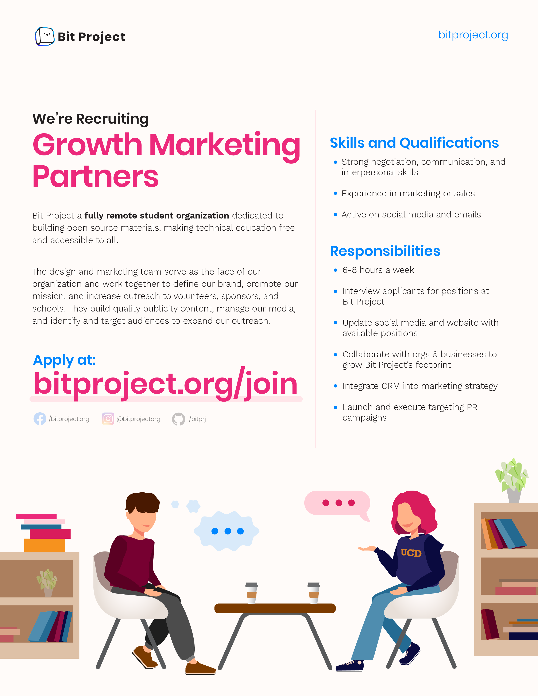
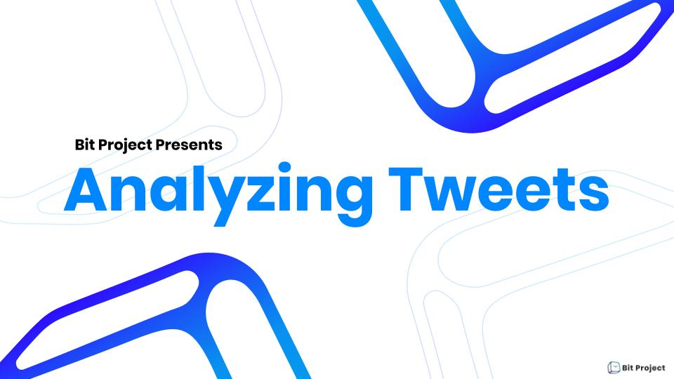
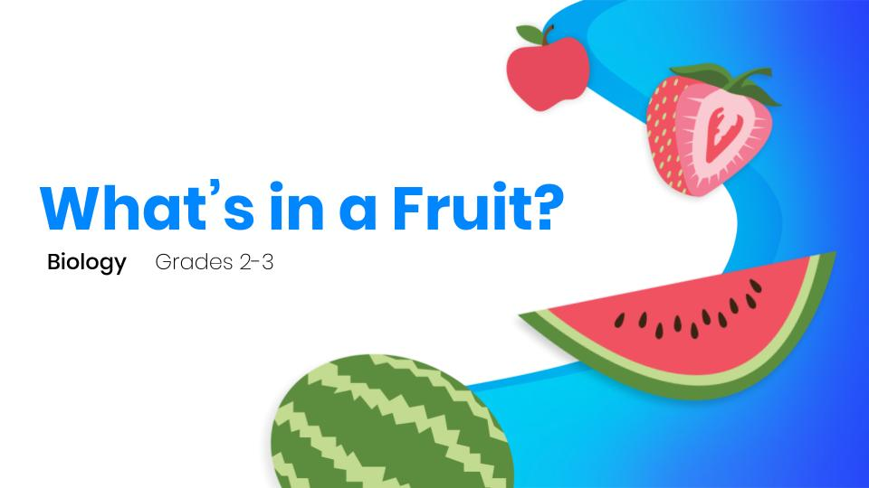
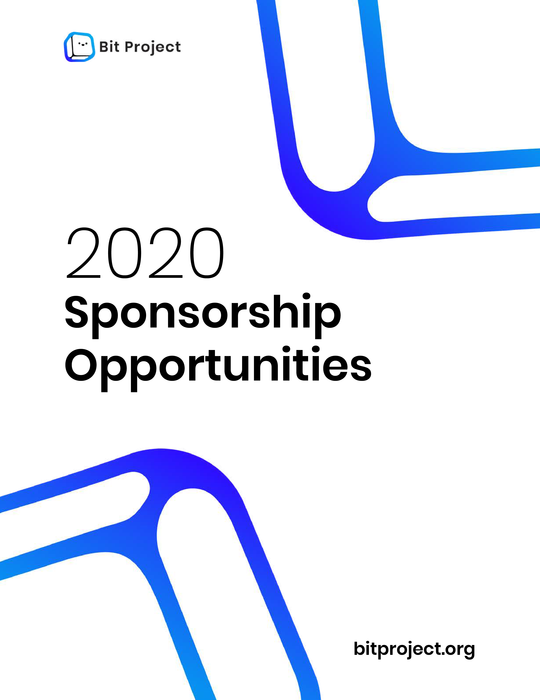
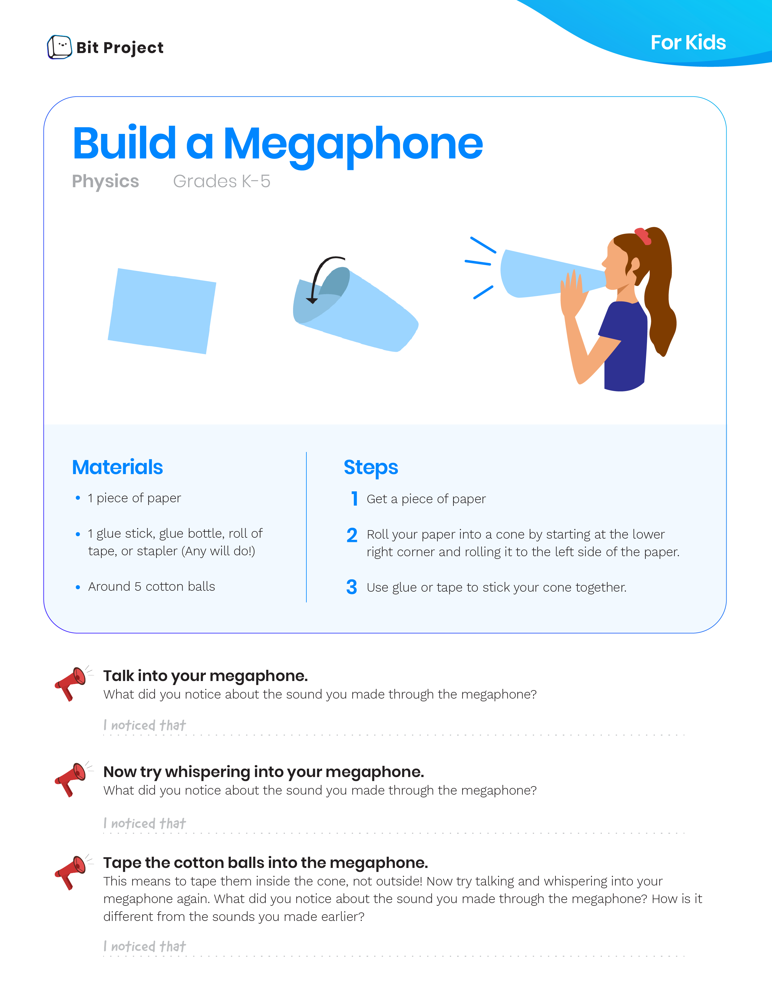
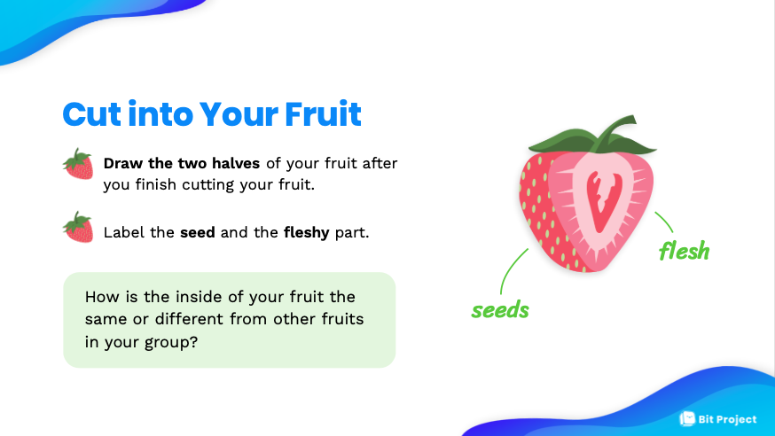

# Design Team

## Our Workflow

Bit Project Content Creators work with all departments within the organization to design and produce original, high quality content that can be used in for branding and marketing. Our design process tends to look like this:

#### 0. Receive Project Brief

Client assigns us Github issues or projects over Slack. Our goal is identify:  
1. Clients Needs/Wants  
2. What the Context behind the graphic is  
3. Where the graphic is being used  
4. Who is the graphic targeted towards

#### 1. Research

We research the the context of the graphic to a point where we are able to describe the concept with our own words. \(ex. APIs = the middleman between programmer and server. Accesses and Retrieves data.\)  
We also research what other designers have done to communicate similar ideas/concepts. 

#### 2. Brainstorm/Sketches

## Departments:

#### Marketing

The Marketing team is in charge of advertising and outreach for Bit Project. We are involved in the marketing strategy, and create and style the outgoing content which includes event/recruitment flyers, presentation slides for meetings, document styling for formal pitches, merchandise designs, and logos.

#### Developer Relations

_**Presentation Slides**_  
****The Dev Rel team hosts interactive code workshops/bootcamps targeted towards college students with no background in CS. We aim to create concise, clear, and engaging presentation slides. We aim to graphically convey complex CS concepts and avoid long, wordy, technical text.  
  
_**Event and Recruitment Flyers**_  
Dev Rel events are targeted towards students with little or no background knowledge in CS. We use graphics to describe the concept behind CS topics. For example, APIs are depicted as a conversation. Photos of people interacting with each other from past workshops are also used in flyers.   
Dev Rel recruitment flyers are targeted towards computer

#### Primary Education

_**Presentation Slides**_  
Primary Ed uses presentation slides to host hands-on learning activities for elementary students. Since elementary students are less likely to read the slides, we focus on illustrating a multitude of graphics to communicate key concepts and engage the young audience. The text on the presentation slides are kept to a minimum and questions directed towards the audience such as "What did you observe?" are highlighted to help kids follow along in the activity.   
  
_**Email Newsletter**_ ****  
A weekly email newsletter containing is sent out to parents of elementary students. The newsletter contains latest updates about Bit Project, as well as a weekly learning activity parents and kids can do. We designed the Newsletter activity to have two parts: 1. a section for parents that describes learning objectives, 2. a section for kids, which includes activity instructions, fill in the blank questions, and small, easy-to-read paragraphs of core concepts.  
  
_**Social Media**_  
We plan on targeting both parents and kids using Facebook and Twitter. We translate the newsletter activity into step-by-step graphics that are posted on social media.   
  
 

### Workflow:

Our workflow includes receiving project assignments from other teams and meeting with team managers to discuss ideas. We create mockups for projects and present our ideas for feedback and revisions.

If you would like discuss designs or possible projects, feel free to message us in the **\#design** channel on slack at least one week prior to the deadline. Please have an idea and descriptions/references prepared.

## Projects We Work On 

### Flyers

We design event flyers, advertisements, recruitment flyers, and other outreach endeavors.  

### Presentations 

We style and brand presentations used for workshops, formal pitches, and primary education events.   

### Document Templates

We style and brand formal Bit documents such as Sponsorship Packets, Pitches, Case Studies, and Blog Posts. We also style and provide input on other outgoing media such as the email newsletter.   

### Illustrations \(Graphics\)

We create graphics that illustrate conceptual ideas for flyers and presentations.

## Tools

**Adobe Illustrator**- Digital Illustrations/Graphics, Flyers

**Adobe Photoshop**- Photo editing

**Adobe InDesign**- Document Styling

**Google Slides**- Presentation Styling

**Google Docs**- Document Styling

## Important Links

### Brand Guidelines \(wip\)

### Presentation Templates \(wip\)

### Graphics Library 

[https://github.com/bitprj/marketing/tree/master/design/graphics](https://github.com/bitprj/marketing/tree/master/design/graphics)

### Past Flyers \(wip\)

