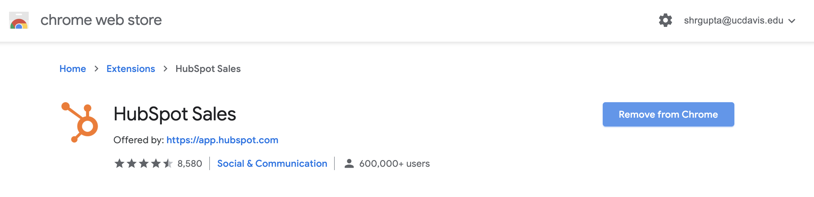
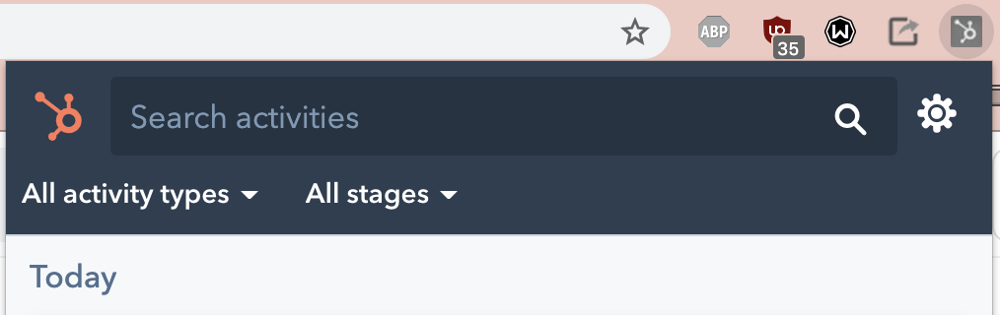
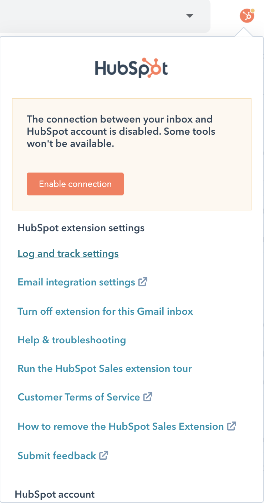
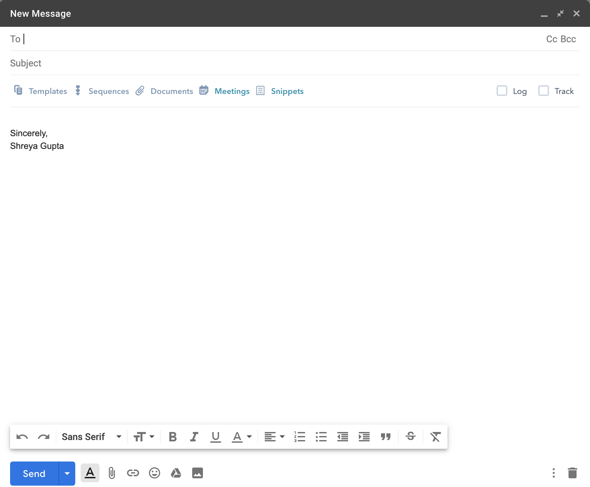
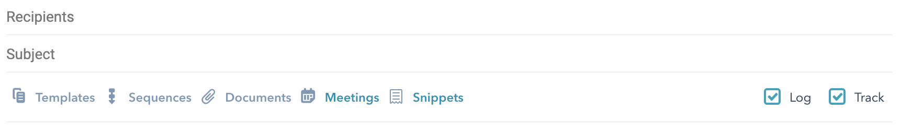

# Airtable & HubSpot

## Airtable

Airtable Link: [https://airtable.com/tblPo65FZeC3q6V9Y/viw1Vij54J9qNEeq6?blocks=hide](https://airtable.com/tblPo65FZeC3q6V9Y/viw1Vij54J9qNEeq6?blocks=hide)

### Downloading as a CSV file

#### 1. Click on the three dots and select Download CSV.

### Assigning Schools to Collaborators

### Adding Emails

#### 1. Find the Marketing University Outreach Airtable.

#### 2. Click the plus sign at the bottom of the spreadsheet.

#### 3. Place the Name of the Organization in the first Column.

#### 4. Click on the plus sign in the University Column. Select the respective university as it is currently linked to the University Table.

#### 5. Input the Email into the Email column.

### Linking Tables to One Another

## HubSpot

### Sending and Tracking Emails

#### 1. Get the HubSpot Sales Chrome Extension

#### 2. Log into the extension with your HubSpot emails

Click on the extension in the toolbar at the top right of the screen and make sure that you're signed in 

#### 3. Go into your mailbox and set up HubSpot Settings

Click on "Log and track settings"

Turn off the logging and tracking settings to prevent logging/tracking your personal emails as in the image below:

#### 4. Send out individual emails

When you compose your email, the logging and tracking settings will be turned off.

Make sure to turn the settings on for all Bit contact, **including when you respond to emails.**

#### 5. Get the email template from the Marketing GitHub

[https://github.com/bitprj/marketing/blob/master/email\_templates/csclub.md](https://github.com/bitprj/marketing/blob/master/email_templates/csclub.md)

#### 6. Send out email individually

Replace \[NAME\] anywhere in the emails.

Turn log/track back on for that email.

